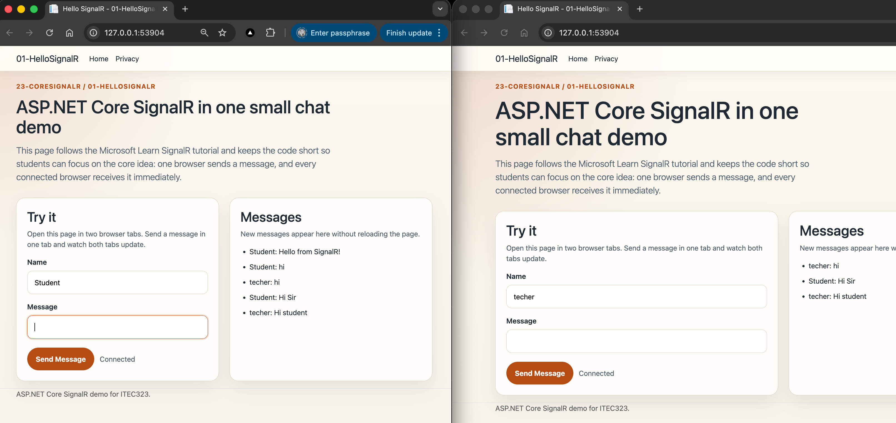

# 01-HelloSignalR

## Overview

This project is the first sample in the `23-CoreSignalR` module.

It demonstrates the core SignalR idea with a very small Razor Pages chat app:

1. one browser sends a message
2. the hub receives it on the server
3. all connected browsers receive the message immediately

The sample is adapted from the official Microsoft Learn tutorial for ASP.NET Core SignalR and simplified for classroom use with **.NET 10** and **Visual Studio Code**.

## Screenshot  



## Learning Objectives

By working through this project, students will learn how to:

- create a Razor Pages app with the .NET CLI
- add SignalR services in `Program.cs`
- create a simple hub class
- connect JavaScript code to a SignalR hub
- send a message from one client to all connected clients
- observe real-time updates without refreshing the page

## Project Structure

```text
01-HelloSignalR/
├── 01-HelloSignalR.csproj
├── Hubs/
├── Pages/
├── Properties/
├── wwwroot/
├── docs/
├── scripts/
├── README.md
├── QUICKSTART.md
└── FRD.md
```

## Main Features

- small real-time chat demo
- shared `ChatHub` for broadcasting messages
- beginner-friendly client JavaScript
- SignalR browser client loaded from unpkg to keep the first sample short
- short teaching notes in `docs/Key-Takeaways.md`
- optional Playwright recording script for a demo video

## Related Files

- [QUICKSTART.md](QUICKSTART.md) for setup and run steps
- [FRD.md](FRD.md) for functional requirements
- [docs/Key-Takeaways.md](docs/Key-Takeaways.md) for teaching notes
- [Microsoft Learn tutorial](https://learn.microsoft.com/en-us/aspnet/core/tutorials/signalr?view=aspnetcore-10.0&tabs=visual-studio-code)
