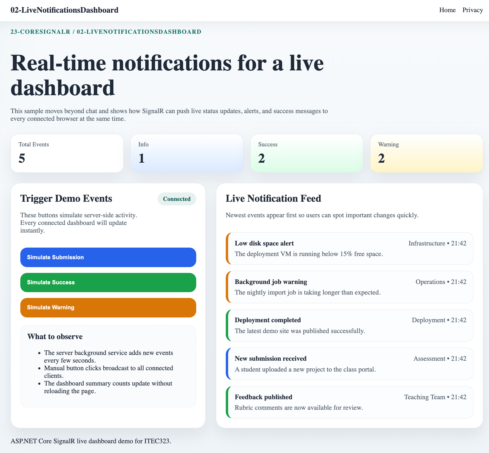

# 02-LiveNotificationsDashboard

## Overview

This project is the second sample in the `23-CoreSignalR` module.

It demonstrates a small real-time dashboard where notifications appear automatically and update all connected clients at once.

The sample is designed to feel more practical than a chat app while still staying short and beginner-friendly for **.NET 10** and **Visual Studio Code**.

## Screenshot



[Youtube demo](https://youtu.be/ydUKbSGw3KQ)

## Learning Objectives

By working through this project, students will learn how to:

- use SignalR for server-to-client push notifications
- build a small dashboard instead of a chat screen
- send structured payloads such as title, message, source, and severity
- keep recent notifications in an in-memory store
- generate server events with a background hosted service
- update summary cards and feeds without refreshing the page

## Project Structure

```text
02-LiveNotificationsDashboard/
├── 02-LiveNotificationsDashboard.csproj
├── Hubs/
├── Models/
├── Services/
├── Pages/
├── Properties/
├── wwwroot/
├── docs/
├── scripts/
├── README.md
├── QUICKSTART.md
└── FRD.md
```

## Main Features

- live notification feed with newest items first
- summary cards for total, info, success, and warning events
- background demo events generated on the server
- manual notification buttons that broadcast to all clients
- responsive dashboard layout for laptop and mobile screens

## Related Files

- [QUICKSTART.md](QUICKSTART.md) for setup and run steps
- [FRD.md](FRD.md) for functional requirements
- [docs/Key-Takeaways.md](docs/Key-Takeaways.md) for teaching notes
