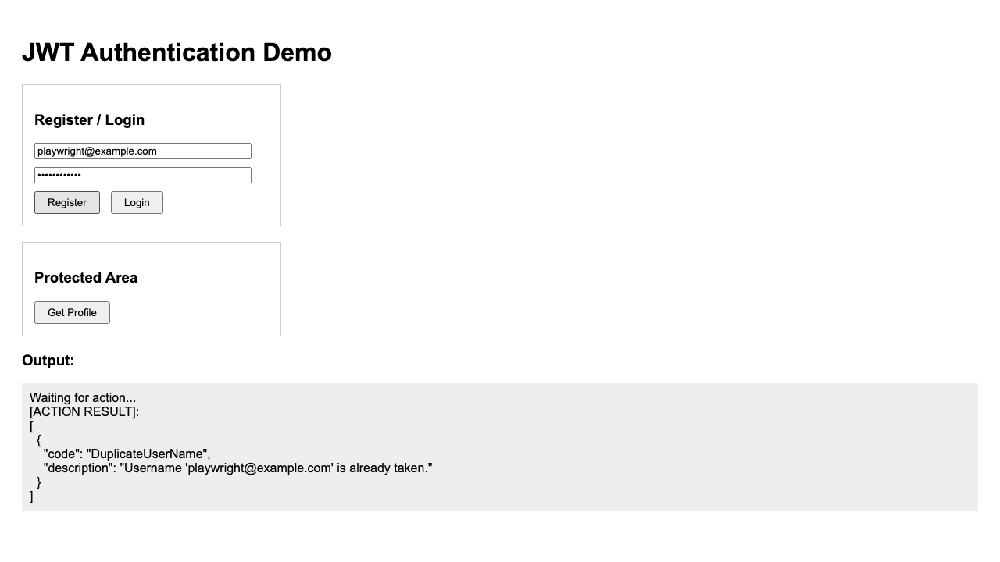
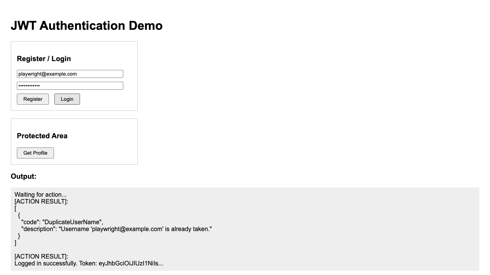
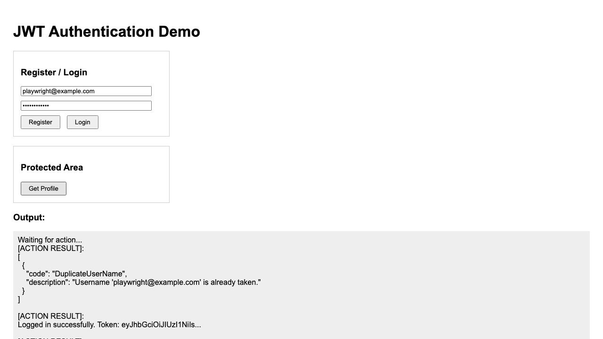

# 01.JwtAuthAPI

## Overview

This project is the primary sample in the `24-Identity-JWT-Auth` module.

It demonstrates how to configure ASP.NET Core Identity handling and how to protect endpoints using JSON Web Tokens (JWT).

The sample is built to be simple and beginner-friendly for **.NET 10** and **Visual Studio Code**, providing a baseline authentication API for mobile or SPA frontends.

## Screenshot

 
 


## Learning Objectives

By working through this project, students will learn how to:

- configure an `IdentityDbContext` and use Identity managers to handle user accounts safely
- generate and digitally sign JSON Web Tokens (JWT) for stateless authentication
- apply the `[Authorize]` attribute to APIs to ensure only logged-in users with a valid token have access
- use standard HTTP clients to store and transmit tokens natively via the `Authorization: Bearer <TOKEN>` header

## Project Structure

```text
01.JwtAuthAPI/
├── 01.JwtAuthAPI.csproj
├── Data/
├── Endpoints/
├── Models/
├── Properties/
├── Services/
├── wwwroot/
├── tests/
├── README.md
├── QUICKSTART.md
└── FRD.md
```

## Main Features

- minimal API endpoints for register, login, and protected profile access
- SQLite test database integration inside `AppDbContext`
- custom `JwtTokenService` encapsulating JWT logic
- static files hosting for integrated frontend UI
- automated Playwright visual testing script executing natively via DOM interaction
- full xUnit integration test suite pointing locally directly at `WebApplicationFactory`

## Related Files

- [QUICKSTART.md](QUICKSTART.md) for setup and run steps
- [FRD.md](FRD.md) for functional requirements
- [docs/Key-Takeaways.md](../docs/Key-Takeaways.md) for teaching notes