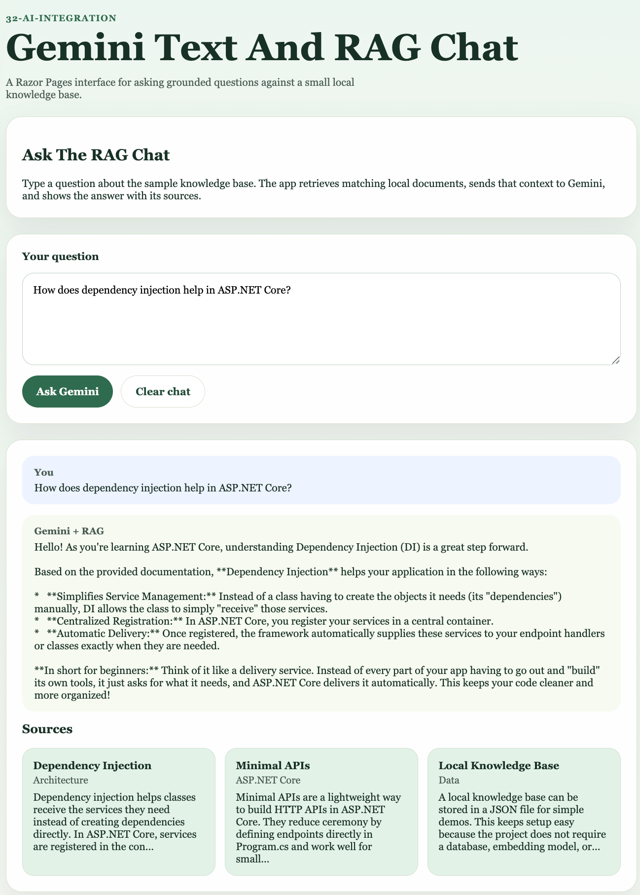

# 02.GeminiTextAndRagRazor

## Overview

This project evolves the Gemini RAG Minimal API sample into a Razor Pages web application. Users can ask questions from a browser, see grounded answers, and keep a simple chat history in their session.

## Screenshot



## Learning Objectives

By working through this project, students will learn how to:

- build a beginner-friendly Razor Pages interface for AI interactions
- call Gemini-backed RAG services from a PageModel
- keep a chat history in session
- reuse local JSON documents as grounded context
- display answers and sources in a responsive web page

## Main Features

- a single chat page with question input and clear chat action
- session-backed conversation history
- grounded answers generated with Gemini
- source cards that show which documents supported each answer

The sample is configured to try `gemini-3-flash-preview` first, then fall back to `gemini-2.5-flash-lite`, `gemini-2.5-flash`, and `gemini-2.0-flash`.

## Project Structure

```text
02.GeminiTextAndRagRazor/
├── 02.GeminiTextAndRagRazor.csproj
├── Program.cs
├── Pages/
├── Models/
├── Services/
├── Data/
├── Properties/
├── wwwroot/
├── docs/
├── tests/
├── README.md
├── QUICKSTART.md
└── FRD.md
```

## Related Files

- [QUICKSTART.md](QUICKSTART.md)
- [FRD.md](FRD.md)
- [docs/RazorChatNotes.md](docs/RazorChatNotes.md)

## Sample Prompts

Try these prompts in the chat page to test the local RAG knowledge base:

- `Why should I keep my Google API key in .env.local?`
- `What does RAG mean in this sample project?`
- `How does dependency injection help in ASP.NET Core?`
- `Why does this project use a JSON knowledge base instead of a database?`
- `How does prompt context improve an AI answer?`
- `What are Minimal APIs in ASP.NET Core?`

To test a question that is outside the local knowledge base, try:

- `What is the capital of Japan?`
