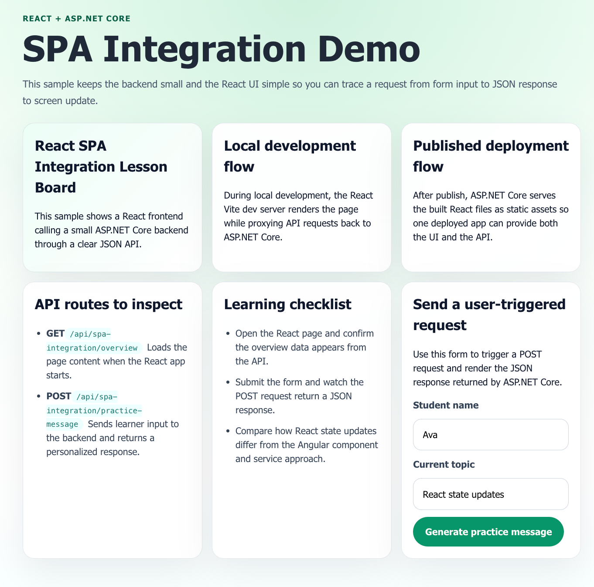

# 01.ReactWebApiDemo

## Overview

This sample demonstrates how to build a beginner-friendly React frontend that talks to an ASP.NET Core backend created from `Microsoft.JavaScript.Templates` with the `reactwebapi` template.

The project keeps both sides intentionally small:

- the React app loads one startup payload from the backend
- the React form sends one POST request to the backend
- the ASP.NET Core API returns simple JSON that students can inspect easily

## Screenshot



## Learning Objectives

By working through this sample, students will learn how to:

- use `reactwebapi` on `.NET 10`
- understand the difference between local development flow and published deployment flow
- trace an HTTP request from React form input to ASP.NET Core controller to JSON response
- manage a small amount of React component state for API calls
- validate input on the backend before returning a response

## Project Structure

```text
01.ReactWebApiDemo/
├── 01.ReactWebApiDemo.Server/
│   ├── Controllers/
│   ├── Models/
│   ├── Services/
│   ├── Properties/
│   └── tests/
├── 01.reactwebapidemo.client/
│   └── src/
├── docs/
├── README.md
├── QUICKSTART.md
└── FRD.md
```

## Main Features

- `GET /api/spa-integration/overview` returns the data the React page shows on first load
- `POST /api/spa-integration/practice-message` accepts learner input and returns a personalized response
- the React page shows loading, success, and error states
- the published app can serve both the built React frontend and the backend API from ASP.NET Core

## Prerequisites

- .NET 10.0 SDK
- Node.js and npm
- `Microsoft.JavaScript.Templates`

## Related Files

- [QUICKSTART.md](QUICKSTART.md)
- [FRD.md](FRD.md)
- [docs/IntegrationFlow.md](docs/IntegrationFlow.md)
- [docs/ReactVsAngular.md](docs/ReactVsAngular.md)
