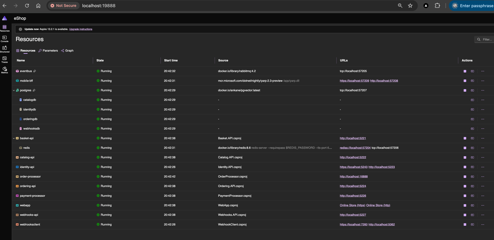
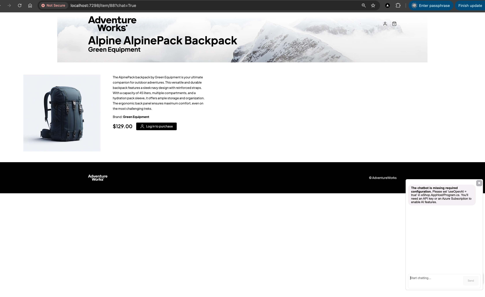

# 35-eShop-Architecture

## Overview

This module is a guided architecture study of Microsoft's official [`dotnet/eShop`](https://github.com/dotnet/eShop) reference application.

Unlike the earlier modules in this repository, `35-eShop-Architecture` is not a project that students build from scratch. Instead, it helps students:

- inspect a real services-based .NET application
- understand how `.NET Aspire` coordinates local development
- see Docker-managed infrastructure in action
- discuss when microservices are useful and when they add complexity

The local class demo uses the upstream `eShop.AppHost` project so the infrastructure runs the same way Microsoft designed it.

## Screenshots

  

## Learning Objectives

By working through this module, students will learn how to:

- explain the difference between a monolith and a microservices-based application
- identify the responsibilities of `Catalog`, `Basket`, `Ordering`, `Identity`, and `Webhooks`
- describe how RabbitMQ supports asynchronous communication between services
- describe why Redis and PostgreSQL are provisioned as Docker containers for local development
- understand the role of `.NET Aspire` and `eShop.AppHost`
- run the official eShop sample locally as a class demonstration
- understand why trusted local development certificates matter for HTTPS-based local tooling

## Project Structure

```text
35-eShop-Architecture/
├── docs/
│   └── eShop-Architecture-Analysis.md
├── scripts/
│   └── run-eshop-demo.sh
├── README.md
├── QUICKSTART.md
└── FRD.md
```

## Main Learning Artifacts

- [docs/eShop-Architecture-Analysis.md](docs/eShop-Architecture-Analysis.md) explains the architecture in beginner-friendly language
- [QUICKSTART.md](QUICKSTART.md) shows how to run the upstream sample locally for a class demo
- [FRD.md](FRD.md) defines the educational and demonstration requirements for this module

## Important Note

This module intentionally does **not** vendor the `dotnet/eShop` source code into the `ITEC323` repository.

Instead, the helper script clones the official upstream repository into `/tmp/eshop-demo`, checks out a pinned commit, and launches the official `eShop.AppHost` project from there.
