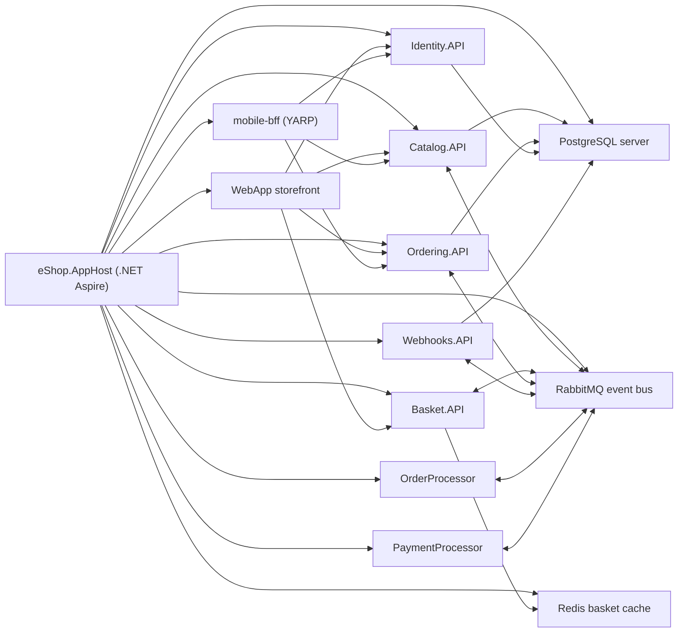

# eShop Architecture Analysis

## Why This Sample Matters

`dotnet/eShop` is Microsoft's official reference application for showing how a modern .NET system can be split into multiple services.

This makes it a strong teaching example for architecture discussion, but not a good first web app for beginners to build line by line. Earlier `ITEC323` modules focus on simpler apps such as Razor Pages projects because they are easier to understand, debug, and extend. `eShop` is useful later in the course because students can compare those simpler apps with a more realistic distributed system.

## Big Picture

The current `dotnet/eShop` sample uses `.NET Aspire` as the local orchestration layer. Instead of starting every service manually, the `eShop.AppHost` project describes:

- which services should run
- which infrastructure resources they depend on
- which environment variables and URLs they need
- which resources should wait for others to be ready

When you run `src/eShop.AppHost/eShop.AppHost.csproj`, Aspire starts the application graph and provisions supporting infrastructure through Docker containers.

## Simple Architecture Diagram



## Core Architecture Idea

`eShop` is organized around business capabilities instead of one large shared web application.

Each major area owns its own code, storage, and runtime process:

| Service | Main responsibility | Notable dependency |
|---|---|---|
| `Catalog.API` | products, brands, catalog browsing | PostgreSQL, RabbitMQ |
| `Basket.API` | shopping basket state | Redis, RabbitMQ |
| `Ordering.API` | orders and checkout workflow | PostgreSQL, RabbitMQ |
| `Identity.API` | login, identity, callback URLs | PostgreSQL |
| `Webhooks.API` | webhook subscriptions and notifications | PostgreSQL, RabbitMQ |
| `OrderProcessor` | background order processing | RabbitMQ, ordering database |
| `PaymentProcessor` | background payment workflow simulation | RabbitMQ |
| `WebApp` | customer-facing storefront | calls backend APIs |
| `mobile-bff` | backend-for-frontend gateway for mobile clients | routes to selected APIs |

This separation lets teams change one area without rebuilding the entire system, but it also means there are more moving parts to configure and monitor.

## How `.NET Aspire` Fits In

The `eShop.AppHost` project is the entry point for local orchestration.

In the current upstream `Program.cs`, Aspire provisions:

- `redis`
- `eventbus` using RabbitMQ
- `postgres` using a PostgreSQL container image

It then creates separate databases for:

- `catalogdb`
- `identitydb`
- `orderingdb`
- `webhooksdb`

After that, Aspire wires the application services together with references, endpoints, and startup dependencies such as waiting for RabbitMQ or PostgreSQL before certain services begin.

This is an important teaching point: the infrastructure is still Docker-based, but the app no longer expects students to hand-author a large `docker-compose.yml` file to run the local demo. Aspire becomes the coordinator.

## Why The Demo Uses `.NET 10`

At the pinned upstream commit used by this module, `src/eShop.AppHost/eShop.AppHost.csproj` targets `net10.0`, and the repository `global.json` pins the SDK family to `10.0.100`.

That means seeing a `.NET 10` welcome banner during the first run is expected for this revision. Some upstream README text still mentions `.NET 9`, but the pinned code used by this module is a newer `.NET 10` revision.

## Why The SSL Error Happens

The Aspire dashboard uses HTTPS and internal gRPC communication. If the local ASP.NET Core development certificate is missing or not trusted by macOS, the dashboard can open but parts of the UI fail with errors such as `UntrustedRoot`.

This is a local machine setup issue, not a RabbitMQ or eShop architecture problem.

The usual fix is:

```bash
dotnet dev-certs https --trust
```

If the certificate state is broken, clean and recreate it:

```bash
dotnet dev-certs https --clean
dotnet dev-certs https --trust
```

## How Docker Is Used

For this sample, Docker is mainly used for infrastructure rather than for every line of application management.

When Aspire starts the app, Docker runs containers for the supporting services:

- **RabbitMQ** for asynchronous messaging
- **Redis** for basket storage and caching
- **PostgreSQL** for relational data

From a classroom perspective, this is helpful because students can open Docker Desktop and see that:

- the app is not a single process
- infrastructure services are independent from the ASP.NET Core services
- modern distributed apps often mix application processes with containerized dependencies

## RabbitMQ And The Event Bus

RabbitMQ is used as the event bus that lets services communicate asynchronously.

That means a service can publish an event without directly calling another service and waiting for an immediate response. This helps reduce tight coupling.

For example:

1. one service completes part of a workflow
2. it publishes an integration event to RabbitMQ
3. another service or background processor subscribes and reacts later

This pattern is useful when:

- work should continue in the background
- multiple services care about the same business event
- temporary service unavailability should not break the entire request flow immediately

It also adds complexity:

- messages can fail or be delayed
- debugging becomes harder than a normal method call
- students must think about eventual consistency instead of assuming everything updates instantly

## Why Data Is Split Across Services

`eShop` does not use one giant shared database for every feature.

Instead, different services own their own data:

- `Catalog.API` uses its own catalog database
- `Identity.API` uses its own identity database
- `Ordering.API` uses its own ordering database
- `Webhooks.API` uses its own webhook database
- `Basket.API` stores basket state in Redis rather than in the relational databases

This service ownership supports clearer boundaries and independent evolution. It also prevents the entire system from depending on one schema for every feature.

The tradeoff is that cross-service reporting and transactions become more complicated.

## Local Development Experience

Local development for `eShop` feels very different from a simple Razor Pages app:

| Simpler course app | eShop demo |
|---|---|
| one project | many projects |
| one web server | multiple APIs, processors, and frontends |
| one local database or none | several data stores and infrastructure services |
| direct debugging path | distributed logs, health checks, and service dependencies |

This is why `eShop` works best as a guided demo and architecture case study rather than a beginner build exercise.

## Strengths Of This Architecture

- clear separation of business capabilities
- independent scaling of different services
- easier to introduce background processing
- better reflection of real enterprise architecture
- strong observability and orchestration story through Aspire

## Costs And Tradeoffs

- more setup than a single ASP.NET Core app
- harder debugging because requests and events cross service boundaries
- more infrastructure to understand
- more operational concepts such as health checks, event handling, and distributed configuration
- greater risk of confusion for students if introduced too early

## Recommended Teaching Angle

For class, treat `eShop` as a comparison exercise:

1. start from what students already know, such as a Razor Pages app
2. show that `eShop` solves a larger and more complex problem
3. highlight how Docker and Aspire reduce local setup pain
4. explain that microservices are a design tradeoff, not an automatic upgrade over a monolith

That framing helps students understand **why** a team might choose this architecture without making them think every future app must be built this way.

## Upstream Version Used For This Module

This module is aligned to the upstream `dotnet/eShop` repository at commit:

```text
b81ad9557090cc37233b9d1a0a729db7b44b6f14
```

At that revision, the code itself targets `.NET 10` and is launched locally with:

```bash
dotnet run --project src/eShop.AppHost/eShop.AppHost.csproj
```
