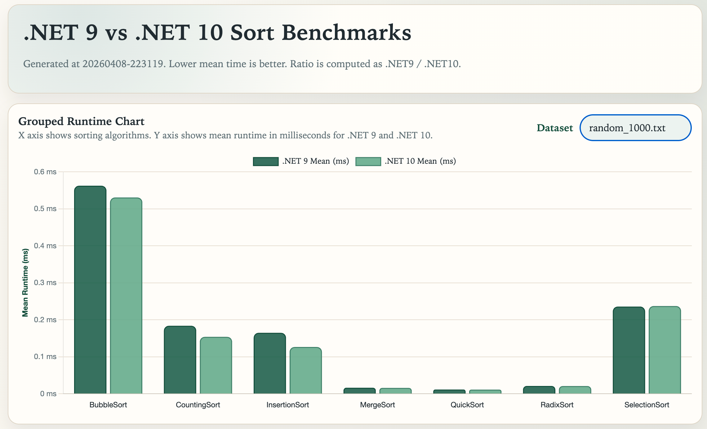

# BenchmarkDotNet: .NET 9 vs .NET 10 Sort Comparison

This project benchmarks the same C# sorting algorithms across .NET 9 and .NET 10 using BenchmarkDotNet.

## Conclusion

.NET 10 is slightly faster than .NET 9 for sorting algorithms.

# Benchmark Results



## What is included

- Sorting algorithms:
  - bubble_sort
  - counting_sort
  - insertion_sort
  - merge_sort
  - quick_sort
  - radix_sort
  - selection_sort
- Dataset generation in C# (`make dataset`)
- Benchmark runner in BenchmarkDotNet (`make benchmark`)
- HTML report output in `reports/report-<timestamp>.html`
- Additional benchmark artifacts in `artifacts/`

## Folder structure

- `benchmark/`: BenchmarkDotNet project and sorting implementations
- `artifacts/`: generated datasets and BenchmarkDotNet artifacts
- `reports/`: generated HTML reports
- `docs/Key-Takeaways.md`: summarized takeaways from the latest benchmark run

## How comparison works

`SortingBenchmarks` is configured with two jobs:

- .NET 9 (`RuntimeMoniker.Net90`)
- .NET 10 (`RuntimeMoniker.Net10_0`)

BenchmarkDotNet executes each benchmark method for both runtimes and the report generator writes a side-by-side comparison table.

## Quick commands

```bash
cd 99-Misc/03-BenchmarkDotNet
make dataset
make run
make benchmark
```

After `make benchmark`, open the generated report in `reports/`.
