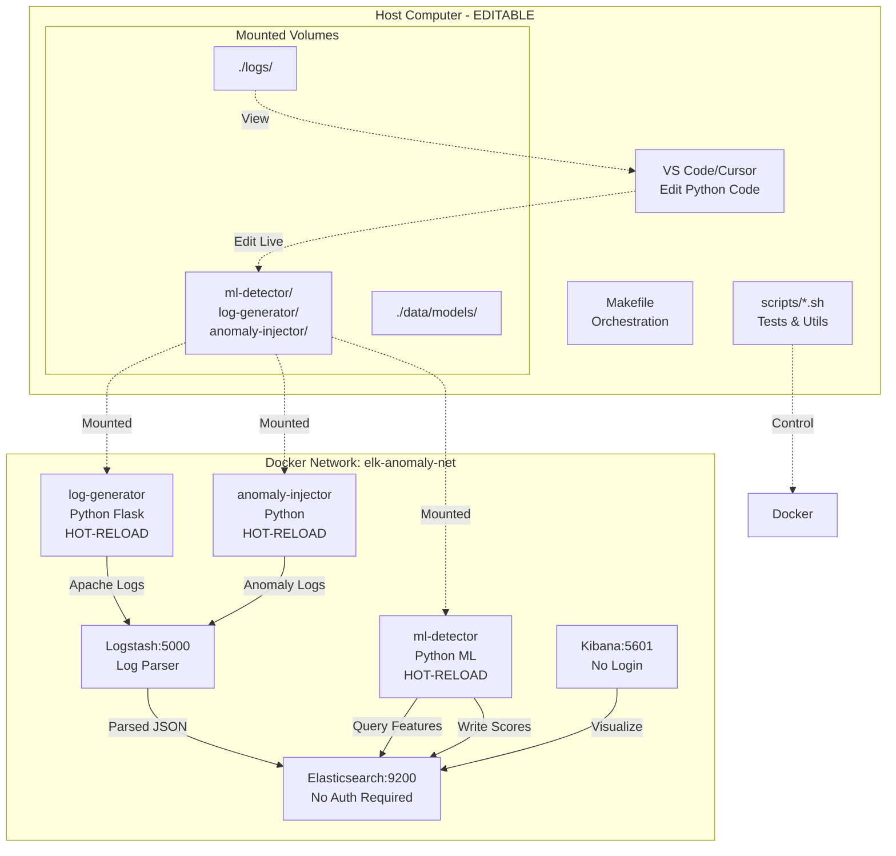

# ELK Stack Anomaly Detection Lab

## Architecture Overview

Complete Docker Compose environment with ELK Stack, ML detection (Isolation Forest + Autoencoder), hot-reload development, automated testing, CI/CD, and video tutorial support.

## Implementation Structure

### 1. Docker Infrastructure

**docker-compose.yml**: Single-command deployment
- Elasticsearch 8.x with 2GB memory, **security disabled** for educational use
- Kibana with pre-configured dashboards, **no authentication required**
- Logstash with custom pipeline
- Custom log-generator (Python with hot-reload)
- Custom anomaly-injector (Python with hot-reload)
- ML-detector service (Python with scikit-learn + TensorFlow, hot-reload enabled)

**Volume Mounts Strategy** (Source Code + Data):
```
# SOURCE CODE - EDITABLE from host IDE (VS Code/Cursor)
./ml-detector/         → /app/                    (Python ML service - EDIT LIVE)
./log-generator/       → /app/                    (Log generator - EDIT LIVE)
./anomaly-injector/    → /app/                    (Anomaly injector - EDIT LIVE)

# DATA & LOGS - VISIBLE on host filesystem
./logs/normal/         → /var/log/normal/         (Normal traffic logs)
./logs/anomaly/        → /var/log/anomaly/        (Attack/anomaly logs)
./logs/ml-detector/    → /app/logs/               (ML detection logs)

# MODELS & CONFIG - SHARED between host and containers
./data/models/         → /app/models/             (Pre-trained models)
./config/              → /app/config/             (ML configs, editable)
./kibana/dashboards/   → /usr/share/kibana/dashboards/
```

**Hot-Reload Implementation**: All Python containers use watchdog or Flask debug mode to auto-restart on file changes

**Network**: `elk-anomaly-net` bridge network

**Security Configuration**: 
- Elasticsearch: `xpack.security.enabled=false` (demo mode)
- Kibana: Direct access at http://localhost:5601 (no login required)
- Note in README: "Security disabled for educational purposes. Enable for production."

**.gitignore**:
```
logs/**/*.log
data/elasticsearch/
data/models/*.h5
data/models/*.pkl
exports/
reports/
*.pyc
__pycache__/
.env.local
.DS_Store
.vscode/
.idea/
```

### 2. Model Training Strategy

**Approach**: Hybrid - pre-trained + auto-train on first run

**data/models/.gitkeep**: Track directory, ignore model files

**scripts/train_models.sh**: Initial model training
- Generates 5000 baseline logs
- Trains Isolation Forest (saves to `isolation_forest.pkl`)
- Trains Autoencoder (saves to `autoencoder.h5`)
- Called automatically by `make build`
- Takes ~60 seconds total

**ML Service Behavior**:
1. On startup: Load pre-trained models from `./data/models/`
2. If models missing: Auto-train on first 1000 Elasticsearch entries
3. Continuous learning: Optional retrain every 24 hours on new baseline

### 3. Data Generation & Injection

**log-generator/**: Python Flask app (hot-reload enabled)
- Generates 2-3 requests/second (120-180/min)
- Apache Combined Log Format
- Realistic: mix of GET/POST, user agents, status codes
- Writes to file + sends to Logstash
- **Editable from host**: Students can modify traffic patterns

**anomaly-injector/**: Python script with 4 anomaly types
1. **Burst**: 1000 requests in 30 seconds (volume spike)
2. **Errors**: HTTP 404/500 flood (error rate spike)
3. **Slow**: Requests with 5-10s response time (latency anomaly)
4. **Scan**: Sequential port/path scanning pattern
- **Editable from host**: Students can add custom anomaly types

**Sample Datasets**: `data/baseline_logs.csv`, `data/anomaly_logs.csv`

### 4. ML Detection Service

**ml-detector/app.py**: Main orchestrator (hot-reload enabled)
- Polls Elasticsearch every 30 seconds (configurable via `.env`)
- Extracts features: requests_per_min, avg_response_time, error_rate, request_size_variance
- Runs both algorithms in parallel threads
- Writes scores back to ES index `anomaly-scores-*`
- **Uses watchdog for auto-reload on code changes**

**ml-detector/isolation_forest.py**: IsolationForest implementation
- contamination=0.05
- n_estimators=100
- Excels at volume/rate anomalies
- **Editable**: Students can tune hyperparameters

**ml-detector/autoencoder.py**: Keras Autoencoder
- Architecture: [8, 16, 8, 4, 8, 16, 8] (symmetric)
- Activation: relu (hidden), sigmoid (output)
- Loss: MSE
- Threshold: 95th percentile of training reconstruction errors
- Excels at pattern/sequence anomalies
- **Editable**: Students can modify architecture

**ml-detector/requirements.txt**:
```
elasticsearch>=8.0,<9.0
scikit-learn>=1.3
tensorflow>=2.13,<3.0
pandas>=2.0
numpy>=1.24
pyyaml>=6.0
watchdog>=3.0  # For hot-reload
```

**ml-detector/Dockerfile**: Includes CMD that watches for changes
```dockerfile
CMD ["python", "-u", "app.py"]  # -u for unbuffered output
# or: CMD ["watchmedo", "auto-restart", "--pattern=*.py", "--", "python", "app.py"]
```

### 5. Logstash Pipeline

**logstash/pipeline/logs.conf**: Parse and enrich
- Grok pattern for Apache Combined Log
- Mutate: extract response_time, calculate error flags
- Aggregate: requests_per_minute counter
- Output: Elasticsearch `logs-*` index

### 6. Kibana Dashboards

**kibana/dashboards/anomaly-detection.ndjson**: Pre-built dashboard
- Time series: Requests/min with anomaly markers
- Dual-axis chart: Isolation Forest score (left) vs Autoencoder score (right)
- Heatmap: Response time distribution
- Data table: Recent anomalies with log details
- Markdown: Instructions for students

### 7. Documentation

**QUICKSTART.md**: 3-minute getting started guide
```markdown
# Quick Start (3 minutes)

## Prerequisites
- Docker Desktop with 4GB+ RAM allocated
- 10GB free disk space
- Git

## Steps
1. Clone: `git clone <repo>`
2. `cd ELK-Anomaly-Detection`
3. `make build` (first time: ~3 minutes)
4. `make up` (starts services: ~30 seconds)
5. `make health` (verify all services ready)
6. Open http://localhost:5601 (no login required)
7. `make demo` (automated 5-minute demonstration)

## Editing Code
- Open project in VS Code/Cursor
- Edit files in `ml-detector/`, `log-generator/`, `anomaly-injector/`
- Changes apply automatically (hot-reload)

## Next Steps
- See README.md for theory and detailed walkthrough
- Try: `make test-isolation-forest`
- Experiment: Edit `ml-detector/isolation_forest.py` to tune parameters
```

**README.md**: Comprehensive guide with:

**Sections**:
1. **Overview** - What this lab demonstrates
2. **Architecture** - Mermaid diagram (see below)
3. **System Requirements** - 4GB RAM, 2 cores, 10GB disk
4. **Installation** - Step-by-step setup
5. **Quick Start** - Link to QUICKSTART.md
6. **Development Mode** - How to edit code with hot-reload
7. **Theory** - How Isolation Forest works (1 paragraph with diagram)
8. **Theory** - How Autoencoders work (1 paragraph with diagram)
9. **Demonstration Walkthrough** - Step-by-step demo instructions
10. **Algorithm Comparison** - When to use which algorithm
11. **Testing** - All `make test-*` commands
12. **Troubleshooting** - Common issues and solutions
13. **Security Note** - Disabled for demo, how to enable for production
14. **VS Code/Cursor Integration** - Recommended extensions, how to debug
15. **Real-World Applications** - Where these techniques are used
16. **References** - Academic papers, documentation links

**Mermaid Architecture Diagram** (embedded in README.md):


**VS Code/Cursor Integration Section** (in README.md):
```markdown
## VS Code/Cursor Integration

### Recommended Extensions
- Python (Microsoft)
- Docker (Microsoft)
- Jupyter (for notebook analysis)
- YAML (Red Hat)
- Markdown Preview Mermaid Support

### Opening the Project
1. `code .` or open folder in Cursor
2. All Python services are in separate folders
3. Edit any `.py` file - changes apply immediately

### Debugging Python Services
1. Attach to container: `docker attach elk-ml-detector`
2. Or view logs: `make logs` or `docker-compose logs -f ml-detector`
3. Add `print()` statements - they appear immediately in logs

### Live Development Workflow
1. Edit `ml-detector/isolation_forest.py`
2. Save file (Cmd+S / Ctrl+S)
3. Container auto-restarts (watch logs with `make logs`)
4. Test change with `make test-isolation-forest`

### Terminal Integration
- Use integrated terminal in VS Code
- Run `make` commands directly
- Multiple terminals for monitoring different services
```

### 8. Makefile & Scripts

**Makefile**: Comprehensive automation
```makefile
help            Display this help message
build           Build containers + train initial models
up              Start all services (detached mode)
down            Stop all services
restart         Restart all services
logs            Tail logs from all containers
ps              Show service status

# Development
dev             Start in development mode (hot-reload + verbose logs)
attach-ml       Attach to ml-detector container terminal
attach-gen      Attach to log-generator container terminal

# Testing
tests           Run all tests sequentially
test-baseline   Verify normal traffic generation
test-isolation-forest   Test volume anomaly detection  
test-autoencoder        Test pattern anomaly detection
test-comparison Compare algorithm performance
test-dashboard  Verify Kibana dashboard access

# Monitoring & Control
monitor         Real-time monitoring dashboard (terminal UI)
health          Service health check
reset           Clear data, keep services running
export          Export detection results to CSV
report          Generate HTML report

# Utilities
clean           Remove all containers, volumes, and data
clean-logs      Clear log files only
demo            Run automated demonstration
video           Generate video tutorial (asciinema + scripts)

# CI/CD
ci-test         Run tests in CI mode (non-interactive)
```

**Core Test Scripts**:

**scripts/test_baseline.sh**: Baseline verification
**scripts/test_isolation_forest.sh**: Burst anomaly detection
**scripts/test_autoencoder.sh**: Pattern anomaly detection
**scripts/test_comparison.sh**: Algorithm comparison
**scripts/test_dashboard.sh**: Dashboard accessibility

**Utility Scripts**:

**scripts/monitor.sh**: Real-time terminal UI
```bash
=== Anomaly Detection Monitor ===
Time: 14:32:15
Logs/min: 145 [NORMAL] ████████████░░░░░░░░
Isolation Forest: 0.12 [OK]     ████░░░░░░░░░░░░
Autoencoder: 0.08 [OK]          ███░░░░░░░░░░░░░
Last anomaly: None
Services: ✓ ES ✓ Kibana ✓ ML ✓ LogGen
Refreshing every 2s... (Ctrl+C to stop)
```

**scripts/reset.sh**: Data reset
**scripts/export_results.sh**: Export to CSV
**scripts/inject_custom_anomaly.sh**: Interactive anomaly injection
**scripts/health_check.sh**: Full system health check
**scripts/generate_report.sh**: HTML report generation
**scripts/utils.sh**: Shared bash functions

### 9. Video Tutorial System

**Complete video tutorial generation system via `make video`**

**scripts/video_tutorial.sh**: Main video generation script
```bash
#!/bin/bash
# Generates complete video tutorial with narration script

# 1. Record terminal session
asciinema rec tutorial.cast --command="bash scripts/video_demo_commands.sh"

# 2. Convert to GIF (embeddable in README)
asciicast2gif tutorial.cast tutorial.gif -s 2 -t monokai

# 3. Convert to MP4 (optional, for video platforms)
if command -v agg &> /dev/null; then
    agg tutorial.cast tutorial.mp4
fi

# 4. Generate narration script
echo "Video files generated:"
echo "  - tutorial.cast (asciinema format)"
echo "  - tutorial.gif (animated GIF)"
echo "  - tutorial.mp4 (video file)"
echo "  - video_narration.txt (voiceover script)"
```

**scripts/video_demo_commands.sh**: Automated command sequence
```bash
#!/bin/bash
# This script runs automatically during video recording
# Each command has timing pauses for smooth video flow

source scripts/video_helpers.sh

# Title screen
show_title "ELK Stack Anomaly Detection Lab"
sleep 3

# Section 1: Setup
show_section "1. Building the Environment"
sleep 1
run_with_pause "make build" 5
wait_for_completion

# Section 2: Starting Services
show_section "2. Starting All Services"
run_with_pause "make up" 3
sleep 5

# Section 3: Health Check
show_section "3. Verifying System Health"
run_with_pause "make health" 3

# Section 4: Normal Traffic
show_section "4. Observing Normal Traffic"
run_with_pause "make monitor" 10
# monitor runs for 10 seconds then auto-stops

# Section 5: Inject Anomaly
show_section "5. Injecting Volume Anomaly"
run_with_pause "make test-isolation-forest" 5
sleep 3

# Section 6: Results
show_section "6. Viewing Detection Results"
run_with_pause "make export" 2
run_with_pause "cat exports/results_*.csv | head -n 10" 3

# Section 7: Dashboard
show_section "7. Kibana Dashboard"
echo "Open http://localhost:5601 in your browser"
sleep 3

# Section 8: Code Editing Demo
show_section "8. Live Code Editing"
echo "Let's modify the detection threshold..."
run_with_pause "cat ml-detector/isolation_forest.py | grep -A 2 'contamination'" 2
echo "Students can edit this file and see changes immediately!"
sleep 3

# Section 9: Cleanup
show_section "9. Cleanup"
run_with_pause "make down" 2

# Outro
show_title "Demo Complete! Try it yourself."
sleep 3
```

**scripts/video_helpers.sh**: Helper functions for video
```bash
#!/bin/bash
# Helper functions for smooth video recording

show_title() {
    clear
    echo "╔════════════════════════════════════════╗"
    echo "║  $1"
    echo "╚════════════════════════════════════════╝"
    echo
}

show_section() {
    echo
    echo "═══ $1 ═══"
    echo
}

run_with_pause() {
    local cmd="$1"
    local pause="${2:-2}"
    echo "\$ $cmd"
    sleep 1
    eval "$cmd"
    sleep "$pause"
}

wait_for_completion() {
    echo "Waiting for build to complete..."
    sleep 2
}
```

**scripts/video_narration.txt**: Voiceover script for students/instructors
```
[00:00-00:03] 
"Welcome to the ELK Stack Anomaly Detection Lab. 
In this tutorial, we'll demonstrate how machine learning 
detects network anomalies in real-time."

[00:04-00:10]
"First, we build our environment with 'make build'. 
This sets up Elasticsearch, Kibana, Logstash, and our 
custom ML detection service with both Isolation Forest 
and Autoencoder algorithms."

[00:11-00:15]
"The build process trains our initial models on baseline 
data. This takes about 60 seconds."

[00:16-00:20]
"Now we start all services with 'make up'. 
Our containers are launching: Elasticsearch, Kibana, 
the log generator, and the ML detector."

[00:21-00:25]
"Let's verify everything is healthy with 'make health'. 
All services are running and ready."

[00:26-00:35]
"We can monitor live traffic with 'make monitor'. 
Notice the normal request rate around 145 per minute. 
Both anomaly scores are low, indicating normal behavior."

[00:36-00:45]
"Now for the interesting part: let's inject an anomaly. 
We'll use 'make test-isolation-forest' to simulate 
a burst attack with 1000 requests in 30 seconds."

[00:46-00:50]
"The Isolation Forest algorithm quickly detects this 
volume spike. The anomaly score jumps above our threshold."

[00:51-00:58]
"We can export the results to CSV format for analysis. 
Here we see the detected anomalies with their scores 
and timestamps."

[00:59-01:05]
"Open the Kibana dashboard in your browser to see 
beautiful visualizations. The spike is clearly visible, 
along with the detection scores from both algorithms."

[01:06-01:15]
"One powerful feature: all code is editable live. 
We can modify the contamination parameter in our 
Isolation Forest implementation, and changes apply 
immediately without rebuilding containers."

[01:16-01:20]
"Finally, clean up with 'make down'. 
This stops all services while preserving your data."

[01:21-01:25]
"That's it! You now have a complete anomaly detection lab. 
Try modifying the algorithms, adjusting thresholds, 
or creating custom anomaly types. Happy learning!"
```

**Video Output Files**:
- `tutorial.cast` - Asciinema format (embed in README with [](url)])
- `tutorial.gif` - Animated GIF (140x40 terminal size, 2x speed)
- `tutorial.mp4` - MP4 video (optional, needs `agg` tool)
- `video_narration.txt` - Complete narration script

### 10. CI/CD Integration

**.github/workflows/test.yml**: GitHub Actions workflow
```yaml
name: ELK Anomaly Detection Tests
on: 
  push:
    branches: [main, develop]
  pull_request:
    branches: [main]

jobs:
  test:
    runs-on: ubuntu-latest
    timeout-minutes: 15
    
    steps:
      - name: Checkout code
        uses: actions/checkout@v3
      
      - name: Set up Docker Compose
        run: docker-compose version
      
      - name: Build containers
        run: make build
      
      - name: Start services
        run: make up
      
      - name: Wait for services (with retry)
        run: |
          for i in {1..10}; do
            if make health; then
              echo "Services ready!"
              break
            fi
            echo "Attempt $i/10: Services not ready, waiting..."
            sleep 10
          done
      
      - name: Run tests
        run: make ci-test
      
      - name: Upload test results
        if: always()
        uses: actions/upload-artifact@v3
        with:
          name: test-results
          path: test-results/
      
      - name: Stop services
        if: always()
        run: make down
```

**scripts/ci_test.sh**: Non-interactive test runner
- Sets timeouts for all tests (max 2 min each)
- Produces JUnit XML output to `test-results/`
- Fails fast on first error
- Returns proper exit codes for CI/CD

### 11. Configuration Files

**.env**: Environment variables
```
# ELK Stack
ELK_VERSION=8.11.0
ES_MEMORY=2g
LOGSTASH_MEMORY=1g
KIBANA_PORT=5601
ES_PORT=9200

# Security (DISABLED for demo)
ELASTIC_SECURITY=false
KIBANA_AUTH_REQUIRED=false

# Development
DEV_MODE=true
HOT_RELOAD=true

# ML Service
ML_POLL_INTERVAL=30
ML_DETECTION_THRESHOLD_IF=0.7
ML_DETECTION_THRESHOLD_AE=0.15

# Log Generation
LOG_RATE=150
ANOMALY_INTENSITY=8
```

**config/ml-config.yaml**: ML parameters (editable from host)
```yaml
isolation_forest:
  contamination: 0.05
  n_estimators: 100
  max_samples: 256
  random_state: 42

autoencoder:
  architecture: [8, 16, 8, 4, 8, 16, 8]
  epochs: 50
  batch_size: 32
  learning_rate: 0.001
  validation_split: 0.2

thresholds:
  isolation_forest: 0.7
  autoencoder_reconstruction: 0.15
  
features:
  - requests_per_minute
  - avg_response_time
  - error_rate
  - request_size_variance
  - unique_ips
  - status_code_diversity
```

**config/security.md**: Instructions to enable security for production
```markdown
# Enabling Security for Production

This lab has security disabled by default for educational purposes.
To enable security for production use:

## Steps

1. Edit `.env`:
   ```
   ELASTIC_SECURITY=true
   KIBANA_AUTH_REQUIRED=true
   ```

2. Set passwords:
   ```bash
   docker-compose exec elasticsearch bin/elasticsearch-setup-passwords auto
   ```

3. Update docker-compose.yml with credentials

4. Restart: `make restart`

5. Login to Kibana with generated credentials

See: https://www.elastic.co/guide/en/elasticsearch/reference/current/security-basic-setup.html
```

## Key Features

1. **One Command Start**: `make up`
2. **Live Code Editing**: Edit Python in VS Code, changes apply immediately
3. **No Authentication**: Direct access for learning
4. **Algorithm Comparison**: Visual side-by-side
5. **Fast Demo**: 5-10 minutes total
6. **Inspectable**: All logs and code on host filesystem
7. **Automated Testing**: `make tests`
8. **CI/CD Ready**: GitHub Actions included
9. **Video Tutorial**: Complete `make video` system with narration
10. **Educational**: Theory sections, comments, and real-world examples

## Expected Demo Flow

1. `make build` (first time: ~3 min)
2. `make up` (30 sec)
3. `make health` (verify ready)
4. Open http://localhost:5601 (no login)
5. `make demo` - automated 5-minute demonstration
6. `make report` - generate HTML report for submission

## Resource Requirements

**Minimum**: 4GB RAM, 2 CPU cores, 10GB disk
**Recommended**: 8GB RAM, 4 CPU cores, 20GB disk
**Docker Desktop**: Configure memory limit to at least 4GB in preferences

## Development Workflow

1. Open project in VS Code/Cursor
2. Edit `ml-detector/isolation_forest.py` (or any Python file)
3. Save (Cmd+S / Ctrl+S)
4. Container auto-restarts (see logs with `make logs`)
5. Test: `make test-isolation-forest`
6. Iterate and learn!

## Implementation Todos

1. Create docker-compose.yml with source code mounts and hot-reload
2. Create .gitignore for logs, models, IDE files
3. Create .env with DEV_MODE and security disabled
4. Create config/ml-config.yaml and config/security.md
5. Build log generator with Flask hot-reload
6. Build 4 anomaly types with hot-reload
7. Configure Logstash pipeline
8. Create scripts/train_models.sh
9. Implement Isolation Forest with hot-reload
10. Implement Autoencoder with hot-reload
11. Create ML service with watchdog auto-restart
12. Design Kibana dashboard
13. Create all test scripts
14. Create monitor, reset, export, health scripts
15. Create complete video tutorial system: video_tutorial.sh, video_demo_commands.sh, video_helpers.sh, video_narration.txt
16. Create Makefile with dev, attach, video targets
17. Write QUICKSTART.md with editing instructions
18. Write README.md with Mermaid diagram, theory, VS Code integration section
19. Create GitHub Actions workflow
20. Generate sample CSV datasets

