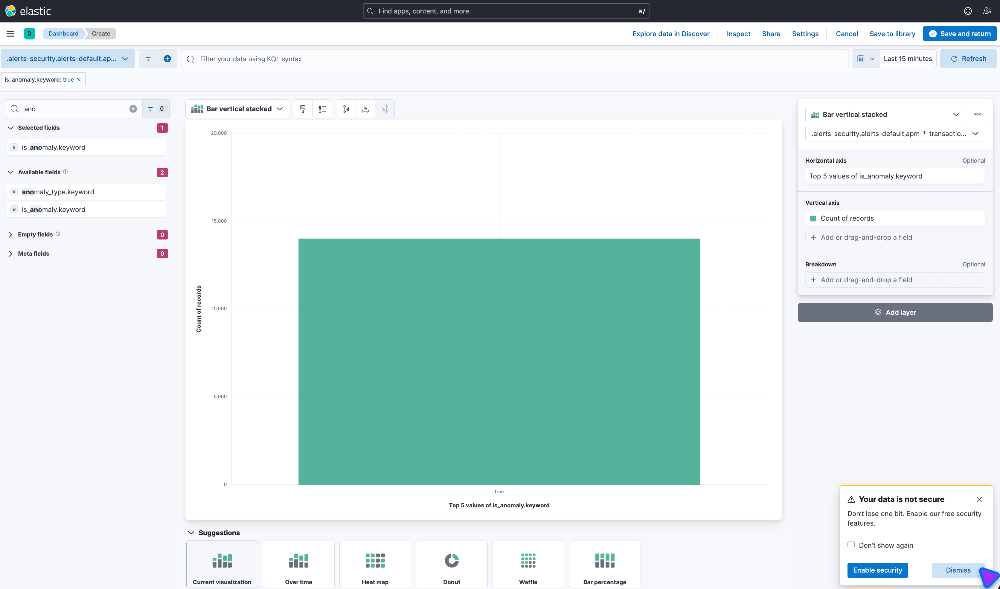
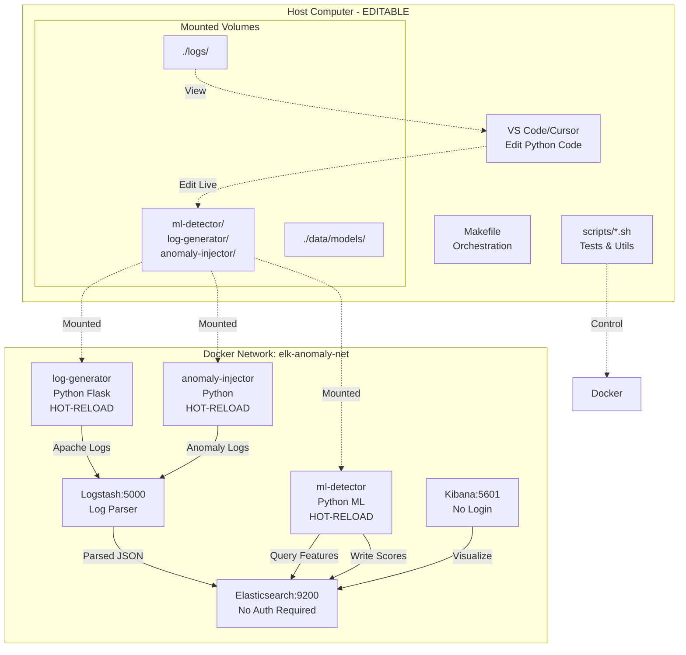

# ELK Stack Anomaly Detection Lab

A comprehensive, Docker-based educational laboratory demonstrating machine learning-powered anomaly detection in network and application traffic using the ELK Stack (Elasticsearch, Logstash, Kibana) with Isolation Forest and Autoencoder algorithms.

## 🎥 Demo Video

[](https://www.youtube.com/watch?v=JHC_Zs-km3Q)

**Watch the complete tutorial:** [ELK Stack Machine Learning Anomaly Detection - Complete Tutorial](https://www.youtube.com/watch?v=JHC_Zs-km3Q)

[](https://opensource.org/licenses/MIT)

## Screenshot



## 🎯 Overview

This lab demonstrates how two complementary machine learning algorithms detect different types of anomalies in real-time:

- **Isolation Forest**: Detects volume-based anomalies (traffic bursts, rate spikes)
- **Autoencoder**: Detects pattern-based anomalies (unusual sequences, latency spikes, scanning)

**Key Features:**
- ✅ One-command setup with Docker Compose
- ✅ Hot-reload development (edit code live!)
- ✅ No authentication required (educational mode)
- ✅ Automated testing and demonstrations
- ✅ Pre-configured Kibana dashboards
- ✅ Real-time monitoring tools
- ✅ CI/CD ready

## 📖 Quick Start

See [QUICKSTART.md](QUICKSTART.md) for a 3-minute getting started guide.

```bash
# Clone and enter directory
git clone <repository-url>
cd ELK-Anomaly-Detection

# Build and start (recommended for first run)
make build
make start       # Starts services + initializes Elasticsearch

# OR manual setup
make build
make up         # Start services only
make init       # Initialize Elasticsearch for single-node

# Verify health
make health

# Run automated demo
make demo

# Open Kibana
open http://localhost:5601
```

## 🏗️ Architecture



## 📚 Theory

### How Isolation Forest Works

**Isolation Forest** is an unsupervised machine learning algorithm that detects anomalies by **isolation** rather than modeling normal behavior.

**Core Concept:**
- Normal points are **hard to isolate** (require many splits in a decision tree)
- Anomalies are **easy to isolate** (require few splits)

**Process:**
1. Build random decision trees
2. For each point, count the number of splits needed to isolate it
3. Points that isolate quickly (few splits) = anomalies

**Best for:**
- Volume spikes (burst attacks)
- Rate anomalies
- Outliers in numerical features

**Parameters:**
- `contamination`: Expected proportion of anomalies (default: 0.05 = 5%)
- `n_estimators`: Number of trees (default: 100)

### How Autoencoders Work

**Autoencoders** are neural networks trained to **reconstruct their input**. They learn to compress (encode) and decompress (decode) normal data patterns.

**Core Concept:**
- Train on **normal data only**
- Normal patterns: Low reconstruction error
- Anomalies: High reconstruction error (network doesn't know how to reconstruct them)

**Architecture:**
```
Input (8) → Encoder (16→8→4) → Bottleneck (4) → Decoder (4→8→16) → Output (8)
```

**Process:**
1. Train network to reconstruct normal traffic features
2. For new data, measure **reconstruction error** (MSE)
3. High error = anomaly

**Best for:**
- Pattern deviations
- Sequential anomalies (port scanning)
- Latency spikes
- Unusual request patterns

**Parameters:**
- `epochs`: Training iterations (default: 50)
- `threshold`: 95th percentile of training errors

### Algorithm Comparison

| Feature | Isolation Forest | Autoencoder |
|---------|------------------|-------------|
| **Type** | Tree-based | Neural network |
| **Training Speed** | Fast (~1 second) | Moderate (~60 seconds) |
| **Detection Speed** | Very fast (~100ms) | Fast (~200ms) |
| **Best for** | Volume anomalies | Pattern anomalies |
| **Interpretability** | High | Low |
| **Memory Usage** | Low | Moderate |

**Combined Approach:** Using both algorithms provides comprehensive anomaly coverage!

## 💻 Development Mode

### Hot-Reload Enabled

All Python code is mounted from the host, allowing live editing:

```bash
# Open in your IDE
code .  # VS Code
cursor .  # Cursor

# Edit any file in:
- ml-detector/
- log-generator/
- anomaly-injector/

# Changes apply immediately (container auto-restarts)
```

### VS Code/Cursor Integration

**Recommended Extensions:**
- Python (Microsoft)
- Docker (Microsoft)
- YAML (Red Hat)
- Markdown Preview Mermaid Support

**Debugging Workflow:**
1. Edit `ml-detector/isolation_forest.py`
2. Save file (Cmd+S / Ctrl+S)
3. Watch container restart: `make logs`
4. Test change: `make test-isolation-forest`

**View Logs in IDE:**
- All logs are in `./logs/` (mounted to host)
- Open `logs/ml-detector/` to see ML service logs
- Tail in terminal: `make logs`

### Configuration

Edit `config/ml-config.yaml` to tune algorithms:

```yaml
isolation_forest:
  contamination: 0.05  # Change detection threshold
  n_estimators: 100

autoencoder:
  epochs: 50
  learning_rate: 0.001

thresholds:
  isolation_forest: 0.7
  autoencoder_reconstruction: 0.15
```

Changes apply on next detection cycle (30 seconds).

## 🧪 Testing

### Automated Tests

```bash
make tests                    # Run all tests
make test-baseline           # Verify normal traffic
make test-isolation-forest   # Test volume detection
make test-autoencoder        # Test pattern detection
make test-comparison         # Compare algorithms
make test-dashboard          # Verify Kibana
```

### Manual Anomaly Injection

```bash
make inject-burst      # Volume spike (1000+ req/30s)
make inject-errors     # Error flood (404/500)
make inject-slow       # Latency spike (5-10s responses)
make inject-scan       # Port/path scanning
make inject-all        # All types sequentially
make inject-custom     # Interactive custom injection
```

### Monitoring

```bash
make monitor    # Real-time terminal dashboard
make health     # System health check
make export     # Export results to CSV
make report     # Generate HTML report
```

## 📊 Kibana Dashboards

Access Kibana at: http://localhost:5601 (no login required)

**Pre-configured Visualizations:**
- Time series: Requests per minute with anomaly markers
- Dual-axis chart: Isolation Forest vs Autoencoder scores
- Heatmap: Response time distribution
- Data table: Anomalous requests with details

## 🎓 Educational Use

### For Students

**Learning Objectives:**
1. Understand unsupervised anomaly detection
2. Compare tree-based vs neural network approaches
3. Apply ML to cybersecurity (intrusion detection)
4. Work with ELK Stack for log analysis

**Exercises:**
1. Modify `contamination` parameter and observe detection sensitivity
2. Create a new anomaly type in `anomaly-injector/injector.py`
3. Add a new feature to the feature extraction pipeline
4. Tune the autoencoder architecture

### For Instructors

**Demonstration Flow (10 minutes):**
1. `make up && make health` (1 min)
2. Open Kibana, show normal traffic baseline (2 min)
3. `make inject-burst` and watch detection (3 min)
4. `make monitor` to show real-time detection (2 min)
5. `make test-comparison` to compare algorithms (2 min)

**Assessment Ideas:**
- Lab report: `make report` generates HTML summary
- Modify detection threshold and measure false positive rate
- Add a new feature and measure detection improvement

## 🔧 Troubleshooting

### Services Won't Start

**Problem:** `make up` fails or containers crash

**Solutions:**
```bash
# Check Docker memory allocation (needs 4GB+)
docker stats

# Increase Docker Desktop memory:
# Docker Desktop → Preferences → Resources → Memory → 4GB+

# Check logs
make logs

# Restart everything
make restart
```

### Elasticsearch "Circuit Breaker" Error

**Problem:** `[parent] Data too large`

**Solution:**
```bash
# Reduce memory usage in .env
ES_MEMORY=2g    # or lower if needed

# Restart
make restart
```

### No Logs Appearing

**Problem:** Elasticsearch has 0 documents

**Solutions:**
```bash
# Wait for log generator to start (30 seconds)
sleep 30 && make health

# Check log generator logs
docker-compose logs log-generator

# Manually verify
curl http://localhost:9200/logs-*/_count
```

### ML Models Not Training

**Problem:** ML detector logs show "Models not loaded"

**Solution:**
```bash
# Models train automatically on first data
# Wait 2-3 minutes after startup
sleep 180 && make health

# Check ML detector logs
docker-compose logs ml-detector

# Manually trigger detection
make test-isolation-forest
```

### Kibana Not Loading

**Problem:** http://localhost:5601 times out

**Solutions:**
```bash
# Kibana takes 60-90 seconds to initialize
wait_for_kibana  # or just wait

# Check Kibana health
curl http://localhost:5601/api/status

# Check Kibana logs
docker-compose logs kibana
```

## 🔒 Security Note

**⚠️ Important:** This lab has security **disabled** for educational purposes.

**What's disabled:**
- Elasticsearch authentication
- Kibana login
- TLS/SSL encryption

**For Production Use:**
See [config/security.md](config/security.md) for instructions to enable security.

## 📦 System Requirements

| Component | Minimum | Recommended |
|-----------|---------|-------------|
| **RAM** | 4GB | 8GB |
| **CPU** | 2 cores | 4 cores |
| **Disk** | 10GB free | 20GB free |
| **Docker** | 20.10+ | Latest |
| **Docker Compose** | 2.0+ | Latest |

**Docker Desktop Settings:**
- Memory: 4GB minimum (8GB recommended)
- CPUs: 2 minimum (4 recommended)

## 🚀 Real-World Applications

This lab demonstrates techniques used in:

- **Security Operations Centers (SOCs)**: Real-time threat detection
- **Network Monitoring**: Identify DDoS, port scanning, data exfiltration
- **Application Performance**: Detect latency spikes, error rates
- **DevOps/SRE**: Anomaly detection in metrics and logs
- **Fraud Detection**: Unusual transaction patterns

**Industry Tools Using Similar Approaches:**
- Elastic SIEM (uses ML for anomaly detection)
- Splunk UBA (User Behavior Analytics)
- Datadog Watchdog (algorithmic monitoring)
- AWS GuardDuty (threat detection)

## 📚 References

### Academic Papers

1. **Isolation Forest:** Liu, F. T., Ting, K. M., & Zhou, Z. H. (2008). "Isolation Forest." In 2008 Eighth IEEE International Conference on Data Mining.

2. **Autoencoders for Anomaly Detection:** Sakurada, M., & Yairi, T. (2014). "Anomaly detection using autoencoders with nonlinear dimensionality reduction."

### Documentation

- [Elasticsearch Documentation](https://www.elastic.co/guide/en/elasticsearch/reference/current/index.html)
- [Scikit-learn Isolation Forest](https://scikit-learn.org/stable/modules/generated/sklearn.ensemble.IsolationForest.html)
- [TensorFlow/Keras Autoencoders](https://www.tensorflow.org/tutorials/generative/autoencoder)

## 🤝 Contributing

Contributions welcome! Areas for improvement:
- Additional anomaly types
- More ML algorithms (LSTM, VAE, One-Class SVM)
- Enhanced visualizations
- Performance optimizations

## 📝 License

MIT License - see [LICENSE](LICENSE) file for details.

## 🙏 Acknowledgments

Built with:
- Elastic Stack (Elasticsearch, Logstash, Kibana)
- scikit-learn (Isolation Forest)
- TensorFlow/Keras (Autoencoder)
- Docker & Docker Compose

---

**Made for education 🎓 | Happy learning! 🚀**

