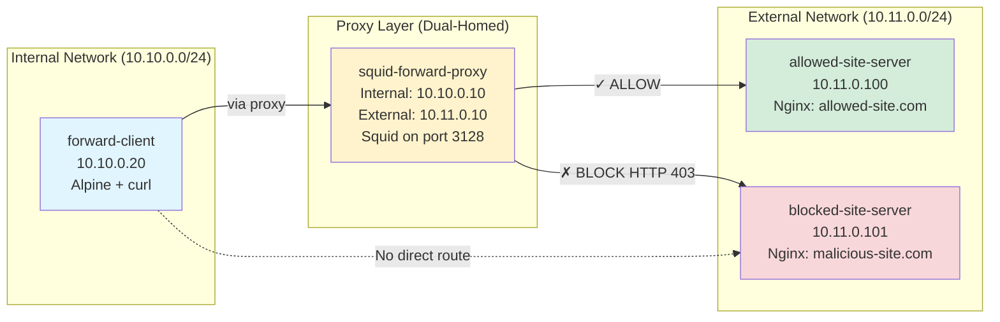
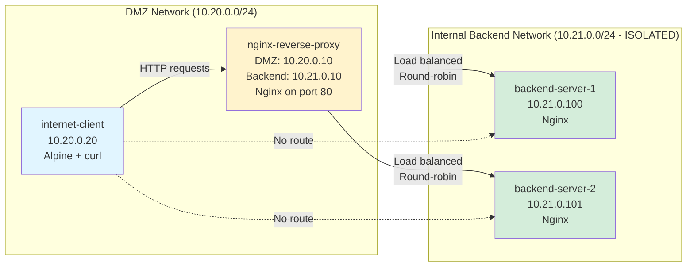

# Application Proxy Firewall Lab - Educational Demo

## Introduction

This lab provides hands-on experience with **Application-Level Gateway (ALG)** firewalls, also known as Application Proxy Firewalls. Unlike packet-filtering firewalls that operate at lower network layers, application proxies work at **Layer 7 (Application Layer)** of the TCP/IP stack, enabling deep inspection of protocol content and commands.

### Purpose
- Educational demonstration of forward and reverse proxy configurations
- Understand traffic control and security at the HTTP application layer
- Learn protocol-level filtering and inspection techniques

### Audience
This lab is designed for **cybersecurity students** learning about:
- Network security architectures
- Application layer firewalls
- Proxy-based security controls
- Traffic inspection and filtering

### Learning Objectives
By completing this lab, you will understand:
1. How forward proxies control outbound (egress) traffic
2. How reverse proxies protect inbound (ingress) traffic
3. The difference between network-layer and application-layer filtering
4. Practical implementation of domain-based access control
5. Load balancing and backend server protection techniques

## Key Concepts

### Forward Proxy
A **forward proxy** sits between clients and the internet, acting on behalf of clients.

- **Direction**: Outbound (Client → Proxy → Internet)
- **Purpose**: Control what external resources internal users can access
- **Use Cases**:
  - Content filtering (block malicious/inappropriate sites)
  - Bandwidth management and caching
  - User anonymity and privacy
  - Compliance and audit logging

**Example**: Corporate network where employees' web requests go through a Squid proxy that blocks social media sites and logs all internet activity.

### Reverse Proxy
A **reverse proxy** sits in front of backend servers, acting on behalf of servers.

- **Direction**: Inbound (Internet → Proxy → Backend Servers)
- **Purpose**: Protect internal servers from direct internet exposure
- **Use Cases**:
  - Load balancing across multiple servers
  - SSL/TLS termination
  - DDoS protection and rate limiting
  - Hide internal network topology

**Example**: Web application where all user requests hit an Nginx reverse proxy that distributes traffic across multiple backend servers and hides their real IP addresses.

### Application Layer Gateway (ALG)
Application proxies provide the highest level of security by:
- **Terminating connections**: No direct end-to-end connection between client and server
- **Protocol inspection**: Understanding and validating application-layer commands (HTTP methods, headers, etc.)
- **Content filtering**: Blocking specific URLs, domains, or content types
- **Logging**: Full audit trail of all requests and responses

### Comparison Table

| Feature | Forward Proxy | Reverse Proxy |
|---------|---------------|---------------|
| **Protects** | Clients (internal users) | Servers (internal services) |
| **Traffic Direction** | Outbound (egress) | Inbound (ingress) |
| **Client Awareness** | Clients must configure proxy | Clients unaware of proxy |
| **Typical Location** | Internal network edge | DMZ or internet-facing |
| **Primary Goal** | Control what users access | Protect and distribute to backends |
| **Common Tools** | Squid, Proxy.pac | Nginx, HAProxy, Apache |

### HTTP-Only Note
This lab uses **HTTP only** for educational simplicity. Real-world production deployments use **HTTPS** with SSL/TLS encryption. The security concepts demonstrated here (filtering, inspection, isolation) apply equally to HTTPS, though certificate handling adds complexity.

## Prerequisites

### Required Software
- **Docker Engine** 20.10 or higher
- **Docker Compose** v2.0 or higher
- **Make** utility (typically pre-installed on macOS/Linux)

### System Requirements
- ~200MB disk space for container images
- Ability to run multiple Docker containers simultaneously
- **No internet connection required** - this is a fully offline lab

### Verify Installation
```bash
docker --version          # Should show 20.10+
docker compose version    # Should show v2.0+
make --version           # Should show GNU Make
```

## Lab Setup

### Quick Start
```bash
# Clone or navigate to the lab directory
cd Proxy-Demonstration

# View all available commands
make help

# Build and start all containers (takes 2-3 minutes first time)
make build

# Run all automated tests
make test

# View logs from proxies
make logs-forward    # Squid forward proxy logs
make logs-reverse    # Nginx reverse proxy logs

# Clean up when done (preserves test logs)
make clean
```

### Directory Structure
```
Proxy-Demonstration/
├── README.md                    # This file
├── Makefile                     # Automation commands
├── PLAN-Proxy-Firewall.md      # Detailed implementation plan
├── scripts/                     # Test automation scripts
│   ├── run-all-tests.sh
│   ├── test-forward-proxy.sh
│   └── test-reverse-proxy.sh
├── logs/                        # Preserved test results
├── forward-proxy-lab/          # Forward proxy scenario
│   ├── docker-compose.yml
│   ├── squid/
│   ├── allowed-site/
│   ├── blocked-site/
│   └── README.md
└── reverse-proxy-lab/          # Reverse proxy scenario
    ├── docker-compose.yml
    ├── nginx/
    ├── backend-servers/
    └── README.md
```

## Running Tests

### Automated Testing
The lab includes automated test scripts that verify each security scenario:

```bash
# Run all tests for both scenarios
make test

# Run only forward proxy tests (4 tests)
make test-forward

# Run only reverse proxy tests (5 tests)
make test-reverse
```

### Understanding Test Output
Test scripts provide **color-coded output**:
- 🟢 **GREEN (✓ PASS)**: Test succeeded as expected
- 🔴 **RED (✗ FAIL)**: Test failed or unexpected result
- 🟡 **YELLOW (INFO)**: Informational messages
- 🔵 **BLUE (LOG)**: Relevant log excerpts from proxies

Each test shows:
```
========================================
[TEST N] Test Name
========================================
ACTION: What request is being sent
EXPECTED: What should happen
RESULT: ✓ PASS or ✗ FAIL
RESPONSE: HTTP response excerpt
LOGS: Relevant proxy log lines
```

### Log Preservation
All test results are automatically saved to the `logs/` directory with timestamps:
```
logs/
├── forward-proxy-test-2025-11-22-143025.log
└── reverse-proxy-test-2025-11-22-143110.log
```

Logs are preserved even after running `make clean`, allowing you to review test results later.

## Network Diagrams

### Forward Proxy Architecture



**Key Points**:
- Client can only reach internet via proxy (network isolation on `proxy-lab-internal`)
- Proxy uses ACL rules to allow/block domains
- Blocked site is unreachable even if client tries to bypass
- All requests are logged to `/var/log/squid/access.log` for audit
- Networks: `proxy-lab-internal` (10.10.0.0/24), `proxy-lab-external` (10.11.0.0/24)

### Reverse Proxy Architecture



**Key Points**:
- Client cannot directly access backend servers (topology hiding on `proxy-lab-backend`)
- Reverse proxy distributes requests across backends (load balancing)
- Proxy filters HTTP methods with `limit_except` (returns HTTP 403)
- Backend network is marked as `internal: true` (no external connectivity)
- Networks: `proxy-lab-dmz` (10.20.0.0/24), `proxy-lab-backend` (10.21.0.0/24)

## Lab Scenarios

### Scenario 1: Forward Proxy (Squid)
**Location**: `forward-proxy-lab/`

Demonstrates **egress control** using Squid forward proxy:
- ✅ **Test 1**: Allow requests to safe domains
- ❌ **Test 2**: Block requests to malicious domains
- 🔒 **Test 3**: Enforce proxy usage (no bypass)
- 📋 **Test 4**: Audit logging and forensics

**Learn about**: Content filtering, compliance logging, network isolation

### Scenario 2: Reverse Proxy (Nginx)
**Location**: `reverse-proxy-lab/`

Demonstrates **ingress protection** using Nginx reverse proxy:
- ⚖️ **Test 1**: Load balancing across backends
- 🔒 **Test 2**: Backend network isolation
- 🛡️ **Test 3**: Header manipulation and info hiding
- ⛔ **Test 4**: HTTP method filtering
- 📋 **Test 5**: Access logging and monitoring

**Learn about**: Load distribution, topology hiding, attack surface reduction

## Learning Outcomes

After completing this lab, you will be able to:

1. **Explain the difference** between forward and reverse proxies
2. **Implement domain-based filtering** using ACL rules
3. **Configure load balancing** for high availability
4. **Demonstrate network isolation** to prevent direct access
5. **Analyze proxy logs** for security monitoring
6. **Apply proxy concepts** to real-world security architectures

### Security Concepts Covered

| Concept | Forward Proxy | Reverse Proxy |
|---------|---------------|---------------|
| **Content Filtering** | Block malicious domains | Block unauthorized methods |
| **Network Isolation** | Prevent proxy bypass | Hide backend topology |
| **Audit Logging** | Track user activity | Monitor incoming requests |
| **Traffic Control** | Egress filtering | Load distribution |
| **Defense in Depth** | Single exit point | Multiple backend layers |

### Real-World Applications

**Forward Proxy Use Cases**:
- Corporate networks (employee internet access control)
- Educational institutions (student filtering)
- Public WiFi hotspots (content restrictions)
- Cloud egress control (data exfiltration prevention)

**Reverse Proxy Use Cases**:
- Web Application Firewalls (WAF)
- Content Delivery Networks (CDN origin shields)
- API Gateways (microservices protection)
- E-commerce sites (high-traffic handling)

## Troubleshooting

### Containers Not Starting
```bash
# Check Docker daemon status
docker info

# View container logs
docker compose -f forward-proxy-lab/docker-compose.yml logs

# Restart containers
make clean
make build
```

### Tests Failing
```bash
# Verify containers are running
docker ps

# Check if all expected containers are present
docker ps | grep -E 'forward-client|squid-forward-proxy|internet-client|nginx-reverse-proxy'

# Rebuild if needed
make clean
make build
```

### DNS Resolution Issues
- The lab uses custom `/etc/hosts` files in containers
- If domains don't resolve, check container logs
- Verify network connectivity with: `docker exec forward-client ping -c 2 squid-forward-proxy`

### Permission Errors
```bash
# Ensure scripts are executable
chmod +x scripts/*.sh

# On macOS/Linux, you may need to allow Docker to access the workspace directory
```

### Port Conflicts
If you get "port already in use" errors:
```bash
# Check what's using the port
lsof -i :80    # or :3128 for Squid
netstat -an | grep LISTEN

# Stop conflicting services or modify docker-compose.yml ports
```

## Additional Resources

### Further Reading
- [Squid Proxy Documentation](http://www.squid-cache.org/Doc/)
- [Nginx Reverse Proxy Guide](https://docs.nginx.com/nginx/admin-guide/web-server/reverse-proxy/)
- [OWASP - Application Layer Gateway](https://owasp.org/)

### Next Steps
After mastering this lab:
1. Add HTTPS support with self-signed certificates
2. Implement rate limiting and DDoS protection
3. Add authentication to proxies
4. Integrate with SIEM for security monitoring
5. Explore WAF rules (ModSecurity with Nginx)

## License and Usage

This lab is intended for **educational purposes only**. Feel free to:
- Use in classroom settings
- Modify for your curriculum
- Share with students and colleagues

---

**Ready to start?** Run `make build` to begin! 🚀

