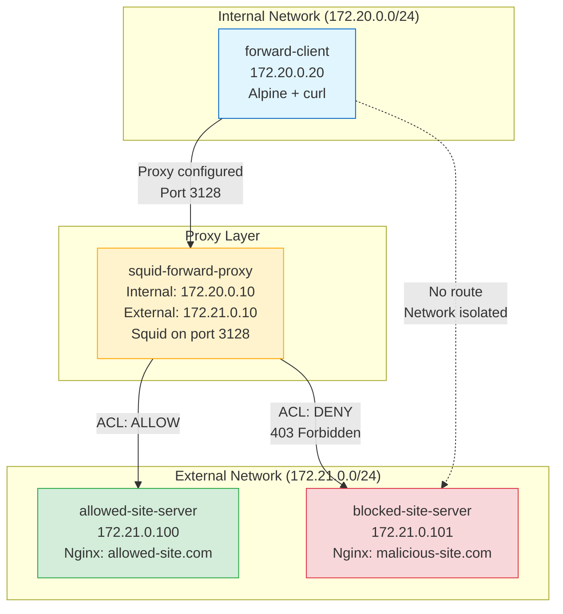

# Forward Proxy Lab - Squid Configuration

## Overview

This lab demonstrates a **forward proxy** using Squid to control outbound (egress) traffic. The forward proxy acts as an intermediary between internal clients and external internet resources, enforcing domain-based access control policies.

## Architecture Diagram



## Network Architecture

### Network Isolation
- **Internal Network** (`172.20.0.0/24`): Contains the client container
  - Client can only reach the proxy, not the internet directly
  - Simulates corporate internal network
  
- **External Network** (`172.21.0.0/24`): Contains web servers
  - Proxy has access to both networks (dual-homed)
  - Web servers are isolated from internal network
  - Simulates the internet

### Container Details

| Container | Network | IP Address | Purpose |
|-----------|---------|------------|---------|
| `forward-client` | internal-network | 172.20.0.20 | Simulates internal user |
| `squid-forward-proxy` | internal-network | 172.20.0.10 | Proxy's internal interface |
| `squid-forward-proxy` | external-network | 172.21.0.10 | Proxy's external interface |
| `allowed-site-server` | external-network | 172.21.0.100 | Simulates safe website |
| `blocked-site-server` | external-network | 172.21.0.101 | Simulates malicious website |

## Domain Name Resolution

The lab uses custom `/etc/hosts` file in the client container to simulate domain names:

```
172.21.0.100  allowed-site.com www.allowed-site.com
172.21.0.101  malicious-site.com www.malicious-site.com
```

**Real-world equivalent**: In production, external DNS servers would resolve domain names. This lab simulates that without requiring internet access.

## Squid ACL Configuration

The Squid proxy uses Access Control Lists (ACLs) to filter traffic:

```conf
# Define allowed domains
acl allowed_domains dstdomain allowed-site.com
acl allowed_domains dstdomain www.allowed-site.com

# Define blocked domains
acl blocked_domains dstdomain malicious-site.com
acl blocked_domains dstdomain www.malicious-site.com

# Access rules (order matters!)
http_access deny blocked_domains    # Explicitly block malicious sites
http_access allow allowed_domains   # Allow safe sites
http_access deny all                # Default deny everything else
```

### How ACLs Work
1. Client sends request via proxy: `http://malicious-site.com`
2. Squid extracts destination domain from HTTP request
3. Squid evaluates ACL rules in order:
   - Check if domain matches `blocked_domains` → YES → **DENY (403)**
4. Request never reaches the web server

**Security benefit**: Application-layer inspection allows filtering based on domain names, not just IP addresses.

## Test Cases

### Test 1: Allowed Traffic ✅
**Objective**: Verify proxy permits access to allowed domains

**Command**:
```bash
docker exec forward-client curl -x squid-forward-proxy:3128 http://allowed-site.com
```

**Expected Result**:
- HTTP 200 OK response
- HTML content from allowed-site-server
- Log entry in Squid showing `TCP_MISS/200`

**Learning**: ACL permit rules, request logging

---

### Test 2: Blocked Traffic ❌
**Objective**: Verify proxy blocks access to malicious domains

**Command**:
```bash
docker exec forward-client curl -x squid-forward-proxy:3128 http://malicious-site.com
```

**Expected Result**:
- HTTP 403 Forbidden response
- Error page from Squid (not from web server)
- Log entry showing `TCP_DENIED/403`

**Learning**: ACL deny rules, content filtering at application layer

---

### Test 3: Proxy Bypass Attempt 🔒
**Objective**: Verify network isolation prevents direct access

**Command**:
```bash
docker exec forward-client curl http://malicious-site.com --max-time 5
```

**Expected Result**:
- Connection timeout or "Could not resolve host"
- No route to external network
- Client is isolated to internal network only

**Learning**: Network-level enforcement, defense in depth

---

### Test 4: Log Inspection 📋
**Objective**: View audit trail of all requests

**Command**:
```bash
docker logs squid-forward-proxy | grep -E "TCP_MISS|TCP_DENIED"
```

**Expected Output**:
```
TCP_MISS/200 ... GET http://allowed-site.com/
TCP_DENIED/403 ... GET http://malicious-site.com/
```

**Learning**: Forensic analysis, compliance monitoring, incident response

## Manual Testing

### Start the Lab
```bash
cd forward-proxy-lab
docker compose up -d
```

### Check Container Status
```bash
docker compose ps
```

All containers should show "running" status.

### Test Allowed Site
```bash
docker exec forward-client curl -v -x squid-forward-proxy:3128 http://allowed-site.com
```

Look for:
- `HTTP/1.1 200 OK` in response
- Green HTML page content

### Test Blocked Site
```bash
docker exec forward-client curl -v -x squid-forward-proxy:3128 http://malicious-site.com
```

Look for:
- `HTTP/1.1 403 Forbidden` in response
- Squid error page (not the red HTML from blocked-site)

### View Proxy Logs
```bash
# View all Squid logs
docker logs squid-forward-proxy

# View only access logs
docker logs squid-forward-proxy 2>&1 | grep "TCP_"

# Follow logs in real-time
docker logs -f squid-forward-proxy
```

### Test Direct Access (Should Fail)
```bash
# Try to bypass proxy - should timeout
docker exec forward-client curl http://malicious-site.com --max-time 5
```

Expected: Connection timeout or DNS resolution failure.

## Security Implications

### Egress Control
- **Single exit point**: All internet traffic must go through proxy
- **Policy enforcement**: Centralized control over what users can access
- **Data exfiltration prevention**: Block connections to known C&C servers

### Application-Layer Inspection
- **URL filtering**: Block specific paths or parameters
- **Protocol validation**: Ensure proper HTTP syntax
- **Content scanning**: Can integrate antivirus, DLP (not in this lab)

### Audit and Compliance
- **Full visibility**: Every request is logged with timestamp, user, destination
- **Forensics**: Investigate security incidents post-mortem
- **Compliance**: Prove adherence to acceptable use policies

## Real-World Applications

### Corporate Networks
- Block social media, streaming sites during work hours
- Prevent access to known malware distribution sites
- Cache frequently accessed content to save bandwidth

### Educational Institutions
- Filter inappropriate content for students
- Enforce internet usage policies
- Monitor for cyberbullying or threats

### Public WiFi
- Protect users from malicious sites
- Prevent abuse of network resources
- Collect analytics on network usage

## Configuration Files

### squid.conf
Location: `forward-proxy-lab/squid/squid.conf`

Key directives:
- `http_port 3128`: Proxy listens on port 3128
- `acl ... dstdomain ...`: Define domain ACLs
- `http_access deny/allow ...`: Enforce access rules
- `access_log stdio:/var/log/squid/access.log`: Log all requests

### docker-compose.yml
Location: `forward-proxy-lab/docker-compose.yml`

Key features:
- Multi-network setup for isolation
- Static IP addresses for predictable testing
- Volume mounts for persistent logs
- Custom /etc/hosts for domain simulation

## Troubleshooting

### Proxy Not Blocking
If blocked sites are accessible:
1. Check ACL syntax in `squid.conf`
2. Verify domain names match exactly
3. Remember: ACLs are case-sensitive
4. Check ACL rule order (deny before allow)

### DNS Resolution Failing
If domain names don't resolve:
1. Verify `/etc/hosts` in client container:
   ```bash
   docker exec forward-client cat /etc/hosts
   ```
2. Check IP addresses match docker-compose.yml
3. Ensure containers are on correct networks

### Cannot Connect to Proxy
If client can't reach proxy:
1. Verify proxy is running: `docker ps | grep squid`
2. Check network connectivity:
   ```bash
   docker exec forward-client ping -c 2 squid-forward-proxy
   ```
3. Check port 3128 is open on proxy

### Logs Not Appearing
If Squid logs are empty:
1. Check volume mount: `docker volume inspect squid-logs`
2. Verify log file permissions
3. Ensure Squid started successfully: `docker logs squid-forward-proxy`

## Stop the Lab
```bash
docker compose down
```

To also remove volumes (clears logs):
```bash
docker compose down -v
```

---

**Next**: Try the [Reverse Proxy Lab](../reverse-proxy-lab/) to learn about ingress protection!

