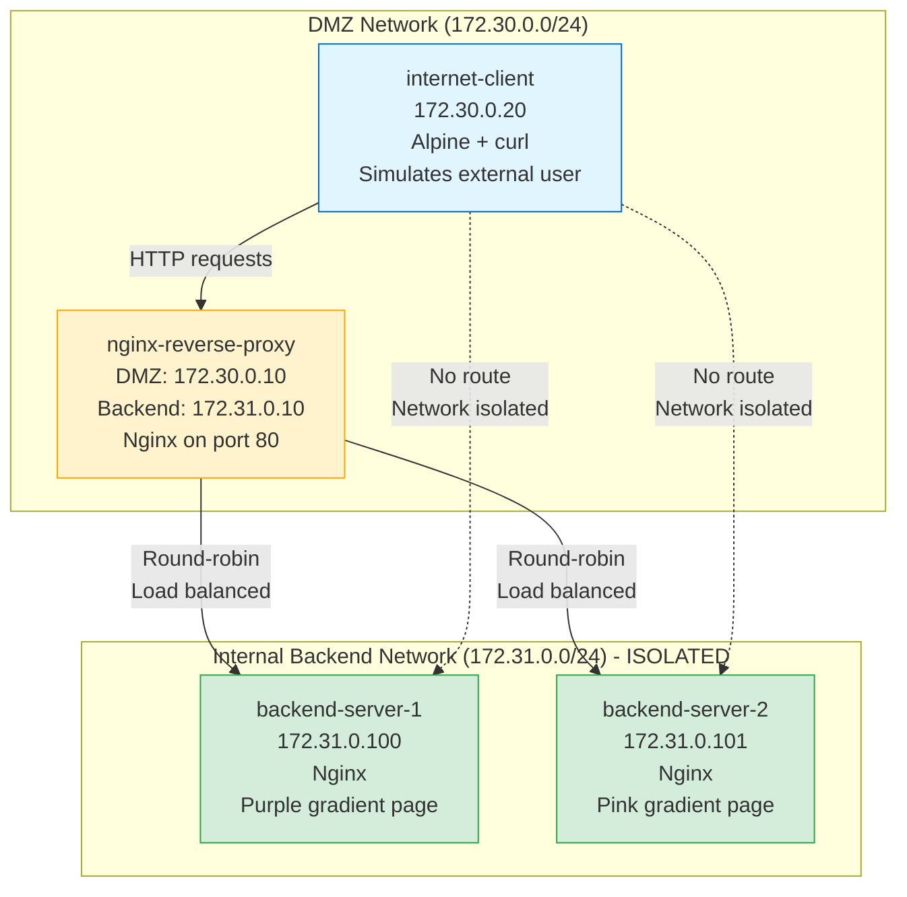

# Reverse Proxy Lab - Nginx Configuration

## Overview

This lab demonstrates a **reverse proxy** using Nginx to protect inbound (ingress) traffic. The reverse proxy sits in front of backend servers, providing load balancing, security filtering, and topology hiding.

## Architecture Diagram



## Network Architecture

### Network Isolation
- **DMZ Network** (`172.30.0.0/24`): Semi-trusted zone
  - Contains the reverse proxy (frontend interface)
  - Contains the client (simulating internet users)
  - Accessible from "internet" but not to backend
  
- **Backend Network** (`172.31.0.0/24`): Trusted internal zone
  - Contains backend application servers
  - **Internal-only network** (no external routing)
  - Reverse proxy is the ONLY way in
  - Simulates protected corporate network

### Container Details

| Container | Network(s) | IP Address(es) | Purpose |
|-----------|------------|----------------|---------|
| `internet-client` | dmz-network | 172.30.0.20 | Simulates external internet user |
| `nginx-reverse-proxy` | dmz-network | 172.30.0.10 | Proxy's external interface |
| `nginx-reverse-proxy` | backend-network | 172.31.0.10 | Proxy's internal interface |
| `backend-server-1` | backend-network | 172.31.0.100 | Internal application server #1 |
| `backend-server-2` | backend-network | 172.31.0.101 | Internal application server #2 |

**Key Point**: The reverse proxy is **dual-homed** (connected to both networks), acting as a security gateway between the internet and internal servers.

## Nginx Configuration

### Upstream Load Balancing

```nginx
upstream backend_servers {
    server backend-server-1:80;
    server backend-server-2:80;
}
```

**How it works**:
- Nginx maintains a pool of backend servers
- Uses **round-robin** algorithm by default
- Request 1 → Server 1, Request 2 → Server 2, Request 3 → Server 1, etc.
- Automatically detects failed backends and stops routing to them

### Security Features

```nginx
# Hide nginx version
server_tokens off;

# Only allow safe HTTP methods
limit_except GET HEAD {
    deny all;
}

# Remove backend server identification
proxy_hide_header X-Powered-By;
proxy_hide_header Server;

# Add custom security headers
add_header X-Proxy-By "Nginx-Reverse-Proxy" always;
```

**Security benefits**:
1. **Method filtering**: Blocks DELETE, PUT, POST (for this lab)
2. **Information hiding**: Attackers can't fingerprint backend servers
3. **Version hiding**: Prevents version-specific exploits
4. **Custom headers**: Identifies that requests went through proxy

### Proxy Headers

```nginx
proxy_set_header Host $host;
proxy_set_header X-Real-IP $remote_addr;
proxy_set_header X-Forwarded-For $proxy_add_x_forwarded_for;
```

**Purpose**: Backend servers can see the original client IP, not the proxy's IP. Critical for logging and security analysis.

## Test Cases

### Test 1: Load Balancing ⚖️
**Objective**: Verify traffic distribution across backends

**Command**:
```bash
for i in {1..10}; do
  docker exec internet-client curl -s http://nginx-reverse-proxy | grep "BACKEND-"
done
```

**Expected Result**:
- ~5 responses from "BACKEND-1" (purple page)
- ~5 responses from "BACKEND-2" (pink page)
- Distribution demonstrates round-robin load balancing

**Learning**: High availability, fault tolerance, traffic distribution

---

### Test 2: Backend Isolation 🔒
**Objective**: Verify backends cannot be accessed directly

**Commands**:
```bash
# Try to reach backend-server-1 directly
docker exec internet-client curl http://backend-server-1 --max-time 5

# Try to reach backend-server-2 directly
docker exec internet-client curl http://backend-server-2 --max-time 5
```

**Expected Result**:
- Connection timeout or "Could not resolve host"
- Client has no route to backend network
- Network isolation enforced at Docker level

**Learning**: Defense in depth, topology hiding

---

### Test 3: Header Manipulation 🛡️
**Objective**: Verify backend server details are hidden

**Command**:
```bash
docker exec internet-client curl -I http://nginx-reverse-proxy
```

**Expected Headers**:
```
HTTP/1.1 200 OK
Server: nginx                     # Generic, not backend version
X-Proxy-By: Nginx-Reverse-Proxy   # Custom header showing proxy
X-Frame-Options: SAMEORIGIN       # Security header
```

**Not present**:
- No `X-Powered-By` header
- No backend server identification
- No version-specific information

**Learning**: Information disclosure prevention, fingerprinting protection

---

### Test 4: Forbidden Method ⛔
**Objective**: Verify HTTP method filtering

**Commands**:
```bash
# Try DELETE request
docker exec internet-client curl -X DELETE http://nginx-reverse-proxy/index.html

# Try POST request
docker exec internet-client curl -X POST http://nginx-reverse-proxy/
```

**Expected Result**:
- HTTP 405 Method Not Allowed
- Error page from Nginx (not backend)
- Only GET and HEAD methods allowed

**Learning**: Attack surface reduction, protocol filtering

---

### Test 5: Access Logs 📋
**Objective**: View request monitoring and backend selection

**Command**:
```bash
docker logs nginx-reverse-proxy 2>&1 | grep "GET / HTTP"
```

**Expected Output**:
```
172.30.0.20 - [timestamp] "GET / HTTP/1.1" 200 ... upstream=172.31.0.100:80
172.30.0.20 - [timestamp] "GET / HTTP/1.1" 200 ... upstream=172.31.0.101:80
```

**Learning**: Security monitoring, forensic analysis, load balancing verification

## Manual Testing

### Start the Lab
```bash
cd reverse-proxy-lab
docker compose up -d
```

### Check Container Status
```bash
docker compose ps
```

All containers should show "running" status.

### Test Load Balancing
```bash
# Send 10 requests and see which backend responds
for i in {1..10}; do
  echo "Request $i:"
  docker exec internet-client curl -s http://nginx-reverse-proxy | grep -E "BACKEND-[12]"
  echo "---"
done
```

Look for alternating responses between BACKEND-1 and BACKEND-2.

### Test Backend Isolation
```bash
# This should fail (timeout)
docker exec internet-client curl http://172.31.0.100 --max-time 5
```

Expected: Timeout or connection refused.

### Test HTTP Method Filtering
```bash
# GET should work
docker exec internet-client curl -X GET http://nginx-reverse-proxy

# DELETE should be blocked
docker exec internet-client curl -X DELETE http://nginx-reverse-proxy
```

Expected: GET returns 200, DELETE returns 405.

### View Proxy Logs
```bash
# View all nginx logs
docker logs nginx-reverse-proxy

# View only access logs with upstream info
docker logs nginx-reverse-proxy 2>&1 | grep upstream

# Follow logs in real-time
docker logs -f nginx-reverse-proxy
```

### Test from Host Browser (Optional)
If you want to test from your web browser:
```bash
# The compose file exposes port 8080
open http://localhost:8080
```

Refresh multiple times to see load balancing in action (page colors alternate).

## Security Implications

### Topology Hiding
- **Backend invisibility**: Attackers never see internal IPs or hostnames
- **Single target**: Only reverse proxy is exposed to attacks
- **Deception**: Attackers can't map internal network structure

### Load Balancing
- **DoS resilience**: Traffic distributed across multiple servers
- **High availability**: If one backend fails, others handle traffic
- **Performance**: Parallel processing of requests

### HTTP Method Filtering
- **Attack surface reduction**: Block dangerous methods (DELETE, PUT, TRACE)
- **Protocol enforcement**: Only allow legitimate operations
- **WAF foundation**: Can extend to filter specific URLs, patterns

### Header Manipulation
- **Information hiding**: Remove version numbers, software details
- **Fingerprinting prevention**: Attackers can't identify backend technology
- **Custom metadata**: Add security headers (CSP, HSTS in production)

### Centralized Logging
- **Single audit point**: All requests logged in one place
- **Anomaly detection**: Easier to spot attack patterns
- **Incident response**: Full request history for investigations

## Real-World Applications

### Web Application Firewalls (WAF)
- Inspect and filter HTTP/HTTPS traffic
- Block SQL injection, XSS, CSRF attacks
- Rate limiting and bot protection

### API Gateways
- Route requests to microservices
- Authentication and authorization
- Request transformation and validation

### Content Delivery Networks (CDN)
- Cache static content at edge locations
- Protect origin servers from traffic spikes
- DDoS mitigation

### E-commerce Platforms
- Handle millions of concurrent users
- Distribute load during sales events
- Protect payment processing servers

### Healthcare/Finance
- Isolate sensitive database servers
- Enforce strict access controls
- Maintain compliance audit logs

## Configuration Files

### nginx.conf
Location: `reverse-proxy-lab/nginx/nginx.conf`

Key directives:
- `upstream backend_servers {}`: Define backend pool
- `limit_except GET HEAD {}`: HTTP method filtering
- `proxy_pass http://backend_servers`: Load balancing
- `proxy_hide_header`: Remove sensitive headers
- `log_format detailed`: Custom logging with upstream info

### docker-compose.yml
Location: `reverse-proxy-lab/docker-compose.yml`

Key features:
- Multi-network setup (DMZ + backend)
- `internal: true` on backend network (no external access)
- Static IP addresses for predictable testing
- Volume mount for persistent Nginx logs
- Optional port mapping for host access

## Troubleshooting

### Load Balancing Not Working
If all requests go to one backend:
1. Check both backends are running:
   ```bash
   docker ps | grep backend-server
   ```
2. Check upstream configuration in nginx.conf
3. View nginx error log:
   ```bash
   docker logs nginx-reverse-proxy 2>&1 | grep error
   ```

### Backend Accessible Directly
If client can reach backends (should not happen):
1. Verify backend network is internal:
   ```bash
   docker network inspect backend-network | grep internal
   ```
   Should show `"internal": true`
2. Check client is only on DMZ network:
   ```bash
   docker inspect internet-client | grep NetworkMode
   ```

### Method Filtering Not Working
If DELETE/POST requests succeed:
1. Check nginx.conf has `limit_except GET HEAD {}`
2. Reload nginx configuration:
   ```bash
   docker exec nginx-reverse-proxy nginx -s reload
   ```
3. Verify with verbose curl:
   ```bash
   docker exec internet-client curl -v -X DELETE http://nginx-reverse-proxy
   ```

### Headers Not Modified
If backend headers are visible:
1. Check `proxy_hide_header` directives in nginx.conf
2. Test with verbose output:
   ```bash
   docker exec internet-client curl -I http://nginx-reverse-proxy
   ```
3. Compare to direct backend (from proxy):
   ```bash
   docker exec nginx-reverse-proxy curl -I http://backend-server-1
   ```

## Advanced Exercises

### 1. Change Load Balancing Algorithm
Modify `upstream` block to use IP hash:
```nginx
upstream backend_servers {
    ip_hash;  # Same client always goes to same backend
    server backend-server-1:80;
    server backend-server-2:80;
}
```

### 2. Add Health Checks
Configure active health monitoring:
```nginx
upstream backend_servers {
    server backend-server-1:80 max_fails=3 fail_timeout=30s;
    server backend-server-2:80 max_fails=3 fail_timeout=30s;
}
```

### 3. Implement Rate Limiting
Protect against DoS:
```nginx
limit_req_zone $binary_remote_addr zone=mylimit:10m rate=10r/s;

location / {
    limit_req zone=mylimit burst=20;
    proxy_pass http://backend_servers;
}
```

### 4. Add SSL/TLS
Encrypt traffic (requires certificates):
```nginx
server {
    listen 443 ssl;
    ssl_certificate /etc/nginx/ssl/cert.pem;
    ssl_certificate_key /etc/nginx/ssl/key.pem;
    ...
}
```

## Stop the Lab
```bash
docker compose down
```

To also remove volumes (clears logs):
```bash
docker compose down -v
```

---

**Next**: Run the automated tests with `make test-reverse` to verify all scenarios!

