# Docker Firewall Lab

A comprehensive Docker-based firewall lab designed to teach students about firewall concepts, iptables rules, and network security using containerized environments.

## 🎯 Lab Overview

This lab demonstrates four key firewall concepts:

1. **Basic Packet Filtering** - Block all traffic except allowed ports (HTTP, SSH)
2. **Port Redirection (DNAT)** - Redirect traffic from one port to another
3. **Source Filtering** - Block traffic from specific hosts
4. **Host-based Access Control** - Allow traffic only from specific hosts

## 🏗️ Architecture

The lab consists of three containers on a custom Docker network:

- **Server Container** (`server`): Hosts web services on ports 80 and 8080
- **Firewall Container** (`firewall`): Implements iptables rules and acts as a security gateway
- **Client Container** (`client`): Used for testing connectivity and firewall rules

## 🚀 Quick Start

### Prerequisites

- Docker and Docker Compose installed
- Linux/macOS environment (for iptables support)
- Basic understanding of networking concepts

### Setup Instructions

1. **Clone and navigate to the lab directory:**
   ```bash
   cd Week06-Firewall-IDS
   ```

2. **Build and start the lab:**
   ```bash
   docker-compose up --build -d
   ```

3. **Verify all containers are running:**
   ```bash
   docker-compose ps
   ```

4. **Check container health:**
   ```bash
   docker-compose logs
   ```

### Container Startup Order

The containers start in the following order:
1. **Client** - Testing container with networking tools
2. **Firewall** - Security gateway with iptables rules
3. **Server** - Web server with multiple services

## 🧪 Testing the Lab

### Access the Client Container

```bash
docker exec -it client sh
```

### Test Commands

#### 1. Test HTTP Connectivity (Should Work)
```bash
# Direct connection to server
curl -v http://server:8080/

# Through firewall port redirection (80->8080)
curl -v http://firewall:80/

# Test API endpoint
curl -v http://server:8080/api

# Test health check
curl -v http://server:8080/health
```

#### 2. Test SSH Connectivity (Should Work)
```bash
# Direct SSH to server
telnet server 22

# SSH through firewall
telnet firewall 22
```

#### 3. Test Blocked Traffic (Should Fail)
```bash
# ICMP ping (blocked by firewall rule)
ping -c 3 server

# Blocked port (e.g., MySQL port 3306)
telnet server 3306

# Blocked port (e.g., PostgreSQL port 5432)
telnet server 5432
```

#### 4. Network Discovery
```bash
# Scan firewall ports
nmap -p 80,443,22,8080 firewall

# Check network connectivity
ping firewall
ping server
```

#### 5. Advanced Testing
```bash
# Test with different user agents
curl -H 'User-Agent: TestBot' http://server:8080/

# Test HTTP methods
curl -X POST http://server:8080/api
curl -X PUT http://server:8080/api

# Test with verbose output
curl -v -i http://server:8080/
```

### Automated Testing Script

Run the provided testing script:
```bash
docker exec -it client /scripts/test-firewall.sh
```

## 🔧 Firewall Rules Explained

### Scenario 1: Basic Packet Filtering
- **Rule**: Allow only HTTP (port 80/8080) and SSH (port 22)
- **Implementation**: `iptables -A FORWARD -p tcp --dport 80 -j ACCEPT`
- **Test**: Try accessing blocked ports (3306, 5432) - should fail

### Scenario 2: Port Redirection (DNAT)
- **Rule**: Redirect port 80 traffic to server:8080
- **Implementation**: `iptables -t nat -A PREROUTING -p tcp --dport 80 -j DNAT --to-destination server:8080`
- **Test**: `curl http://firewall:80/` should work and show server content

### Scenario 3: Block Specific Host
- **Rule**: Block ICMP traffic from client IP
- **Implementation**: `iptables -A FORWARD -s client_ip -p icmp -j DROP`
- **Test**: `ping server` from client should fail

### Scenario 4: Allow Specific Host
- **Rule**: Allow SSH and HTTP from client IP only
- **Implementation**: `iptables -A FORWARD -s client_ip -p tcp --dport 22 -j ACCEPT`
- **Test**: SSH and HTTP should work from client

## 📊 Network Diagrams

### Network Topology


### Traffic Flow

```mermaid
sequenceDiagram
    participant C as Client
    participant F as Firewall
    participant S as Server
    
    Note over C,S: HTTP Request Flow
    C->>F: HTTP GET :80
    F->>F: Check iptables rules
    F->>F: DNAT 80→8080
    F->>S: HTTP GET :8080
    S->>F: HTTP Response
    F->>C: HTTP Response
    
    Note over C,S: Blocked Traffic
    C->>F: ICMP Ping
    F->>F: Check iptables rules
    F->>F: DROP (blocked by rule)
    Note over F: Packet dropped
```


### Port Mapping

```mermaid
graph LR
    subgraph "External Access"
        H[Host Machine]
    end
    
    subgraph "Docker Network"
        F[Firewall<br/>Port 80→Server:8080<br/>Port 22→Server:22]
        S[Server<br/>Port 8080: Web<br/>Port 22: SSH]
    end
    
    H -->|":8080"| S
    H -->|":2222"| S
    F -->|"Internal Routing"| S
    
    style F fill:#ff9999
    style S fill:#99ff99
```


### Container Relationships


## 🧹 Cleanup Instructions

### Stop and Remove Containers
```bash
docker-compose down
```

### Remove Images (Optional)
```bash
docker-compose down --rmi all
```

### Complete Cleanup
```bash
docker-compose down -v --rmi all
docker system prune -f
```

## 🔍 Troubleshooting

### Common Issues

1. **Containers not starting:**
   ```bash
   docker-compose logs
   docker-compose up --build
   ```

2. **Firewall rules not working:**
   ```bash
   docker exec -it firewall iptables -L -v
   docker exec -it firewall iptables -t nat -L -v
   ```

3. **Network connectivity issues:**
   ```bash
   docker network ls
   docker network inspect security_net
   ```

4. **Permission issues:**
   - Ensure Docker has necessary capabilities
   - Check if running on Linux (iptables requires Linux)

### Debug Commands

```bash
# Check container status
docker-compose ps

# View logs
docker-compose logs firewall
docker-compose logs server
docker-compose logs client

# Inspect network
docker network inspect security_net

# Check firewall rules
docker exec -it firewall iptables -L -v -n
docker exec -it firewall iptables -t nat -L -v -n

# Test connectivity
docker exec -it client ping firewall
docker exec -it client ping server
```

## 📚 Learning Objectives

After completing this lab, students will understand:

- **Firewall Concepts**: Packet filtering, port redirection, source filtering
- **iptables Rules**: INPUT, FORWARD, OUTPUT chains and NAT tables
- **Network Security**: Defense in depth, traffic control, access policies
- **Docker Networking**: Container communication, custom networks
- **Security Testing**: Penetration testing, vulnerability assessment

## 🎓 Lab Scenarios Summary

| Scenario | Concept | iptables Rule | Expected Result |
|----------|---------|---------------|-----------------|
| 1 | Block all except HTTP/SSH | `FORWARD -p tcp --dport 80 -j ACCEPT` | Only HTTP/SSH works |
| 2 | Port redirection | `PREROUTING -p tcp --dport 80 -j DNAT` | Port 80→8080 redirect |
| 3 | Block specific host | `FORWARD -s client_ip -p icmp -j DROP` | Client ping fails |
| 4 | Allow specific host | `FORWARD -s client_ip -p tcp -j ACCEPT` | Client traffic allowed |

## 📝 Additional Resources

- [iptables Documentation](https://netfilter.org/documentation/)
- [Docker Networking](https://docs.docker.com/network/)
- [Network Security Fundamentals](https://www.cisco.com/c/en/us/products/security/what-is-network-security.html)

---

**Lab Created for ITEC624 - Network Security Course**
