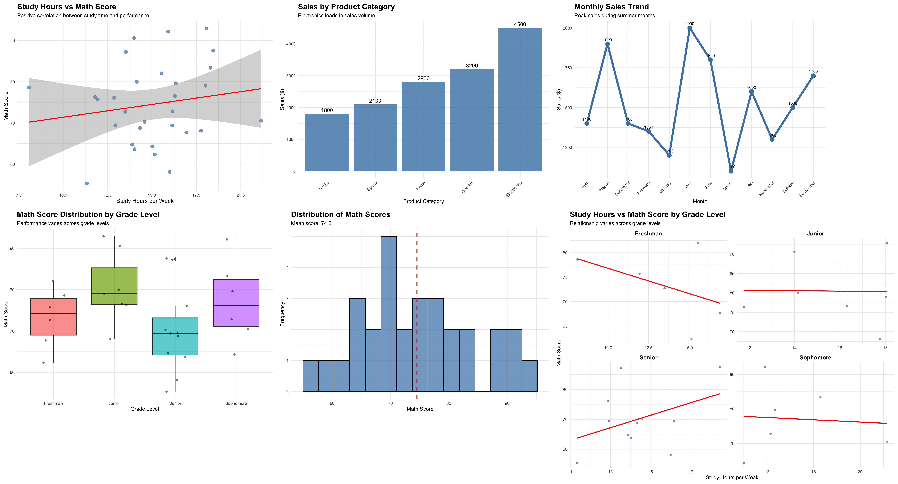
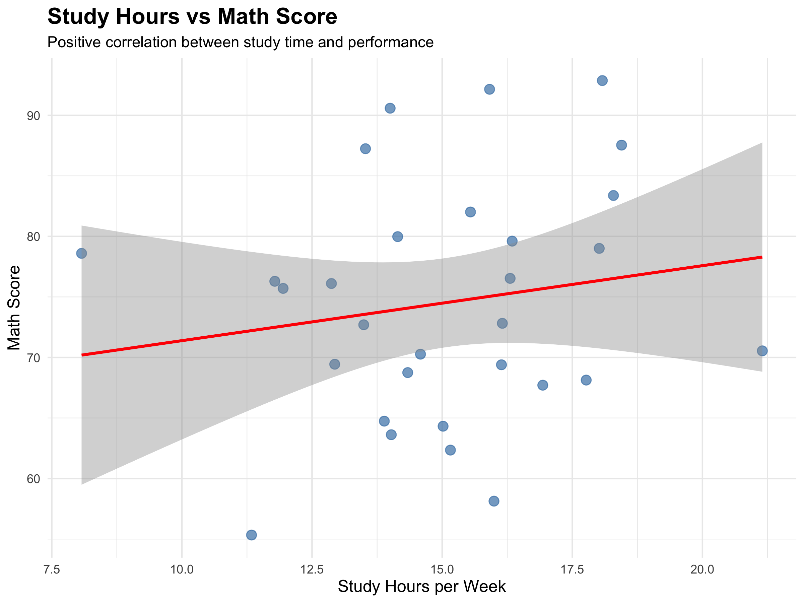
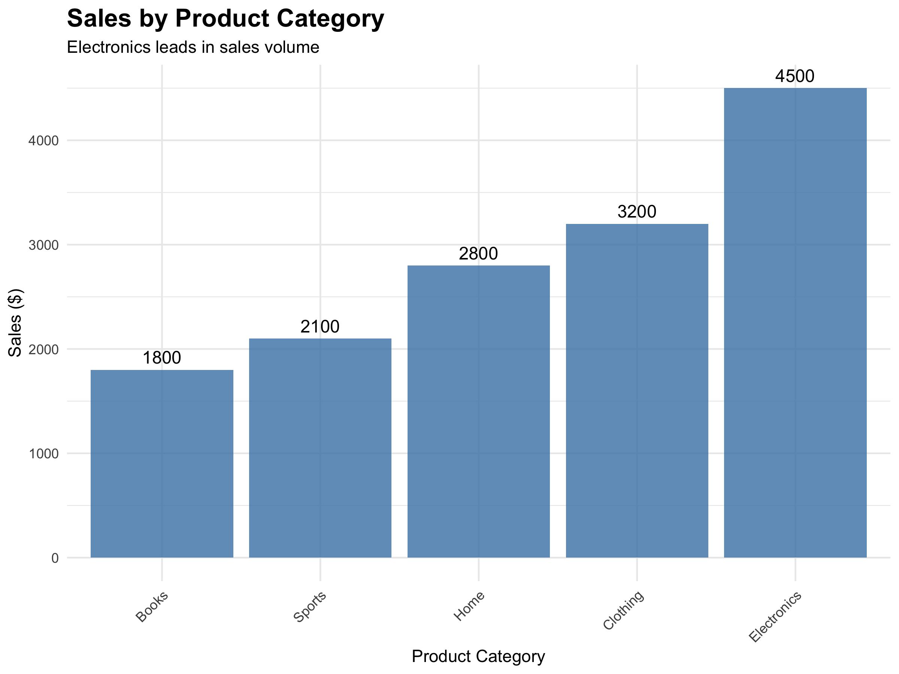
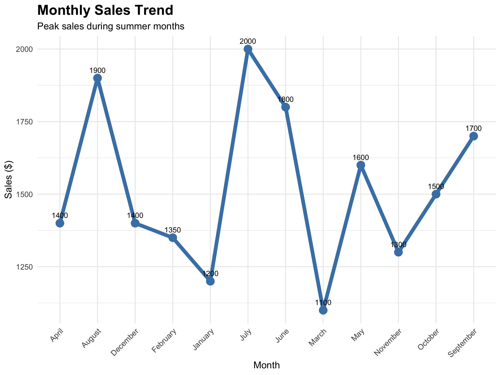
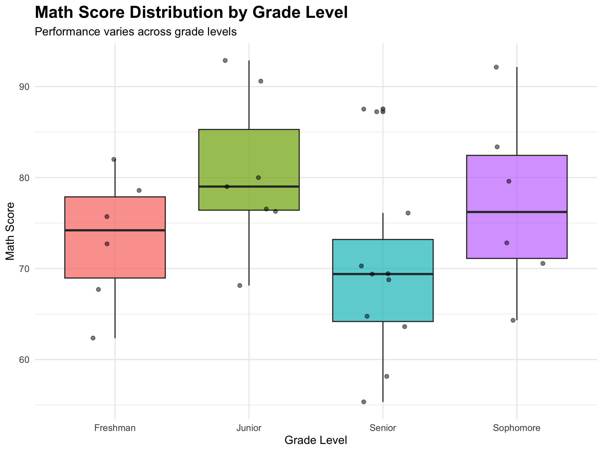
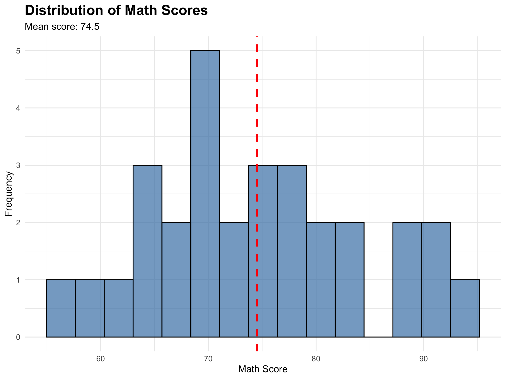
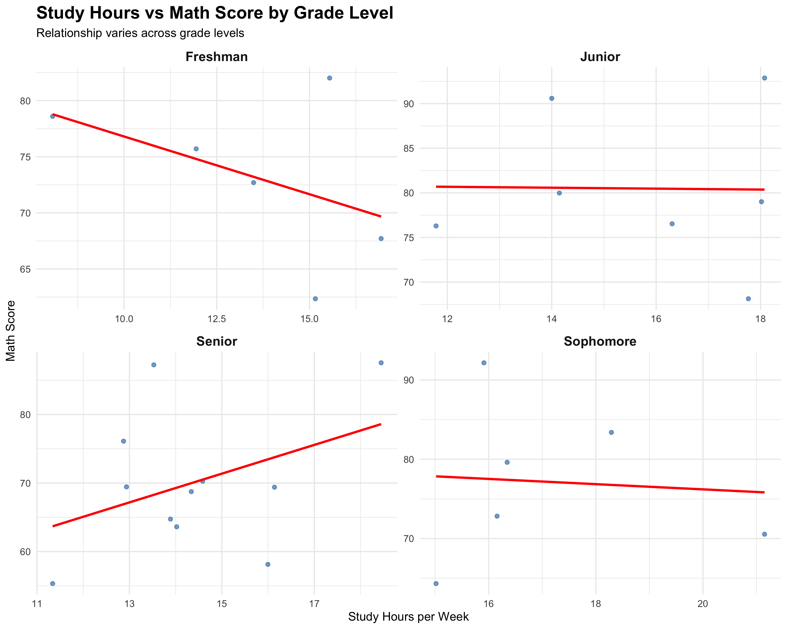

# ggplot2 Examples

## Overview
This directory contains comprehensive examples of ggplot2, R's powerful data visualization package. The examples demonstrate various plot types and techniques using simple, generated sample data.



## Contents
- `ggplot2.R` - Main R script with all examples
- `ggplot2.md` - Detailed documentation and explanations
- `images/` - Directory containing generated plot images
- `README.md` - This file

## What is ggplot2?
ggplot2 is an R package for creating elegant and complex plots from data in a data frame. It implements the "Grammar of Graphics" which allows you to build plots by combining independent components like data, aesthetics, geometries, scales, and themes.

## Features Demonstrated
The examples cover 7 different plot types:

1. **Scatter Plot with Regression Line** - Shows relationship between study hours and math scores
2. **Bar Chart** - Displays sales by product category
3. **Line Chart** - Illustrates monthly sales trends
4. **Box Plot** - Compares math score distributions across grade levels
5. **Histogram** - Shows distribution of math scores with mean line
6. **Faceted Plot** - Relationship between study hours and math scores by grade level
7. **Density Plot** - Math score density distributions by grade level

## Sample Data
The examples use three simple, generated datasets:
- **Student Performance Data**: 30 students with scores, study hours, and grade levels
- **Monthly Sales Data**: 12 months of sales and profit figures
- **Product Categories**: 5 product types with sales and profit margin data

## Quick Start

### Prerequisites
- R installed on your system
- ggplot2 package

### Installation
```r
install.packages("ggplot2")
```

### Running the Examples
```r
# Load the library
library(ggplot2)

# Run the script
source("ggplot2.R")
```

### Output
The script generates 7 high-quality PNG images in the `images/` directory, each demonstrating different ggplot2 capabilities.

## Key Concepts Covered
- **Aesthetics (aes)**: Mapping data variables to visual properties
- **Geometries (geom)**: Different plot types and visual elements
- **Scales**: Controlling how data values map to aesthetics
- **Facets**: Creating multiple plots based on categorical variables
- **Themes**: Controlling overall plot appearance
- **Labels**: Adding titles, subtitles, and axis labels

## Best Practices
- Start with simple plots and add complexity gradually
- Use meaningful aesthetics that map logically to your data
- Maintain consistent styling across plots
- Always provide clear, descriptive labels
- Choose appropriate scales for your data
- Use faceting wisely to show relationships across categories

## File Structure
```
00-00-ggplot2/
├── ggplot2.R          # Main R script
├── ggplot2.md         # Detailed documentation
├── README.md          # This file
└── images/            # Generated plot images
    ├── 01_scatter_plot.png
    ├── 02_bar_chart.png
    ├── 03_line_chart.png
    ├── 04_box_plot.png
    ├── 05_histogram.png
    ├── 06_faceted_plot.png
    └── 07_density_plot.png
```

## Learning Path
1. Start with the basic scatter plot example
2. Progress through bar charts and line charts
3. Explore distribution plots (histograms, box plots)
4. Learn about faceting and advanced techniques
5. Experiment with custom themes and styling


# Screenshots

      