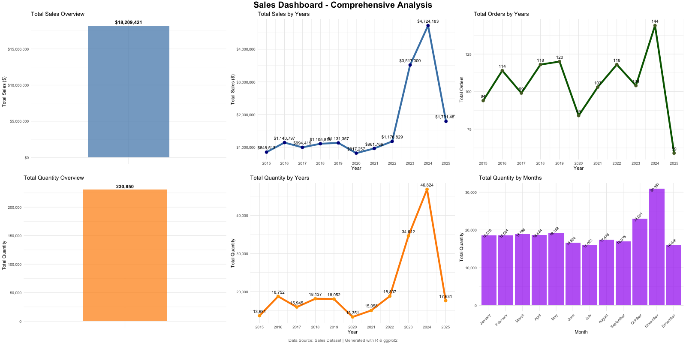
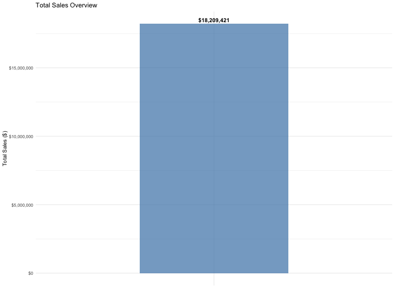
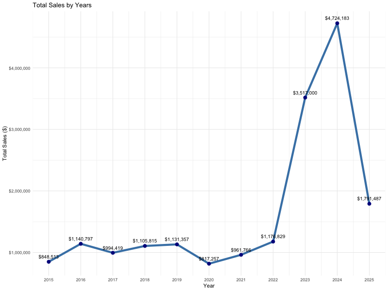
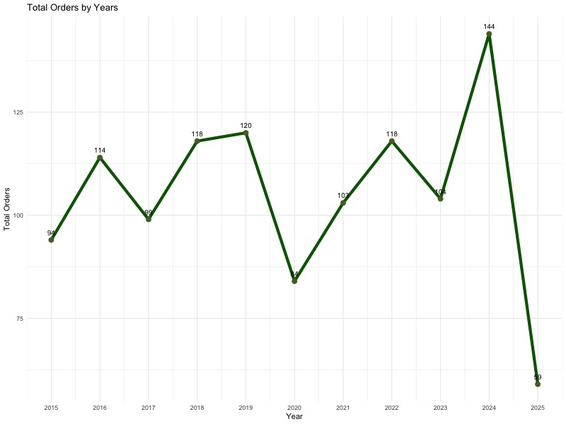
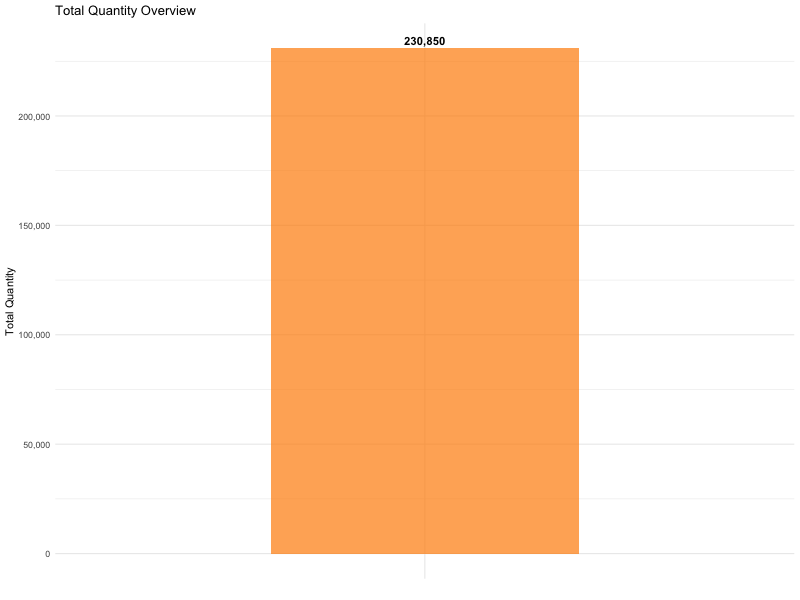
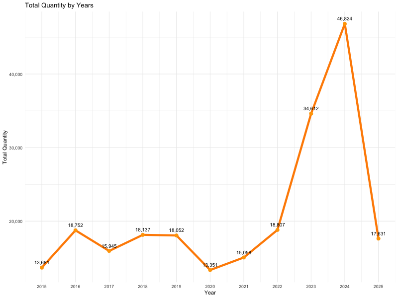
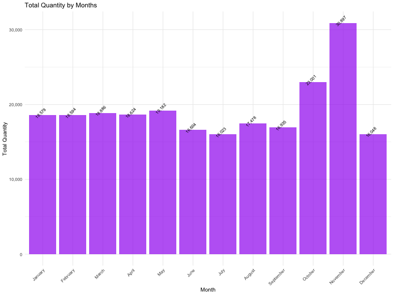

# Sales Dashboard - R Implementation

This project implements a comprehensive sales dashboard using R and ggplot2 to visualize sales data insights.



## Overview

The dashboard provides key performance indicators and visualizations for sales data analysis, including:

- **Total Sales**: Overall sales performance
- **Sales by Years**: Year-over-year sales trends
- **Total Orders**: Order volume analysis
- **Orders by Years**: Order trends over time
- **Total Quantity**: Product quantity sold
- **Quantity by Years**: Quantity trends over time
- **Quantity by Months**: Monthly quantity patterns

## Files Structure

```
00-03-ggplot-dashboard/
├── README.md                    # This file
├── dashboard.R                  # Main R script for dashboard generation
├── dashboard.Rmd               # R Markdown file with documentation
├── dashboard.md                # Generated markdown output
├── sales-data-dashboard.md     # Dataset description and column details
├── images/                     # Generated visualization images
│   ├── 00_combined_dashboard.png  # Combined dashboard with all visualizations
│   ├── 01_total_sales.png
│   ├── 02_sales_by_years.png
│   ├── 03_orders_by_years.png
│   ├── 04_total_quantity.png
│   ├── 05_quantity_by_years.png
│   └── 06_quantity_by_months.png
└── sales-dataset/
    └── sales.csv               # Source sales dataset
```

## Dataset

The sales dataset contains comprehensive sales information including:
- Order details (order number, date, status)
- Product information (product line, code, MSRP)
- Customer information (name, contact, location)
- Sales metrics (quantity, price, total sales)
- Geographic data (country, territory, state)

## Requirements

### R Packages
- `ggplot2` - For creating visualizations
- `dplyr` - For data manipulation
- `lubridate` - For date handling
- `scales` - For formatting scales

### Installation
```r
install.packages(c("ggplot2", "dplyr", "lubridate", "scales"))
```

## Usage

### Running the R Script
```bash
cd 00-03-ggplot-dashboard
Rscript dashboard.R
```

### Running the R Markdown
```bash
cd 00-03-ggplot-dashboard
Rscript -e "rmarkdown::render('dashboard.Rmd')"
```

## Features

### Visualizations
1. **Combined Dashboard**: Single comprehensive image with all 6 visualizations arranged in a 2x3 grid
2. **Total Sales Overview**: Bar chart showing total sales amount
3. **Sales by Years**: Line chart displaying sales trends across years
4. **Orders by Years**: Line chart showing order volume trends
5. **Total Quantity**: Bar chart displaying total quantity sold
6. **Quantity by Years**: Line chart showing quantity trends over years
7. **Quantity by Months**: Bar chart showing monthly quantity patterns

### Design Features
- **White Background**: All plots have white backgrounds for clean presentation
- **Consistent Styling**: Uniform color scheme and formatting
- **High Resolution**: PNG images saved at 800x600 resolution
- **Professional Layout**: Clean, publication-ready visualizations

## Output

The dashboard generates:
- 7 high-quality PNG images in the `images/` directory (6 individual + 1 combined dashboard)
- Comprehensive R Markdown documentation
- Dataset description and analysis

## Combined Dashboard

The main feature is the **Combined Dashboard** (`00_combined_dashboard.png`) which displays all 6 visualizations in a single comprehensive view:

- **Layout**: 2x3 grid arrangement
- **Top Row**: Total Sales, Sales by Years, Orders by Years
- **Bottom Row**: Total Quantity, Quantity by Years, Quantity by Months
- **Professional Header**: "Sales Dashboard - Comprehensive Analysis"
- **Footer**: Data source and generation information

This combined dashboard provides a complete overview similar to professional business intelligence tools like Power BI, making it perfect for executive presentations and comprehensive analysis.

## Key Insights

The dashboard provides insights into:
- Sales performance trends
- Seasonal patterns in sales and orders
- Product quantity distribution
- Year-over-year growth analysis
- Monthly performance patterns

## Technical Notes

- All visualizations use ggplot2 for consistency
- Date handling uses lubridate for robust date operations
- Data aggregation uses dplyr for efficient processing
- White backgrounds are enforced for all plots
- Error handling included for robust execution

# Screenshots

      

