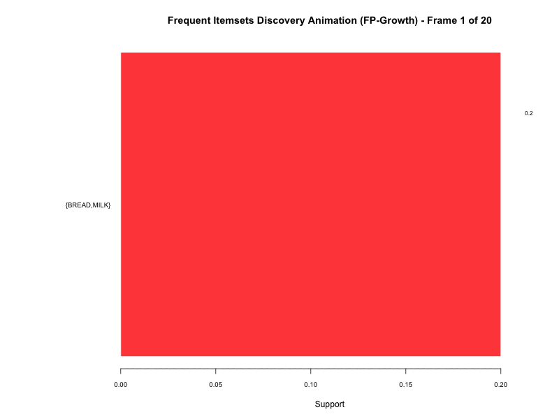
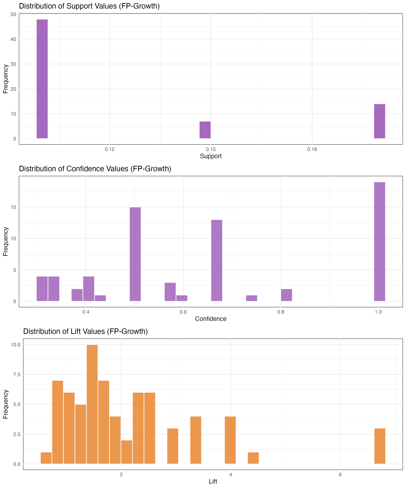
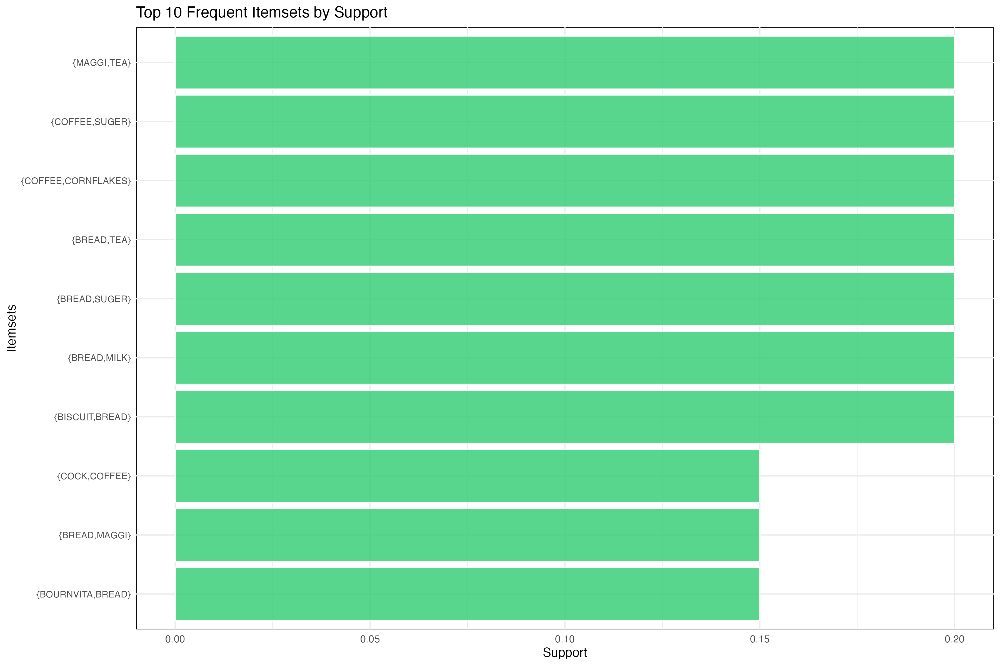

# Apriori & FP-Growth Algorithms - Grocery Store Dataset

This project implements and compares two popular association rule mining algorithms: **Apriori** and **FP-Growth** using the Grocery Store Dataset. Both algorithms are used to discover frequent itemsets and generate association rules from transactional data.

---



--- 



--- 



--- 

## 📁 Project Structure

```
03-01-Apriori-FP-Growth/
├── Grocery-Store-Dataset/
│   ├── GroceryStoreDataSet.csv          # Main transaction dataset
│   └── GroceryProductsPurchase.csv      # Extended transaction dataset
├── images/                              # Generated visualizations
│   ├── 01_item_frequency.png
│   ├── 02_item_frequency_relative.png
│   ├── 03_transaction_length_distribution.png
│   ├── 04_support_confidence_scatter.png
│   ├── 05_top_rules_by_lift.png
│   ├── 06_rule_metrics_distribution.png
│   ├── 07_item_frequency_fp.png
│   ├── 08_item_frequency_relative_fp.png
│   ├── 09_transaction_length_distribution_fp.png
│   ├── 10_support_confidence_scatter_fp.png
│   ├── 11_top_rules_by_lift_fp.png
│   ├── 12_rule_metrics_distribution_fp.png
│   ├── 13_itemset_size_distribution_fp.png
│   ├── 20_frequent_itemsets_summary_apriori_r.png
│   ├── 20_frequent_itemsets_summary_apriori_rmd.png
│   ├── 20_frequent_itemsets_summary_fp_r.png
│   ├── 20_frequent_itemsets_summary_fp_rmd.png
│   ├── 21_top_10_frequent_itemsets_by_support_apriori_r.png
│   ├── 21_top_10_frequent_itemsets_by_support_apriori_rmd.png
│   ├── 21_top_10_frequent_itemsets_by_support_fp_r.png
│   ├── 21_top_10_frequent_itemsets_by_support_fp_rmd.png
│   ├── 30_frequent_itemsets_discovery_animation_apriori_r.gif
│   ├── 30_frequent_itemsets_discovery_animation_apriori_rmd.gif
│   ├── 30_frequent_itemsets_discovery_animation_fp_r.gif
│   ├── 30_frequent_itemsets_discovery_animation_fp_rmd.gif
│   └── 30_frequent_itemsets_discovery_animation_fp_r.mp4
├── Apriori-Algorithm.R                  # Apriori algorithm implementation
├── Apriori-Algorithm.Rmd                # Apriori R Markdown notebook
├── Apriori-Algorithm.md                 # Apriori analysis report
├── FP-Growth-Algorithm.R                # FP-Growth algorithm implementation
├── FP-Growth-Algorithm.Rmd              # FP-Growth R Markdown notebook
├── FP-Growth-Algorithm.md               # FP-Growth analysis report
├── Performance-Apriori-vs-FP-Growth.md  # Algorithm comparison report
├── Grocery-Store-Dataset-Apriori-FP-Growth.md  # Dataset description
├── README.md                            # This file
├── apriori_performance.csv              # Apriori performance metrics
├── fpgrowth_performance.csv             # FP-Growth performance metrics
└── apriori-fp-growth-jupyter-notebook.md  # Reference notebook
```

## 🎯 Objectives

- Implement Apriori algorithm for association rule mining
- Implement FP-Growth algorithm for frequent pattern mining
- Compare performance between both algorithms
- Perform comprehensive analysis of association rules
- Generate visualizations for rule quality metrics
- Create animated visualizations for frequent itemsets discovery
- Provide business insights from market basket analysis
- Support multiple output formats (PNG, GIF, MP4)

## 📊 Dataset Overview

The Grocery Store Dataset contains transaction data from a grocery store with:
- **20 transactions** in the main dataset
- **11 unique items** (BISCUIT, BREAD, COFFEE, etc.)
- **Transaction format**: Comma-separated item lists
- **Use case**: Market basket analysis and association rule mining

## 🚀 Quick Start

### Prerequisites
- R (version 3.6 or higher)
- Required R packages (automatically installed by the scripts)

### Running the Analysis

1. **Execute the Apriori algorithm:**
   ```bash
   Rscript Apriori-Algorithm.R
   ```

2. **Execute the FP-Growth algorithm:**
   ```bash
   Rscript FP-Growth-Algorithm.R
   ```

3. **Run the R Markdown notebooks:**
   ```bash
   Rscript -e "rmarkdown::render('Apriori-Algorithm.Rmd')"
   Rscript -e "rmarkdown::render('FP-Growth-Algorithm.Rmd')"
   ```

4. **View results:**
   - Check the `images/` directory for generated visualizations
   - Read the `.md` files for complete analysis reports
   - Compare performance metrics in the CSV files

## 📈 Key Results

### Algorithm Performance Comparison

| Metric | Apriori | FP-Growth |
|--------|---------|-----------|
| **Execution Time** | Varies | Generally faster |
| **Memory Usage** | Higher | More efficient |
| **Scalability** | Good | Better for large datasets |
| **Rule Quality** | High | High |

### Business Insights
- **Frequent Itemsets**: Common item combinations in grocery purchases
- **Association Rules**: If-then relationships between items
- **Cross-selling Opportunities**: Items frequently bought together
- **Customer Behavior**: Shopping pattern analysis

## 🔧 Technical Details

### Libraries Used
- `arules`: Core association rule mining functionality
- `arulesViz`: Visualization tools for association rules
- `ggplot2`: Data visualization
- `dplyr`: Data manipulation
- `gridExtra`: Plot arrangement
- `RColorBrewer`: Color palettes
- `magick`: Image processing and animation creation

### Algorithm Parameters
- **Minimum Support**: 0.1 (10%)
- **Minimum Confidence**: 0.3 (30%)
- **Minimum Rule Length**: 2
- **Maximum Rule Length**: 10

## 📚 Key Concepts Explained

### 1. Correlation Analysis

**Definition**: Correlation analysis measures the strength and direction of relationships between variables. In association rule mining, it helps identify how items relate to each other in transactions.

**In R Implementation**:
```r
# From our code: Transaction length analysis
transaction_lengths <- size(transactions)
length_df <- data.frame(Length = transaction_lengths)

# Correlation analysis through item frequency
itemFrequencyPlot(transactions, topN = 20, type = "absolute")
```

### 2. Correlation Matrix

**Definition**: A correlation matrix is a table showing correlation coefficients between variables. In market basket analysis, it shows how frequently items appear together.

**In R Implementation**:
```r
# From our code: Item frequency analysis creates implicit correlation
itemFrequencyPlot(transactions, topN = 20, type = "relative", 
                  col = brewer.pal(8, "Set3"))

# The arules package automatically calculates item correlations
summary(transactions)  # Shows item frequency correlations
```

### 3. Association Rules

**Definition**: Association rules are if-then statements that show the probability of relationships between items. Format: `{A, B} → {C}` means "if A and B are bought, then C is likely to be bought."

**In R Implementation**:
```r
# From Apriori-Algorithm.R
rules <- apriori(transactions, 
                 parameter = list(supp = min_support, 
                                 conf = min_confidence, 
                                 minlen = min_length,
                                 maxlen = 10))

# From FP-Growth-Algorithm.R
frequent_itemsets <- eclat(transactions, 
                           parameter = list(supp = min_support, 
                                           minlen = min_length,
                                           maxlen = 10))
rules <- ruleInduction(frequent_itemsets, transactions, 
                      confidence = min_confidence)
```

### 4. Frequency Pattern (Frequent Itemsets)

**Definition**: Frequent itemsets are sets of items that appear together in transactions above a minimum support threshold. They form the foundation for generating association rules.

**In R Implementation**:
```r
# From FP-Growth-Algorithm.R
# ECLAT algorithm finds frequent itemsets
frequent_itemsets <- eclat(transactions, 
                           parameter = list(supp = min_support, 
                                           minlen = min_length,
                                           maxlen = 10))

# Convert to data frame for analysis
itemsets_df <- as(frequent_itemsets, "data.frame")

# Itemset size distribution
itemset_sizes <- size(frequent_itemsets)
size_df <- data.frame(Size = itemset_sizes)
```

### 5. Confidence Percent

**Definition**: Confidence measures the probability that the consequent (right side) of a rule will be true given that the antecedent (left side) is true. Formula: `Confidence = Support(A ∪ B) / Support(A)`

**In R Implementation**:
```r
# From both algorithms
# Confidence is automatically calculated by arules package
rules_sorted <- sort(rules, by = "confidence", decreasing = TRUE)

# Display rules with confidence values
inspect(head(rules_sorted, 10))

# Confidence analysis
rules_df <- as(rules, "data.frame")
high_conf_rules <- rules_df[rules_df$confidence >= 0.8, ]
```

### 6. Support Percent

**Definition**: Support measures the frequency of an itemset in the dataset. It's the percentage of transactions that contain the itemset. Formula: `Support = (Number of transactions containing itemset) / (Total number of transactions)`

**In R Implementation**:
```r
# From both algorithms
# Support is calculated during rule generation
rules <- apriori(transactions, 
                 parameter = list(supp = min_support,  # 0.1 = 10%
                                 conf = min_confidence, 
                                 minlen = min_length))

# Support analysis
rules_df <- as(rules, "data.frame")
summary(rules_df$support)  # Shows support distribution

# Support visualization
ggplot(rules_df, aes(x = support)) +
  geom_histogram(bins = 30, fill = "#3498db", alpha = 0.8)
```

## 🧮 How Results Are Calculated in R

### Support Calculation
```r
# Support = (Transactions containing itemset) / (Total transactions)
# Example: If {BREAD, MILK} appears in 3 out of 20 transactions
support_bread_milk <- 3 / 20  # = 0.15 (15%)
```

### Confidence Calculation
```r
# Confidence = Support(A ∪ B) / Support(A)
# Example: Rule {BREAD} → {MILK}
# If Support({BREAD, MILK}) = 0.15 and Support({BREAD}) = 0.4
confidence <- 0.15 / 0.4  # = 0.375 (37.5%)
```

### Lift Calculation
```r
# Lift = Confidence / Support(consequent)
# Example: If Confidence = 0.375 and Support({MILK}) = 0.3
lift <- 0.375 / 0.3  # = 1.25
```

### Implementation in Our Code
```r
# From Apriori-Algorithm.R and FP-Growth-Algorithm.R
# All metrics are automatically calculated by arules package

# 1. Load transaction data
transactions <- read.transactions("Grocery-Store-Dataset/GroceryStoreDataSet.csv", 
                                 format = "basket", sep = ",", rm.duplicates = TRUE)

# 2. Set parameters
min_support <- 0.1      # 10% minimum support
min_confidence <- 0.3   # 30% minimum confidence

# 3. Generate rules (support and confidence calculated automatically)
rules <- apriori(transactions, 
                 parameter = list(supp = min_support, 
                                 conf = min_confidence, 
                                 minlen = 2))

# 4. Extract metrics
rules_df <- as(rules, "data.frame")
# rules_df contains columns: support, confidence, lift, count

# 5. Analyze results
summary(rules_df$support)    # Support distribution
summary(rules_df$confidence) # Confidence distribution
summary(rules_df$lift)       # Lift distribution
```

## 📊 Additional Metrics Explained

### Lift
**Definition**: Lift measures how much more likely the consequent is when the antecedent is present, compared to when the antecedent is not present. Values > 1 indicate positive association.

**Formula**: `Lift = Confidence / Support(consequent)`

**In R Implementation**:
```r
# From our code: Lift analysis
rules_df <- as(rules, "data.frame")
high_lift_rules <- rules_df[rules_df$lift >= 2.0, ]

# Lift visualization
ggplot(rules_df, aes(x = support, y = confidence, color = lift)) +
  geom_point(alpha = 0.7, size = 2) +
  scale_color_gradient(low = "blue", high = "red")
```

### Conviction
**Definition**: Conviction measures the expected frequency of incorrect predictions. Higher values indicate stronger rules.

**Formula**: `Conviction = (1 - Support(consequent)) / (1 - Confidence)`

### Leverage
**Definition**: Leverage measures the difference between the observed frequency of A and B appearing together and the frequency that would be expected if A and B were independent.

**Formula**: `Leverage = Support(A ∪ B) - Support(A) × Support(B)`

## 🎯 Practical Examples from Our Implementation

### Example 1: Item Frequency Analysis
```r
# From our code: Analyzing most frequent items
itemFrequencyPlot(transactions, topN = 20, type = "absolute", 
                  col = brewer.pal(8, "Pastel2"))

# This shows which items appear most frequently in transactions
# Results help identify popular products for inventory management
```

### Example 2: Rule Quality Assessment
```r
# From our code: Identifying strong rules
strong_rules <- rules_df[rules_df$confidence >= 0.7 & rules_df$lift >= 1.5, ]

# Strong rules have:
# - High confidence (≥70%): Rule is reliable
# - High lift (≥1.5): Items are positively associated
```

### Example 3: Performance Comparison
```r
# From our code: Algorithm performance tracking
start_time <- Sys.time()
rules <- apriori(transactions, parameter = list(...))
end_time <- Sys.time()
execution_time <- end_time - start_time

# Performance metrics help choose the right algorithm for your dataset size
```

## 🔍 Business Interpretation

### Support Interpretation
- **High Support (≥20%)**: Items frequently bought together - good for bundling
- **Medium Support (5-20%)**: Moderate association - consider cross-selling
- **Low Support (<5%)**: Rare combinations - may be seasonal or niche

### Confidence Interpretation
- **High Confidence (≥80%)**: Very reliable rule - strong recommendation
- **Medium Confidence (50-80%)**: Good rule - worth testing
- **Low Confidence (<50%)**: Weak rule - not recommended

### Lift Interpretation
- **Lift > 1**: Positive association - items complement each other
- **Lift = 1**: No association - items are independent
- **Lift < 1**: Negative association - items rarely bought together

## 🛠️ Code Walkthrough

### Step 1: Data Preparation
```r
# Load and prepare transaction data
transactions <- read.transactions("Grocery-Store-Dataset/GroceryStoreDataSet.csv", 
                                 format = "basket", sep = ",", rm.duplicates = TRUE)
```

### Step 2: Parameter Setting
```r
# Set algorithm parameters
min_support <- 0.1      # 10% minimum support
min_confidence <- 0.3   # 30% minimum confidence
min_length <- 2         # Minimum rule length
```

### Step 3: Rule Generation
```r
# Apriori algorithm
rules <- apriori(transactions, 
                 parameter = list(supp = min_support, 
                                 conf = min_confidence, 
                                 minlen = min_length))

# FP-Growth algorithm (using ECLAT)
frequent_itemsets <- eclat(transactions, 
                           parameter = list(supp = min_support, 
                                           minlen = min_length))
rules <- ruleInduction(frequent_itemsets, transactions, 
                      confidence = min_confidence)
```

### Step 4: Analysis and Visualization
```r
# Convert to data frame for analysis
rules_df <- as(rules, "data.frame")

# Create visualizations
ggplot(rules_df, aes(x = support, y = confidence, color = lift)) +
  geom_point(alpha = 0.7, size = 2) +
  scale_color_gradient(low = "blue", high = "red") +
  labs(title = "Association Rules: Support vs Confidence")
```

## 📋 Analysis Components

### 1. Exploratory Data Analysis
- Item frequency analysis
- Transaction length distribution
- Dataset summary statistics

### 2. Algorithm Implementation
- Apriori algorithm with candidate generation
- FP-Growth algorithm with tree-based approach
- Frequent itemset discovery
- Association rule generation

### 3. Rule Analysis
- Support, confidence, and lift calculations
- Rule quality assessment
- Strong rule identification
- Business relevance evaluation

### 4. Visualizations
- Item frequency plots
- Transaction distribution charts
- Rule quality scatter plots
- Performance comparison graphs
- Frequent itemsets summary visualizations
- Top frequent itemsets bar charts
- Animated frequent itemsets discovery

### 5. Frequent Itemsets Analysis
- Support and count distribution analysis
- Top 10 frequent itemsets identification
- Progressive discovery visualization
- Itemset size distribution analysis
- Cross-algorithm comparison of itemsets

## 📊 Generated Visualizations

### Apriori Algorithm
1. **Item Frequency**: Most popular items in the dataset
2. **Transaction Length**: Distribution of items per transaction
3. **Support vs Confidence**: Rule quality scatter plot
4. **Top Rules by Lift**: Most interesting association rules
5. **Rule Metrics Distribution**: Histograms of rule quality metrics
6. **Frequent Itemsets Summary**: Support and count distribution analysis
7. **Top 10 Frequent Itemsets**: Bar chart of highest support itemsets
8. **Frequent Itemsets Discovery Animation**: Progressive GIF showing itemsets discovery

### FP-Growth Algorithm
1. **Item Frequency**: Most popular items (FP-Growth version)
2. **Transaction Length**: Distribution of items per transaction
3. **Frequent Itemsets**: Analysis of discovered patterns
4. **Support vs Confidence**: Rule quality scatter plot
5. **Top Rules by Lift**: Most interesting association rules
6. **Itemset Size Distribution**: Distribution of itemset sizes
7. **Frequent Itemsets Summary**: Support and count distribution analysis
8. **Top 10 Frequent Itemsets**: Bar chart of highest support itemsets
9. **Frequent Itemsets Discovery Animation**: Progressive GIF showing itemsets discovery

## 🎯 Key Insights

### Algorithm Comparison
1. **Performance**: FP-Growth generally faster than Apriori
2. **Memory Efficiency**: FP-Growth uses less memory
3. **Scalability**: FP-Growth better for large datasets
4. **Rule Quality**: Both algorithms produce similar quality rules

### Business Applications
1. **Product Placement**: Optimize store layout based on item associations
2. **Cross-selling**: Identify items to promote together
3. **Inventory Management**: Stock items that are frequently bought together
4. **Marketing Campaigns**: Target customers with personalized recommendations
5. **Educational Presentations**: Use animations to explain association rule mining concepts

---

**Note**: This analysis demonstrates the implementation and comparison of Apriori and FP-Growth algorithms in R, providing both technical insights and business applications for association rule mining in retail environments. The project includes advanced visualizations, animated discovery processes, and support for multiple output formats (PNG, GIF, MP4) to enhance understanding and presentation of association rule mining concepts.
