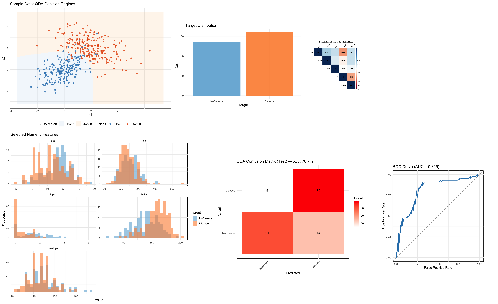
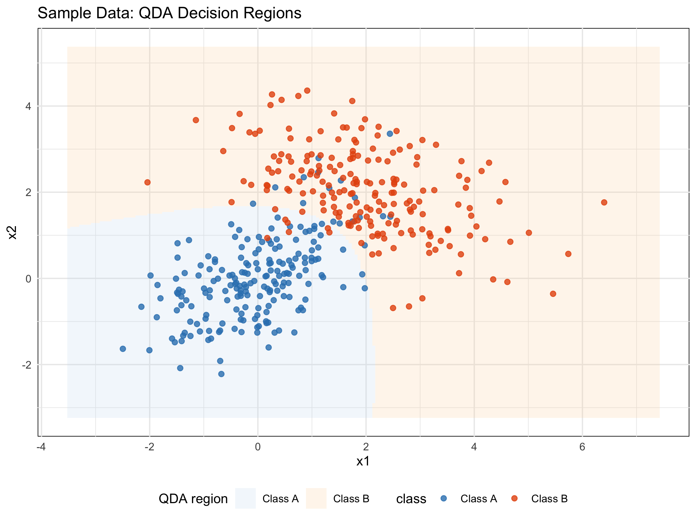
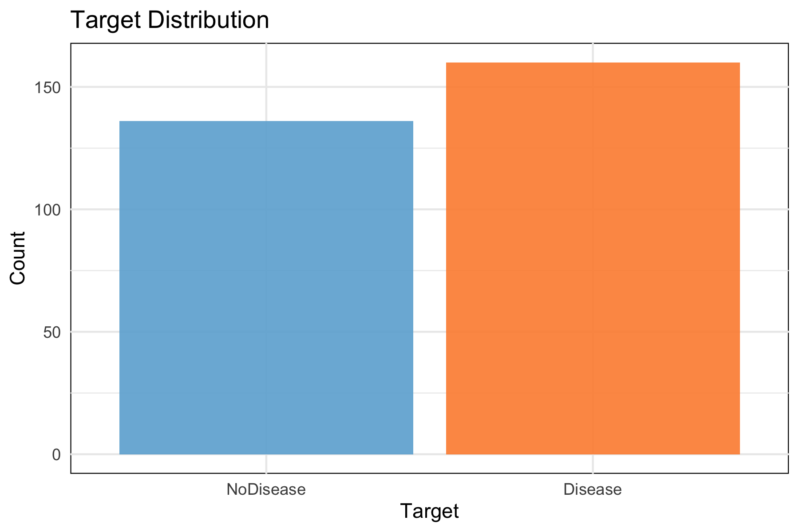
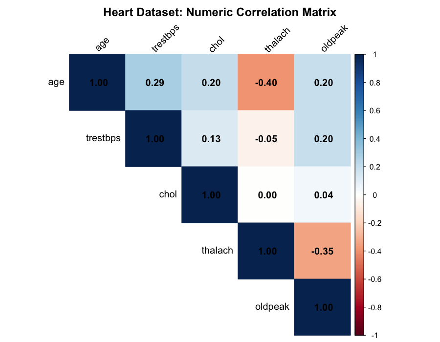
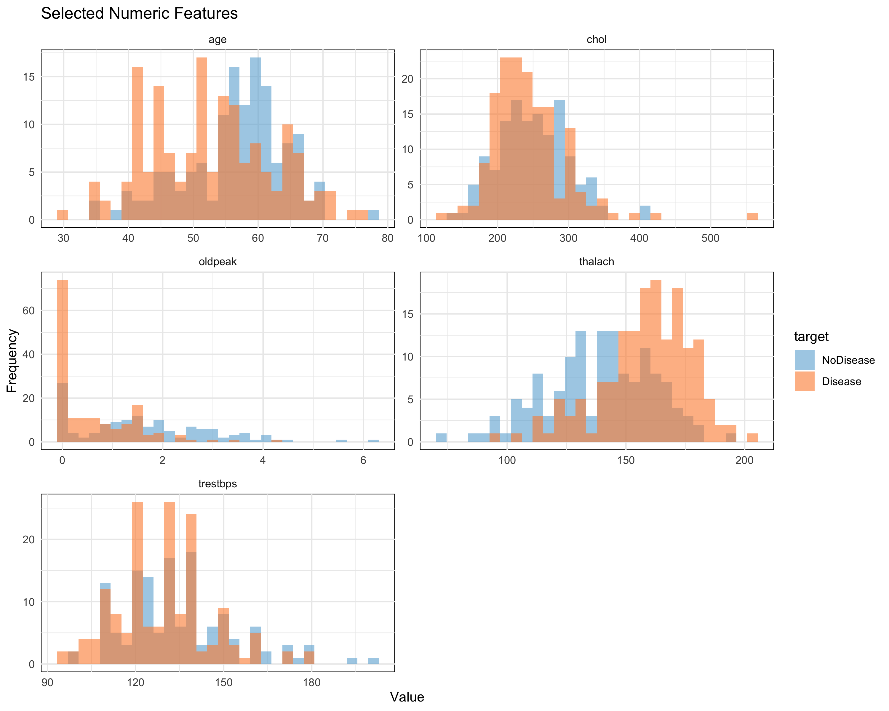
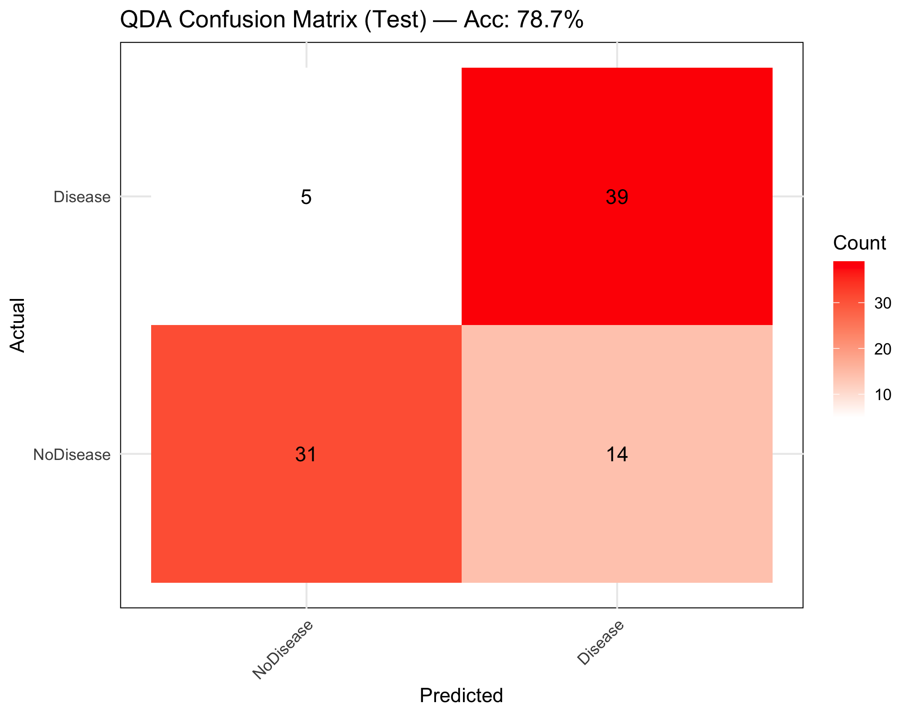
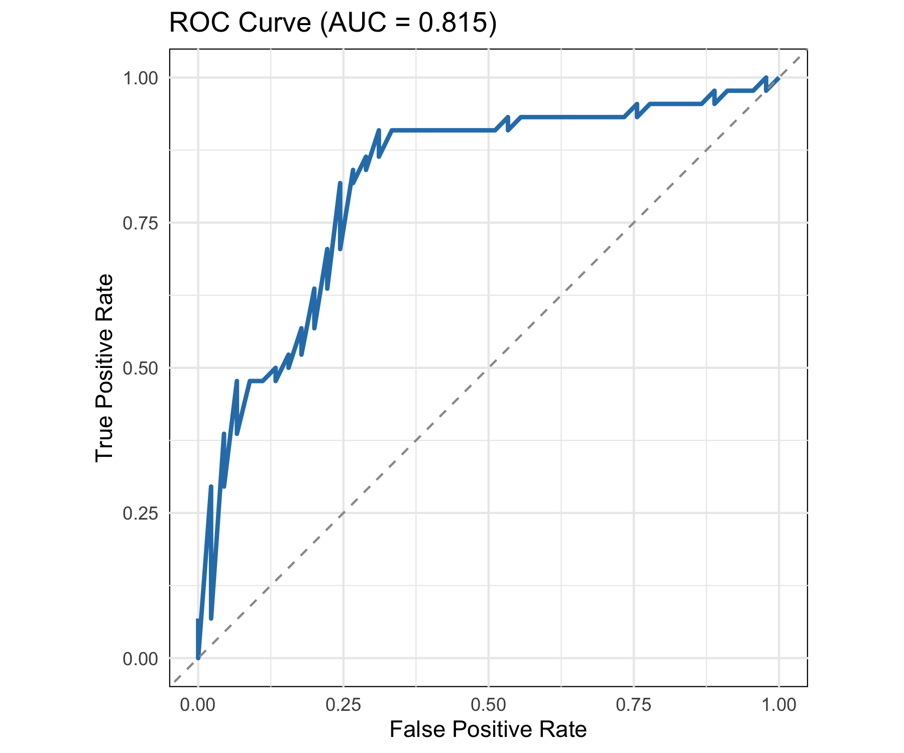

# Quadratic Discriminant Analysis (QDA) — Heart Disease Dataset

This module implements Quadratic Discriminant Analysis (QDA). It includes:

- A simple synthetic example showing curved decision boundaries of QDA
- QDA on the Heart Disease dataset (`Heart-Disease-Dataset/heart.csv`)
- EDA visuals (target distribution, correlation matrix, histograms)
- Evaluation visuals (confusion matrix, ROC curve)



## Files

- `Quadratic-Discriminant-Analysis.R` — R script to run end-to-end, generates images
- `Quadratic-Discriminant-Analysis.Rmd` — R Markdown report; renders to GitHub markdown and HTML
- `Quadratic-Discriminant-Analysis.md` — Rendered markdown from the Rmd (to be generated)
- `images/` — Output figures

## How to Run

1. Run the script (generates images):

```bash
Rscript 05-03-Quadratic-Discriminant-Analysis/Quadratic-Discriminant-Analysis.R
```

2. Render the Rmd to GitHub-flavored markdown and HTML:

```r
rmarkdown::render(
  "05-03-Quadratic-Discriminant-Analysis/Quadratic-Discriminant-Analysis.Rmd",
  output_format = c("github_document", "html_document")
)
```

The rendered markdown will be saved as `Quadratic-Discriminant-Analysis.md` alongside the Rmd. All figures are saved in `images/`.

## Notes

- The dataset is small; results can vary with the random train/test split.
- We use only numeric predictors for QDA to keep it simple and robust.
- Known faulty rows (`ca == 4`, `thal == 0`) are removed if present.

# Screenshots

     