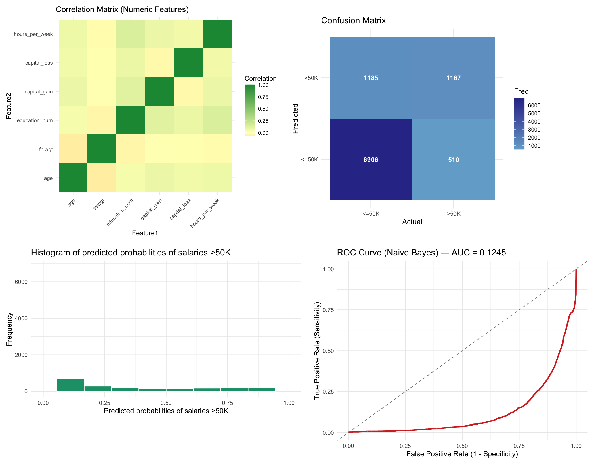
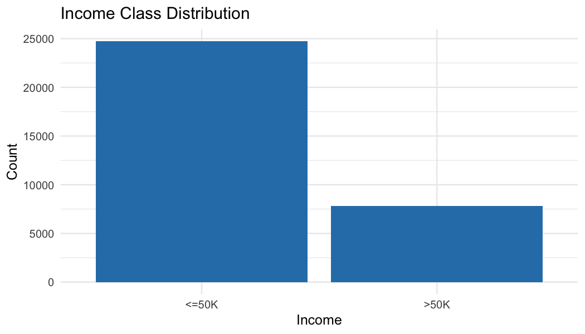
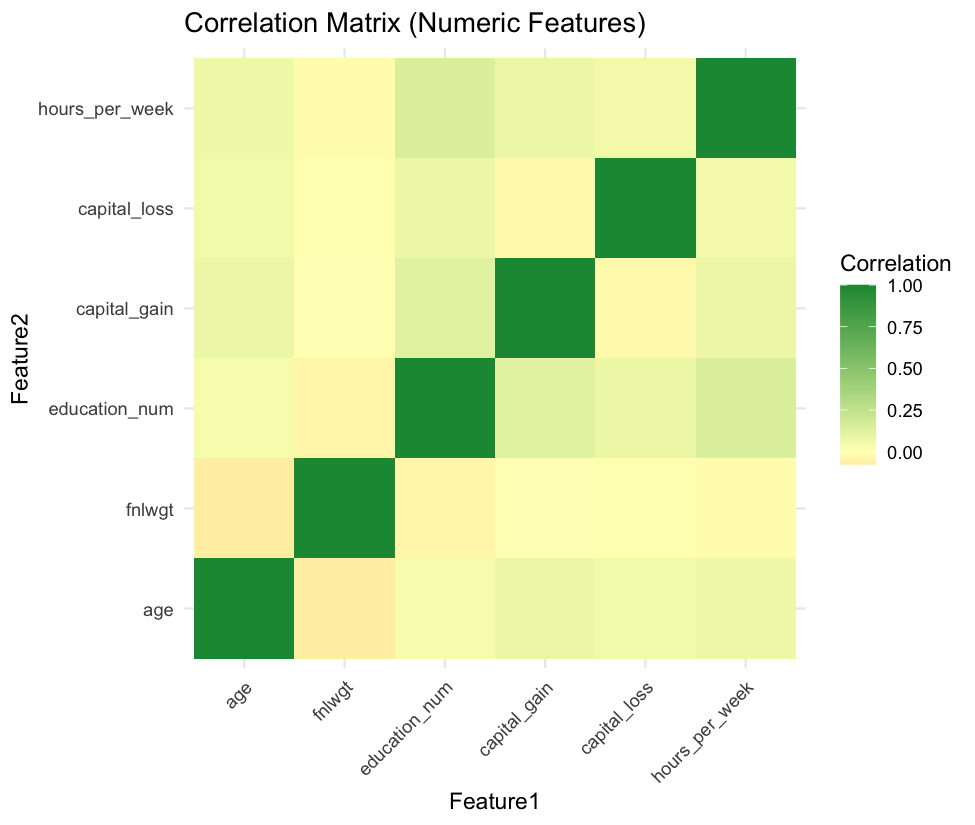
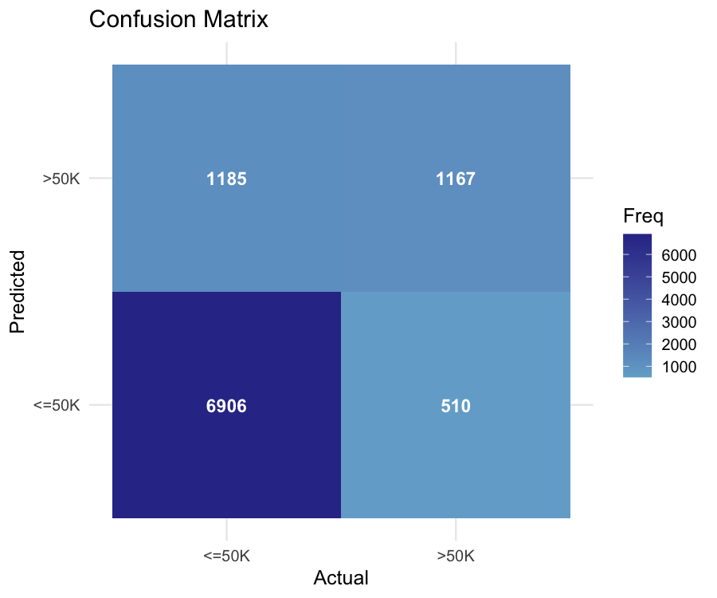
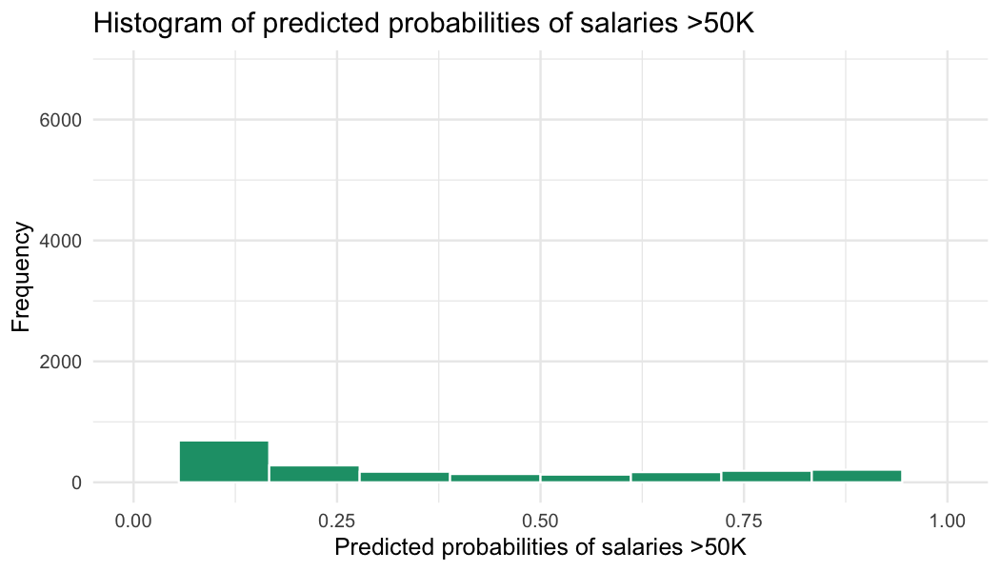
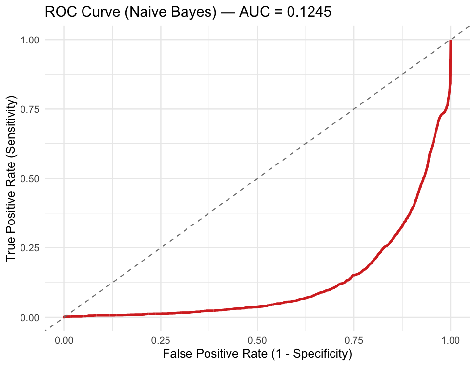

# Naive Bayes Classifier — Adult Income Dataset

This module implements a Gaussian Naive Bayes classifier to predict whether a person makes more than 50K/year using the Adult Income dataset.



## Files

- `Naive-Bayes-Classifier.R` — R script to run end-to-end, generates images
- `Naive-Bayes-Classifier.Rmd` — R Markdown report; renders to GitHub markdown and HTML
- `Naive-Bayes-Classifier.md` — Rendered markdown from the Rmd (to be generated)
- `Income-Dataset-Naive-Bayes-Classifier.md` — Dataset and columns description
- `Income-Dataset/adult.csv` — Dataset (no header)
- `images/` — Output figures

## How to Run

1. Run the script (generates images):

```bash
Rscript 05-04-Naive-Bayes-Classifier/Naive-Bayes-Classifier.R
```

2. Render the Rmd to GitHub-flavored markdown and HTML:

```r
rmarkdown::render(
  "05-04-Naive-Bayes-Classifier/Naive-Bayes-Classifier.Rmd",
  output_format = c("github_document", "html_document")
)
```

The rendered markdown will be saved as `Naive-Bayes-Classifier.md` alongside the Rmd. All figures are saved in `images/`.

## Notes

- Missing values in `workclass`, `occupation`, and `native_country` are encoded as `?` and imputed with training-set mode.
- Numeric features are z-score standardized based on the training set.
- Positive class for metrics and ROC is `>50K`.

# Screenshots

    