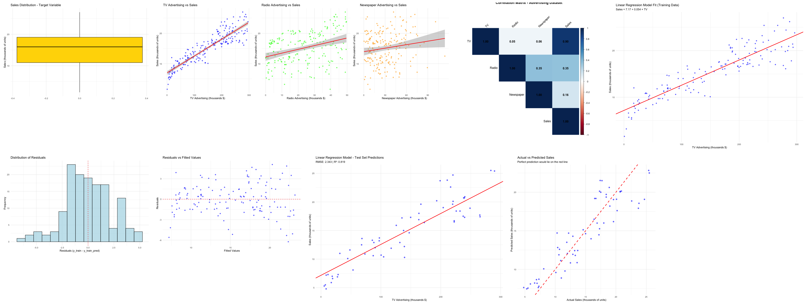
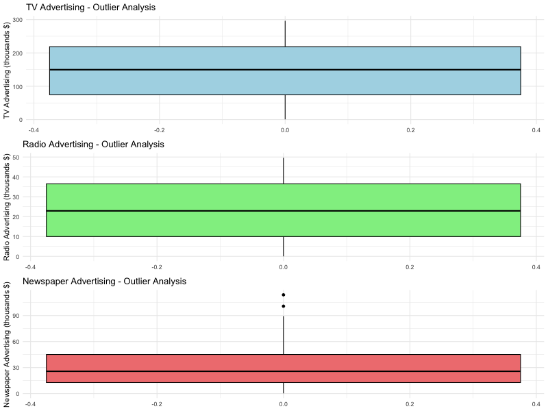
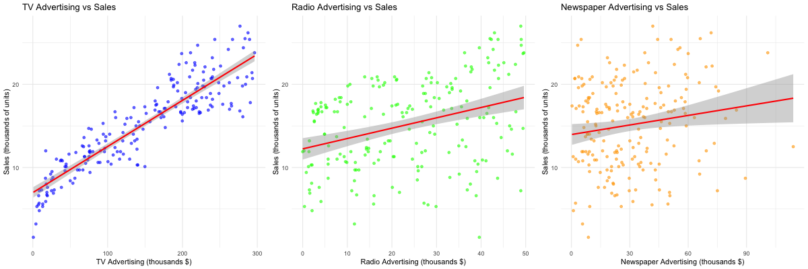
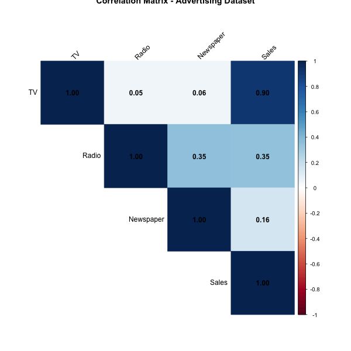
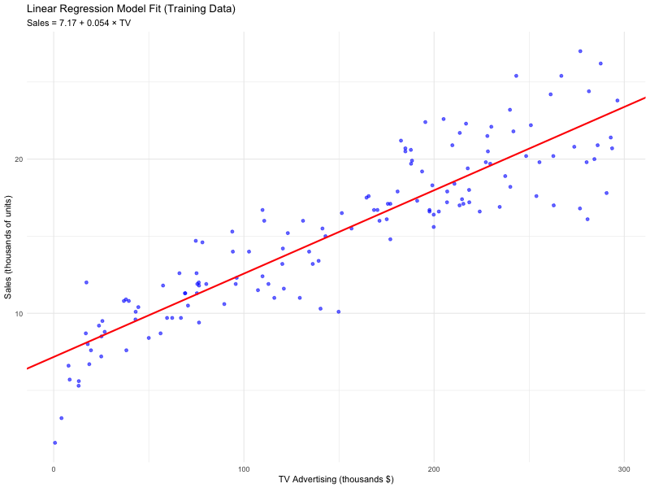
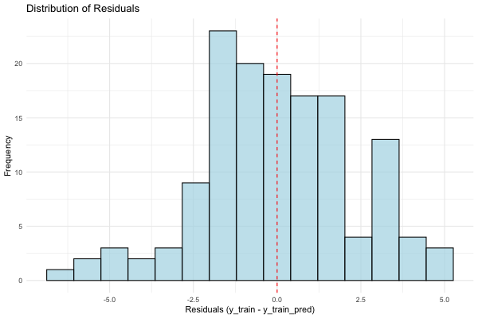
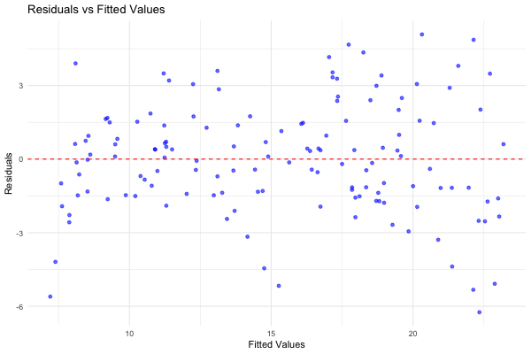
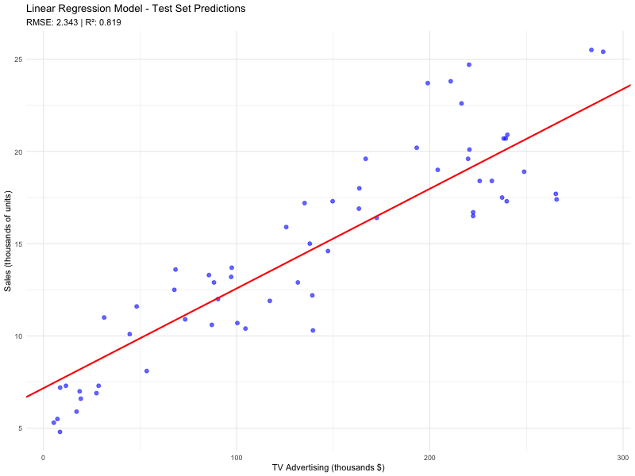
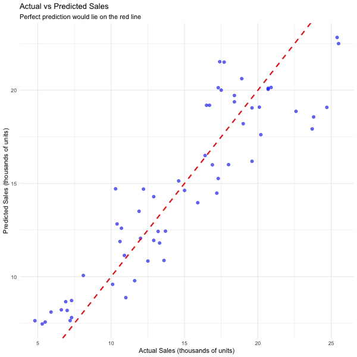

# Linear Regression Analysis

## Project Overview

This project implements a simple linear regression model to predict sales based on advertising spending across different platforms (TV, Radio, Newspaper). The analysis follows a comprehensive approach including data exploration, model building, evaluation, and visualization.



## Dataset

- **File**: `Salary-Dataset/advertising.csv`
- **Source**: ISLR (Introduction to Statistical Learning with R)
- **Variables**:
  - `TV`: TV advertising spending (in thousands of dollars)
  - `Radio`: Radio advertising spending (in thousands of dollars)
  - `Newspaper`: Newspaper advertising spending (in thousands of dollars)
  - `Sales`: Sales (in thousands of units)

## Files Structure

- `Linear-Regression.R`: Main R script with complete analysis
- `Linear-Regression.Rmd`: R Markdown file for reproducible analysis
- `Linear-Regression.md`: Generated markdown documentation
- `Salary-Dataset-Linear-Regression.md`: Dataset description and column details
- `images/`: Directory containing all generated plots and visualizations

## Analysis Steps

1. **Data Loading and Inspection**
   - Load the advertising dataset
   - Examine data structure and basic statistics
   - Check for missing values and outliers

2. **Exploratory Data Analysis**
   - Univariate analysis of target variable (Sales)
   - Correlation analysis between variables
   - Visualization of relationships

3. **Model Building**
   - Simple linear regression using TV advertising as predictor
   - Train-test split (70% train, 30% test)
   - Model fitting using OLS (Ordinary Least Squares)

4. **Model Evaluation**
   - Residual analysis
   - Model performance metrics (R-squared, RMSE)
   - Visualization of model fit

5. **Predictions**
   - Test set predictions
   - Performance evaluation on test data

## Key Analysis Results

**Dataset**: 200 observations, 4 variables (TV, Radio, Newspaper, Sales)
**Model**: Simple linear regression using TV advertising as predictor
**Performance**:
- Training R² = 0.8071 (80.7% variance explained)
- Test R² = 0.8193 (81.9% variance explained)
- RMSE = 2.34
- MAE = 1.94
**Model Equation**: Sales = 7.17 + 0.054 × TV
**Interpretation**: For every $1000 increase in TV advertising, sales increase by 0.054 thousand units

## Key Findings

- TV advertising shows the strongest correlation with sales
- The linear regression model achieves good predictive performance
- R-squared value indicates the model explains a significant portion of sales variance

## Usage

To run the analysis:

```r
# Run the R script
source("Linear-Regression.R")

# Or knit the R Markdown file
rmarkdown::render("Linear-Regression.Rmd")
```

## Dependencies

- `ggplot2`: For data visualization
- `dplyr`: For data manipulation
- `corrplot`: For correlation matrix visualization
- `gridExtra`: For arranging multiple plots
- `stats`: For statistical functions (built-in)

## Output

The analysis generates several visualizations:
- Data distribution plots
- Correlation heatmap
- Scatter plots showing relationships
- Model fit visualization
- Residual analysis plots
- Prediction vs actual plots

All plots are saved as PNG files with white backgrounds in the `images/` directory.

# Screenshots

        