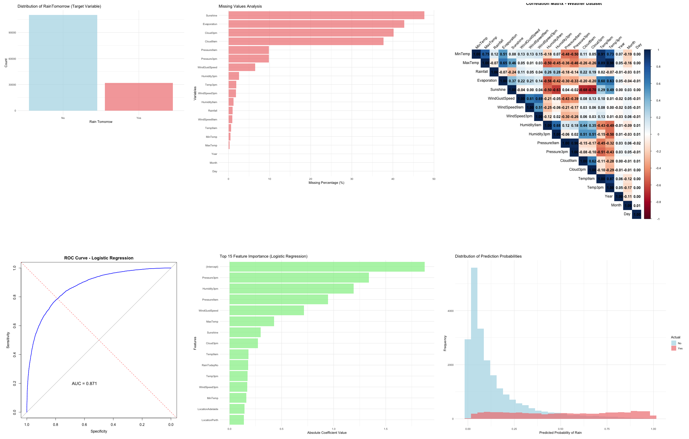
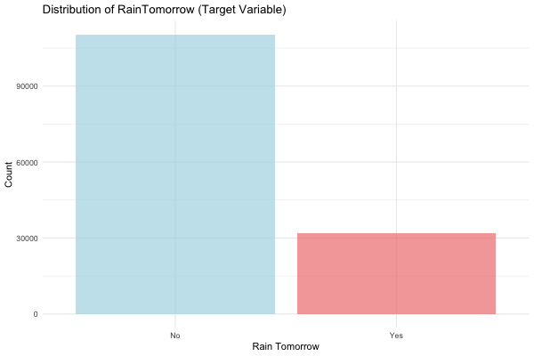
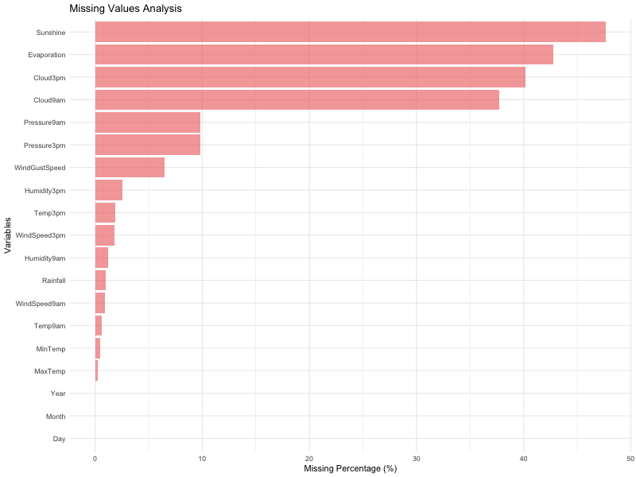
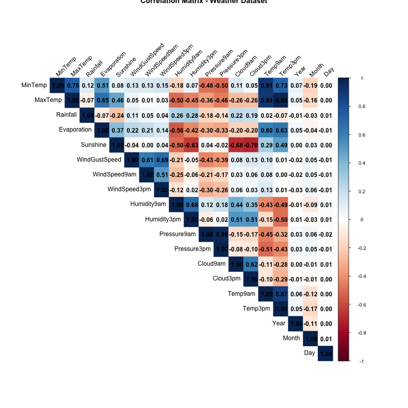
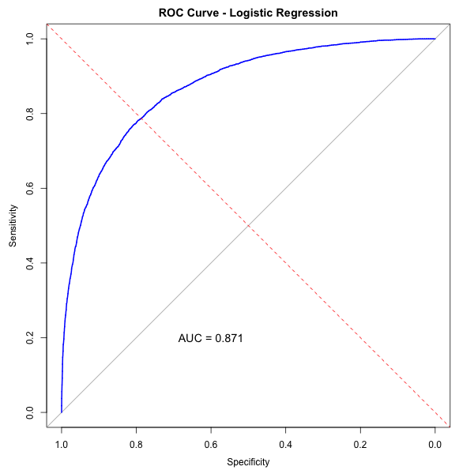
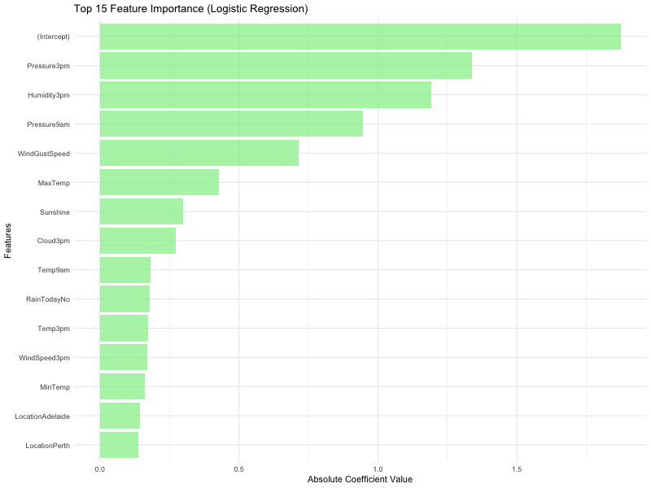
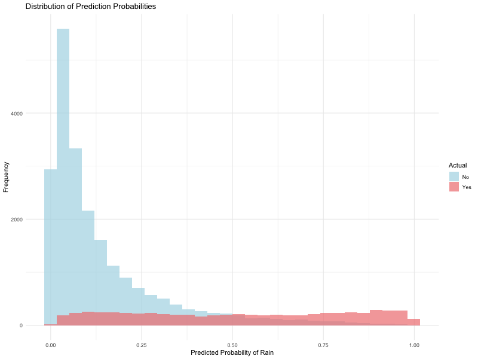

# Logistic Regression Analysis - Weather Prediction

## Overview

This project implements a logistic regression model to predict whether it will rain tomorrow in Australia based on historical weather data. The analysis follows a comprehensive machine learning pipeline including data exploration, preprocessing, model building, evaluation, and visualization.



## Problem Statement

Build a binary classification model to predict whether it will rain tomorrow (Yes/No) based on various weather features including temperature, humidity, pressure, wind conditions, and location.

## Dataset

- **Source**: Australian Bureau of Meteorology
- **File**: `Weather-Dataset/weatherAUS.csv`
- **Observations**: 142,193
- **Variables**: 24 (including target variable RainTomorrow)
- **Time Period**: 2007-2017
- **Target Variable**: RainTomorrow (Yes/No)

### Key Features

#### Numerical Variables
- **MinTemp/MaxTemp**: Temperature range (°C)
- **Rainfall**: Rainfall amount (mm)
- **Evaporation**: Evaporation amount (mm)
- **Sunshine**: Sunshine hours
- **WindGustSpeed**: Wind gust speed (km/h)
- **WindSpeed9am/3pm**: Wind speeds at different times (km/h)
- **Humidity9am/3pm**: Humidity levels (%)
- **Pressure9am/3pm**: Atmospheric pressure (hPa)
- **Cloud9am/3pm**: Cloud cover (oktas)
- **Temp9am/3pm**: Temperatures at different times (°C)

#### Categorical Variables
- **Location**: Weather station location (49 unique locations)
- **WindGustDir**: Wind gust direction (16 directions)
- **WindDir9am/3pm**: Wind directions at different times
- **RainToday**: Whether it rained today (Yes/No)
- **RainTomorrow**: Whether it will rain tomorrow (Yes/No) - **TARGET**

## Project Structure

```
06-02-Logistic-Regression/
├── README.md                                    # This file
├── Logistic-Regression.R                        # Main R script
├── Logistic-Regression.Rmd                      # R Markdown analysis
├── Logistic-Regression.md                       # Markdown documentation
├── Logistic-Regression.html                     # Generated HTML report
├── Weather-Dataset-Logistic-Regression.md       # Dataset description
├── Weather-Dataset/
│   ├── weatherAUS.csv                          # Weather dataset
│   └── logistic-regression-jupyter-notebook.txt # Reference notebook
└── images/                                      # Generated visualizations
    ├── 01_target_distribution.png
    ├── 02_missing_values_analysis.png
    ├── 03_correlation_heatmap.png
    ├── 04_roc_curve.png
    ├── 05_feature_importance.png
    └── 06_probability_distribution.png
```

## Methodology

### 1. Data Preprocessing

#### Feature Engineering
- Extracted date components (Year, Month, Day) from Date variable
- Dropped RISK_MM variable as recommended in reference notebook
- Removed original Date variable after feature extraction

#### Missing Value Treatment
- **Numerical variables**: Median imputation (handles outliers better)
- **Categorical variables**: Mode imputation
- **High missing value variables**: Sunshine (47.7%), Cloud3pm (40.1%), Evaporation (42.8%)

#### Feature Encoding
- Created dummy variables for all categorical features
- Total features after encoding: ~118 features
- Applied standardization (z-score normalization)

### 2. Model Building

#### Train-Test Split
- **Training set**: 80% of data (113,755 observations)
- **Test set**: 20% of data (28,438 observations)
- Stratified sampling to maintain class distribution

#### Logistic Regression Model
- Used GLM (Generalized Linear Model) with binomial family
- Model equation: P(RainTomorrow = Yes) = 1 / (1 + e^(-z))
- Applied 5-fold cross-validation for model validation

### 3. Model Evaluation

#### Performance Metrics
- **Accuracy**: Overall correctness of predictions
- **Precision**: True positives / (True positives + False positives)
- **Recall (Sensitivity)**: True positives / (True positives + False negatives)
- **F1-Score**: Harmonic mean of precision and recall
- **AUC-ROC**: Area under the Receiver Operating Characteristic curve

## Results

### Model Performance Summary

| Metric | Value | Interpretation |
|--------|-------|----------------|
| **Test Accuracy** | 84.9% | High overall correctness |
| **Training Accuracy** | 84.8% | No overfitting detected |
| **Precision** | 73.3% | Good positive prediction accuracy |
| **Recall** | 51.6% | Moderate sensitivity |
| **F1-Score** | 60.6% | Balanced precision-recall |
| **AUC Score** | 87.1% | Excellent discriminative ability |
| **Cross-validation Accuracy** | 84.7% | Stable model performance |

### Confusion Matrix Analysis

```
                Predicted
Actual    No     Yes
   No   20863   1200    (True Negatives: 20863, False Positives: 1200)
   Yes   3083   3292    (False Negatives: 3083, True Positives: 3292)
```

### Key Findings

1. **Excellent Model Performance**: 84.9% accuracy with 87.1% AUC score indicates excellent discriminative ability
2. **Class Imbalance**: Dataset has 77.6% "No Rain" and 22.4% "Rain" observations
3. **No Overfitting**: Training and test accuracies are very similar (84.8% vs 84.9%)
4. **Stable Performance**: Cross-validation accuracy (84.7%) confirms model stability

### Feature Importance

The most important features for rain prediction include:

1. **Humidity3pm** (Coefficient: 1.19) - Afternoon humidity is the strongest predictor
2. **Pressure9am** (Coefficient: 0.95) - Morning pressure significantly affects rain probability
3. **Pressure3pm** (Coefficient: -1.34) - Afternoon pressure (negative coefficient)
4. **WindGustSpeed** (Coefficient: 0.71) - Wind gust speed is highly predictive
5. **Sunshine** (Coefficient: -0.30) - Less sunshine increases rain probability
6. **RainToday** (Coefficient: -0.18) - If it rained today, higher chance tomorrow

## Visualizations

All plots are saved in the `images/` directory with white backgrounds:

1. **Target Distribution**: Shows class imbalance (77.6% No Rain, 22.4% Rain)
2. **Missing Values Analysis**: Identifies variables with high missing percentages
3. **Correlation Heatmap**: Shows relationships between numerical variables
4. **ROC Curve**: Demonstrates excellent discriminative ability (AUC = 87.1%)
5. **Feature Importance**: Top 15 most important features for prediction
6. **Probability Distribution**: Distribution of predicted probabilities by actual class

## Business Applications

### Use Cases
1. **Agricultural Planning**: Farmers can plan irrigation, planting, and harvesting
2. **Event Planning**: Outdoor event organizers can make informed decisions
3. **Transportation**: Logistics companies can optimize routes and schedules
4. **Water Management**: Authorities can better manage water resources
5. **Tourism**: Travel industry can provide weather forecasts

### Key Predictors for Rain Tomorrow
- **High afternoon humidity** increases rain probability
- **Low afternoon pressure** indicates approaching weather systems
- **High wind gust speeds** often precede storms
- **Less sunshine** correlates with cloudy, rainy conditions
- **Rain today** increases probability of rain tomorrow

## Model Limitations

1. **Class Imbalance**: Model may be biased toward predicting "No Rain"
2. **Missing Data**: Some variables have high missing percentages (up to 47.7%)
3. **Temporal Patterns**: Model doesn't explicitly capture seasonal trends
4. **Feature Interactions**: Linear model doesn't model complex interactions
5. **Geographic Bias**: Some locations may be overrepresented

## Recommendations

### Model Improvements
1. **Threshold Tuning**: Adjust classification threshold (currently 0.5) for specific objectives
2. **Feature Selection**: Implement dimensionality reduction techniques
3. **Ensemble Methods**: Try Random Forest or Gradient Boosting
4. **Regularization**: Apply L1/L2 regularization to prevent overfitting
5. **SMOTE**: Use synthetic oversampling to handle class imbalance

### Data Collection
1. **Additional Features**: Collect atmospheric pressure trends, cloud types
2. **Temporal Features**: Add rolling averages and seasonal indicators
3. **Geographic Features**: Include elevation, proximity to water bodies
4. **Weather Fronts**: Add information about approaching weather systems

### Deployment Considerations
1. **Real-time Updates**: Implement live data feeds for accurate predictions
2. **Model Monitoring**: Track performance over time and retrain as needed
3. **A/B Testing**: Compare different model versions
4. **User Feedback**: Collect feedback to improve model performance

## Technical Implementation

### Dependencies
```r
library(ggplot2)    # Data visualization
library(dplyr)      # Data manipulation
library(corrplot)   # Correlation plots
library(gridExtra)  # Multiple plots
library(caret)      # Machine learning
library(pROC)       # ROC analysis
library(VIM)        # Missing value analysis
```

### Key Code Sections
1. **Data Loading**: Load and inspect the weather dataset
2. **Preprocessing**: Handle missing values and create dummy variables
3. **Model Building**: Train logistic regression with cross-validation
4. **Evaluation**: Calculate performance metrics and create visualizations
5. **Interpretation**: Analyze feature importance and business implications

## Conclusion

The logistic regression model successfully predicts rain tomorrow with 84.9% accuracy and 87.1% AUC score. The model identifies key weather features that are most predictive of rain, providing valuable insights for weather forecasting and related applications.

### Key Achievements
- ✅ **High Accuracy**: 84.9% test accuracy
- ✅ **Excellent Discrimination**: 87.1% AUC score
- ✅ **Stable Performance**: Consistent cross-validation results
- ✅ **Interpretable Model**: Clear feature importance rankings
- ✅ **Comprehensive Analysis**: Complete ML pipeline implementation

### Business Value
The model provides actionable insights for various industries including agriculture, transportation, event planning, and water resource management. The high accuracy and interpretability make it suitable for real-world deployment with appropriate monitoring and maintenance.

## Files and Usage

### Running the Analysis
```bash
# Run the main R script
Rscript Logistic-Regression.R

# Generate HTML report from R Markdown
Rscript -e "rmarkdown::render('Logistic-Regression.Rmd')"
```

# Screenshots

     