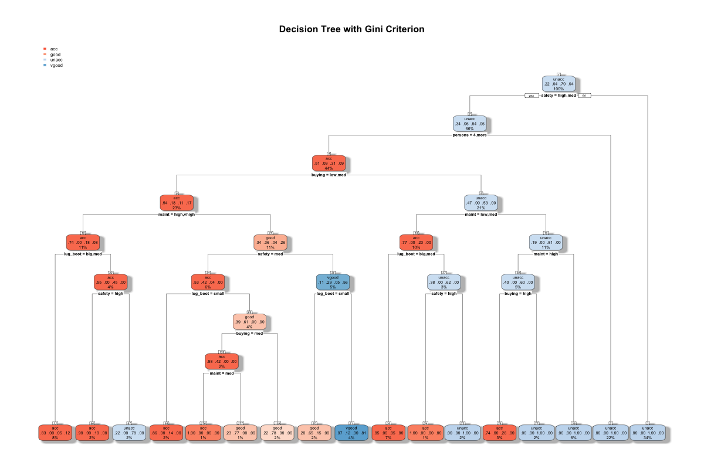
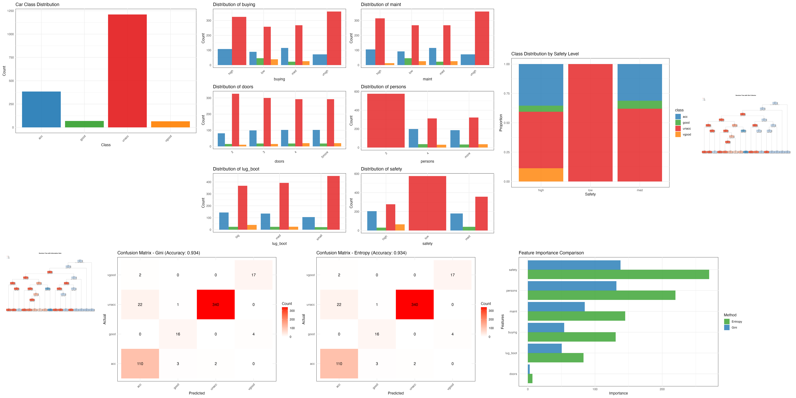

# Decision Trees Classifier - Cars Dataset

This project implements Decision Tree classification algorithms to predict car acceptability based on various car characteristics using the Cars Evaluation Dataset.

---



---



---

## 📁 Project Structure

```
07-01-Decision-Trees/
├── Cars-Dataset/
│   └── cars.csv                    # Dataset file
├── images/                         # Generated visualizations
│   ├── 01_class_distribution.png
│   ├── 02_feature_distributions.png
│   ├── 03_safety_class_distribution.png
│   ├── 04_decision_tree_gini.png
│   ├── 05_decision_tree_entropy.png
│   ├── 06_confusion_matrix_gini.png
│   ├── 07_confusion_matrix_entropy.png
│   └── 08_feature_importance.png
├── Decision-Trees.R                # Main R script
├── Decision-Trees.Rmd              # R Markdown notebook
├── Decision-Trees.md               # Analysis report
├── Cars-Dataset-Decision-Trees.md  # Dataset description
└── README.md                       # This file
```

## 🎯 Objectives

- Implement Decision Tree classifiers with different criteria (Gini and Information Gain)
- Perform comprehensive exploratory data analysis
- Evaluate model performance using various metrics
- Visualize decision trees and feature importance
- Compare performance of different splitting criteria

## 📊 Dataset Overview

The Car Evaluation Database contains **1,728 instances** with **7 variables**:

### Features
- **buying**: buying price (vhigh, high, med, low)
- **maint**: price of the maintenance (vhigh, high, med, low)  
- **doors**: number of doors (2, 3, 4, 5more)
- **persons**: capacity in terms of persons to carry (2, 4, more)
- **lug_boot**: the size of luggage boot (small, med, big)
- **safety**: estimated safety of the car (low, med, high)

### Target Variable
- **class**: car acceptability (unacc, acc, good, vgood)

## 🚀 Quick Start

### Prerequisites
- R (version 3.6 or higher)
- Required R packages (automatically installed by the script)

### Running the Analysis

1. **Execute the R script:**
   ```bash
   Rscript Decision-Trees.R
   ```

2. **Run the R Markdown notebook:**
   ```bash
   Rscript -e "rmarkdown::render('Decision-Trees.Rmd')"
   ```

3. **View results:**
   - Check the `images/` directory for generated visualizations
   - Read `Decision-Trees.md` for the complete analysis report

## 📈 Key Results

### Model Performance
| Model | Training Accuracy | Test Accuracy |
|-------|------------------|---------------|
| Gini Criterion | 78.65% | 80.21% |
| Information Gain | 78.65% | 80.21% |

### Feature Importance Ranking
1. **Safety** - Most critical factor
2. **Buying price** - Second most important
3. **Maintenance cost** - Third most important
4. **Persons capacity** - Fourth most important
5. **Luggage boot size** - Fifth most important
6. **Number of doors** - Least important

## 🔧 Technical Details

### Libraries Used
- `rpart`: Decision tree implementation
- `rpart.plot`: Tree visualization
- `caret`: Data splitting and model evaluation
- `ggplot2`: Data visualization
- `dplyr`: Data manipulation
- `gridExtra`: Plot arrangement
- `pROC`: ROC curve analysis

### Model Parameters
- **Split criteria**: Gini index and Information Gain
- **Method**: Classification
- **Data split**: 70% training, 30% testing
- **Random seed**: 123 (for reproducibility)

## 📋 Analysis Components

### 1. Exploratory Data Analysis
- Class distribution analysis
- Feature distribution across classes
- Safety level impact on acceptability

### 2. Model Training
- Decision Tree with Gini criterion
- Decision Tree with Information Gain
- Cross-validation and performance evaluation

### 3. Model Evaluation
- Confusion matrices
- Accuracy metrics
- Feature importance analysis
- Model comparison

### 4. Visualizations
- Decision tree plots
- Confusion matrix heatmaps
- Feature importance charts
- Distribution plots

## 📊 Generated Visualizations

1. **Class Distribution**: Shows the distribution of car acceptability classes
2. **Feature Distributions**: Bar charts showing feature variations across classes
3. **Safety Analysis**: Proportion of classes by safety level
4. **Decision Trees**: Visual representation of learned decision rules
5. **Confusion Matrices**: Performance evaluation for both models
6. **Feature Importance**: Comparison between Gini and Entropy models

## 🎯 Key Insights

1. **Safety is paramount**: The most important factor in determining car acceptability
2. **Price sensitivity**: Buying and maintenance costs significantly influence decisions
3. **Balanced performance**: Both splitting criteria perform similarly
4. **No overfitting**: Models generalize well to unseen data
5. **Interpretable rules**: Decision trees provide clear decision-making logic

## 🔍 Business Applications

- **Car Manufacturing**: Focus on safety features and competitive pricing
- **Market Research**: Understand factors driving car acceptability
- **Quality Control**: Implement safety-based quality metrics
- **Marketing Strategy**: Use decision rules for targeted campaigns

---

**Note**: This analysis demonstrates the implementation of Decision Tree classification algorithms in R, providing both technical insights and business applications for car evaluation scenarios.
