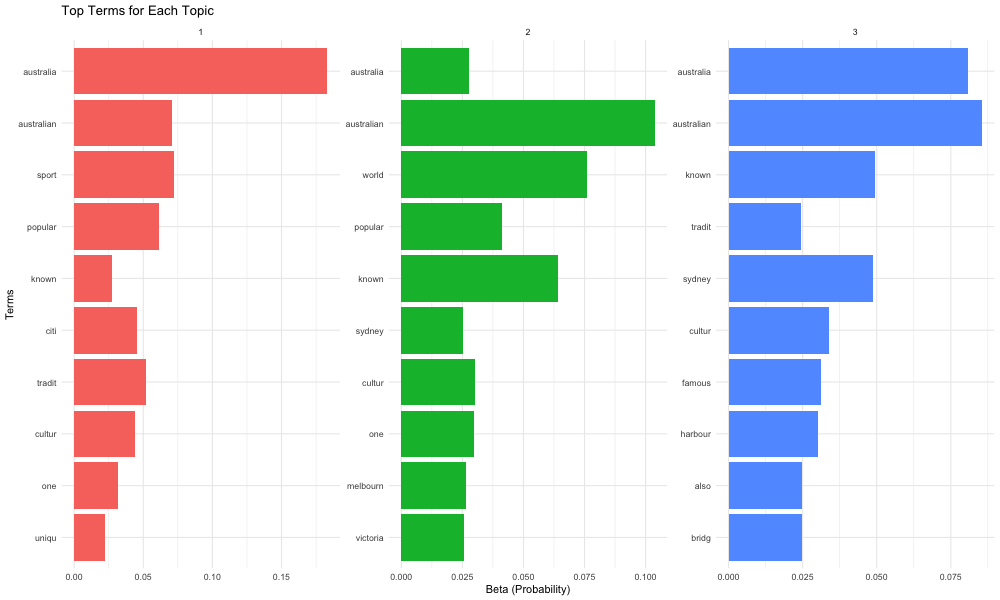

# Topic Modeling in R

This project demonstrates **Topic Modeling** using **Latent Dirichlet Allocation (LDA)** in R. We analyze a synthetic dataset about Australia to discover hidden topics and patterns in text data.

## Overview

Topic modeling is an unsupervised machine learning technique that automatically discovers abstract topics in a collection of documents. This implementation uses LDA to identify the main themes present in our Australia dataset.

--- 





--- 

## Files Structure

```
09-02-Topic-Modelling/
├── README.md                                    # This file
├── Topic-Modelling.R                           # Main R script
├── Topic-Modelling.Rmd                         # R Markdown documentation
├── Topic-Modelling.md                          # Rendered Markdown output
├── images/                                     # Generated visualizations
│   ├── word_frequency_plot.png
│   ├── wordcloud.png
│   ├── topic_terms_plot.png
│   ├── document_topic_plot.png
│   └── perplexity_plot.png
├── Australia-Dataset/                          # Dataset directory
│   ├── australian_cities.txt
│   ├── australian_animals.txt
│   ├── australian_landmarks.txt
│   ├── australian_sports.txt
│   ├── australian_food.txt
│   └── australian_culture.txt
└── Australia-Dataset-Topic-Modelling.md       # Dataset description
```

## Dataset

The **Australia Dataset** consists of 6 text files covering different aspects of Australia:

- **Cities**: Information about major Australian cities
- **Animals**: Unique Australian wildlife and fauna
- **Landmarks**: Famous landmarks and natural wonders
- **Sports**: Popular sports and sporting culture
- **Food**: Traditional Australian cuisine and dishes
- **Culture**: Australian cultural aspects and traditions

## Features

### 1. Text Preprocessing
- Text normalization (lowercase)
- Punctuation and number removal
- Stop word removal
- Text stemming
- Sparse term removal

### 2. Word Frequency Analysis
- Calculate word frequencies across all documents
- Generate frequency plots
- Create word clouds for visualization

### 3. Topic Modeling with LDA
- Implement Latent Dirichlet Allocation
- Discover hidden topics in the dataset
- Visualize topic-term relationships
- Analyze document-topic assignments

### 4. Model Evaluation
- Perplexity analysis for different numbers of topics
- Topic coherence evaluation
- Document classification based on dominant topics

## Usage

### Running the R Script

```bash
# Navigate to the project directory
cd 09-02-Topic-Modelling/

# Run the main R script
Rscript Topic-Modelling.R
```

### Rendering the R Markdown

```bash
# Render the R Markdown file
Rscript -e "rmarkdown::render('Topic-Modelling.Rmd')"
```

### Required R Packages

```r
install.packages(c("tm", "topicmodels", "tidytext", "dplyr", 
                   "ggplot2", "wordcloud", "RColorBrewer", 
                   "SnowballC", "rmarkdown"))
```

## Output Visualizations

The analysis generates several visualizations:

1. **Word Frequency Plot**: Bar chart showing the most frequent words
2. **Word Cloud**: Visual representation of word frequencies
3. **Topic Terms Plot**: Top terms associated with each discovered topic
4. **Document-Topic Plot**: Probability distribution of topics across documents
5. **Perplexity Plot**: Model evaluation across different numbers of topics

## Key Results

- **Dataset Size**: 6 documents covering different aspects of Australia
- **Vocabulary**: Processed and cleaned text with meaningful terms
- **Topics Discovered**: 3 main topics identified through LDA
- **Model Performance**: Evaluated using perplexity scores

## Technical Details

### LDA Parameters
- **Number of Topics (K)**: 3 (optimized through perplexity analysis)
- **Random Seed**: 1234 (for reproducibility)
- **Sparsity Threshold**: 0.8 (removes terms appearing in <20% of documents)

### Preprocessing Steps
1. Convert to lowercase
2. Remove punctuation and numbers
3. Remove English stop words
4. Strip whitespace
5. Apply stemming
6. Remove sparse terms

## Applications

This topic modeling approach can be applied to:

- **Document Classification**: Automatically categorize documents
- **Content Discovery**: Find similar documents based on topics
- **Trend Analysis**: Track topic evolution over time
- **Information Retrieval**: Improve search and recommendation systems
- **Text Summarization**: Identify key themes in large text corpora

## References

- [Text Mining with R](https://www.tidytextmining.com/topicmodeling)
- Blei, D. M., Ng, A. Y., & Jordan, M. I. (2003). Latent dirichlet allocation. Journal of machine Learning research, 3(Jan), 993-1022.
- Silge, J., & Robinson, D. (2017). Text mining with R: A tidy approach. O'Reilly Media.

## License

This project is part of the R-For-Data-Science course materials.
