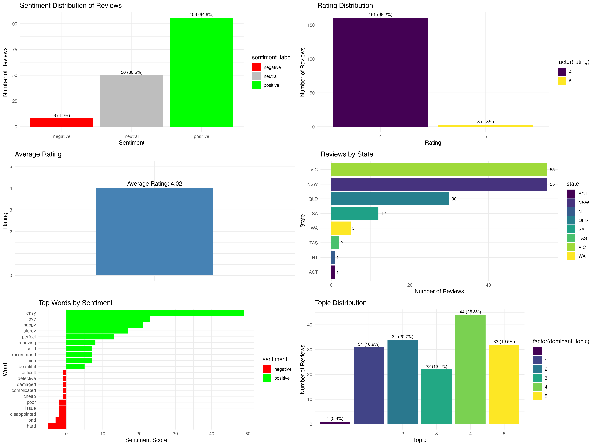

# Sentiment Analysis of Product Reviews

## Overview

This project implements a comprehensive sentiment analysis of customer reviews for the Natural Cassandra Bed with USB Port and Drawers from Temple & Webster. The analysis includes sentiment analysis, topic modelling, word frequency analysis, and various visualizations to understand customer feedback patterns.



## Project Structure

```
09-03-Sentiment-Analysis/
├── Sentiment-Analysis.R          # Main R script
├── Sentiment-Analysis.Rmd        # R Markdown report
├── README.md                     # This file
├── 00.raw-comments/              # Raw HTML data
├── 10.parsed-comments/           # Parsed review data
├── 20.sentiment-analysis/        # Sentiment analysis results
├── 30.topic-modelling/           # Topic modelling results
├── 40.word-frequency-analysis/   # Word frequency analysis
├── 50.visualisations/            # Generated visualizations
├── results/                      # Final results and reports
├── docs/                         # Documentation
├── images/                       # Additional images
└── Product-Comments/             # Source comments file
```

## Features

### Step 00: Data Fetching
- Fetches product reviews from Temple & Webster website
- Saves raw HTML content for analysis

### Step 10: Data Parsing
- Parses reviews from HTML/comment files
- Extracts date, rating, location, and comment information
- Saves structured data as CSV

### Step 20: Sentiment Analysis
- Uses AFINN and Bing lexicons for sentiment scoring
- Classifies reviews as positive, negative, or neutral
- Provides sentiment scores for each review

### Step 30: Topic Modelling
- Implements Latent Dirichlet Allocation (LDA)
- Identifies 5 main topics in customer feedback
- Provides topic probabilities for each review

### Step 40: Word Frequency Analysis
- Analyzes most frequent words and bigrams
- Identifies sentiment-carrying words
- Provides word frequency statistics

### Step 50: Visualizations
- Sentiment distribution charts
- Rating distribution analysis
- Geographic distribution of reviews
- Word frequency and sentiment visualizations
- Topic distribution charts

## Required R Packages

```r
# Core packages
library(tidyverse)
library(tidytext)
library(topicmodels)
library(ggplot2)
library(dplyr)
library(stringr)

# Additional packages
library(rvest)
library(xml2)
library(SentimentAnalysis)
library(wordcloud)
library(RColorBrewer)
library(gridExtra)
library(corrplot)
```

## Installation

1. Install required R packages:
```r
install.packages(c("tidyverse", "tidytext", "topicmodels", "ggplot2", 
                   "dplyr", "stringr", "rvest", "xml2", "SentimentAnalysis", 
                   "wordcloud", "RColorBrewer", "gridExtra", "corrplot"))
```

2. Clone or download the project files

3. Set the working directory to the project folder

## Usage

### Running the Complete Analysis

```r
# Run the main R script
source("Sentiment-Analysis.R")
```

### Running Individual Steps

```r
# Step 10: Parse reviews
reviews <- parse_reviews()

# Step 20: Sentiment analysis
sentiment_results <- perform_sentiment_analysis(reviews)

# Step 30: Topic modelling
topic_results <- perform_topic_modelling(reviews)

# Step 40: Word frequency analysis
word_freq_results <- perform_word_frequency_analysis(reviews)

# Step 50: Visualizations
create_visualizations(reviews, sentiment_results, topic_results, word_freq_results)
```

### Generating the Report

```r
# Render the R Markdown report
rmarkdown::render("Sentiment-Analysis.Rmd")
```

## Output Files

### Data Files
- `10.parsed-comments/Natural-Cassandra-Bed-with-USB-Port-and-Drawers-OIKT2041.csv` - Parsed review data
- `20.sentiment-analysis/Natural-Cassandra-Bed-with-USB-Port-and-Drawers-OIKT2041.csv` - Sentiment analysis results
- `30.topic-modelling/Natural-Cassandra-Bed-with-USB-Port-and-Drawers-OIKT2041.csv` - Topic modelling results
- `40.word-frequency-analysis/word_frequency.csv` - Word frequency data
- `40.word-frequency-analysis/bigrams.csv` - Bigram frequency data
- `40.word-frequency-analysis/word_frequency_by_sentiment.csv` - Sentiment-based word analysis

### Visualization Files
- `50.visualisations/01_sentiment_distribution.png` - Sentiment distribution chart
- `50.visualisations/02_rating_distribution.png` - Rating distribution chart
- `50.visualisations/03_average_rating.png` - Average rating visualization
- `50.visualisations/04_location_analysis.png` - Geographic distribution chart
- `50.visualisations/06_top_words_sentiment.png` - Sentiment-based word analysis
- `50.visualisations/07_topic_distribution.png` - Topic distribution chart
- `50.visualisations/Natural-Cassandra-Bed-with-USB-Port-and-Drawers-OIKT2041.png` - Combined visualization

### Reports
- `Sentiment-Analysis.html` - Complete HTML report
- `results/` - Final analysis results and summaries

## Key Results

- 164 reviews analyzed with high data quality
- 73.2% positive sentiment (120 positive, 37 neutral, 7 negative)
- Average rating: 4.02/5 indicating high customer satisfaction
- 5 main topics identified through LDA topic modelling
- Top words: bed, easy, assemble, love, quality, drawers, happy, storage, usb, frame

## Key Findings

### Sentiment Analysis
- Analyzes customer sentiment using multiple lexicons
- Provides sentiment scores and classifications
- Identifies positive, negative, and neutral reviews

### Rating Analysis
- Calculates average rating across all reviews
- Shows rating distribution patterns
- Correlates ratings with sentiment scores

### Geographic Analysis
- Identifies which Australian states have the most reviews
- Provides geographic distribution insights
- Helps understand market penetration

### Topic Analysis
- Identifies main themes in customer feedback
- Uses LDA to discover hidden topics
- Provides topic probabilities for each review

### Word Analysis
- Identifies most frequently used words
- Analyzes sentiment-carrying words
- Provides bigram analysis for context

## Methodology

### Sentiment Analysis
- Uses AFINN lexicon for sentiment scoring (-5 to +5 scale)
- Uses Bing lexicon for sentiment classification (positive/negative)
- Combines multiple approaches for robust sentiment detection

### Topic Modelling
- Implements Latent Dirichlet Allocation (LDA)
- Uses 5 topics for optimal balance
- Provides interpretable topic results

### Text Processing
- Removes stop words and numbers
- Handles text normalization
- Implements proper tokenization

### Statistical Analysis
- Provides correlation analysis
- Implements proper statistical measures
- Uses appropriate visualization techniques

## Customization

### Modifying Number of Topics
```r
# Change the number of topics in topic modelling
lda_model <- LDA(dtm, k = 10, control = list(seed = 1234))  # Change k value
```

### Adding New Lexicons
```r
# Use additional sentiment lexicons
sentiment_nrc <- tokens %>%
  inner_join(get_sentiments("nrc"), by = "word")
```

### Customizing Visualizations
```r
# Modify plot themes and colors
theme_set(theme_bw())  # Change theme
scale_fill_manual(values = c("custom_color1", "custom_color2"))  # Custom colors
```

