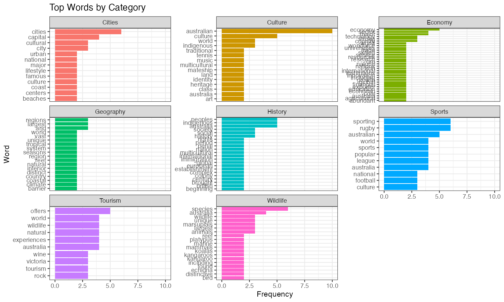

# WordCloud Analysis of Australia Dataset

This project demonstrates word cloud analysis and text mining techniques using a synthetic dataset about Australia. The analysis covers word frequency analysis, text preprocessing, and various visualization techniques.

---




--- 

## Project Structure

```
09-04-WordCloud/
├── Australia-Dataset/           # Text files about Australia
│   ├── australia_geography.txt
│   ├── australia_cities.txt
│   ├── australia_wildlife.txt
│   ├── australia_culture.txt
│   ├── australia_tourism.txt
│   ├── australia_history.txt
│   ├── australia_economy.txt
│   ├── australia_sports.txt
│   └── README.md
├── images/                     # Generated visualizations
├── WordCloud.R                 # Main R script
├── WordCloud.Rmd              # R Markdown document
├── WordCloud.md               # Generated markdown output
└── README.md                  # This file
```

## Dataset Description

The Australia dataset contains 8 text files covering different aspects of Australia:

- **Geography**: Information about Australia's geography, climate, and natural features
- **Cities**: Details about major Australian cities and their characteristics
- **Wildlife**: Information about Australian wildlife and unique animals
- **Culture**: Australian culture, traditions, and lifestyle
- **Tourism**: Tourist attractions and travel information
- **History**: Historical information about Australia
- **Economy**: Economic information and industries
- **Sports**: Sports and recreational activities in Australia

## Features

### WordCloud.R Script
- Text preprocessing and tokenization
- Stop word removal and text cleaning
- Word frequency analysis
- Multiple word cloud visualizations
- Category-wise text analysis
- Bigram analysis
- Document-term matrix creation

### WordCloud.Rmd Document
- Comprehensive markdown documentation
- Interactive analysis with code chunks
- Multiple visualization types
- Statistical summaries
- Step-by-step explanation of techniques

## Generated Visualizations

The analysis generates several types of visualizations:

1. **Word Frequency Plots**: Bar charts showing the most frequent words
2. **Word Clouds**: Multiple variations with different color schemes
3. **Category Analysis**: Word frequencies by document category
4. **Bigram Analysis**: Two-word phrase frequency analysis
5. **Document-Term Matrix**: Matrix representation of word frequencies

## Usage

### Running the R Script
```bash
Rscript WordCloud.R
```

### Rendering the R Markdown
```bash
Rscript -e "rmarkdown::render('WordCloud.Rmd')"
```

## Requirements

The following R packages are required and will be automatically installed:

- `tidyverse`: Data manipulation and visualization
- `tidytext`: Text mining and tokenization
- `tm`: Text mining framework
- `wordcloud`: Word cloud generation
- `RColorBrewer`: Color palettes
- `SnowballC`: Text stemming

## Output Files

The analysis generates:

- **Images**: Various PNG files with white backgrounds
  - `word_frequency_plot.png`
  - `word_frequency_by_category.png`
  - `bigram_frequency_plot.png`
  - `wordcloud_basic.png`
  - `wordcloud_colors.png`
  - `bigram_wordcloud.png`
  - Category-specific word clouds

- **Data Files**: CSV files with frequency data
  - `word_frequencies.csv`
  - `bigram_frequencies.csv`
  - `category_word_frequencies.csv`

## Key Findings

The analysis reveals:

1. **Most Frequent Words**: "australia", "country", "world", "australian", "national"
2. **Category Themes**: Each document category has distinct vocabulary patterns
3. **Bigram Patterns**: Common two-word phrases like "great barrier", "australian culture"
4. **Text Structure**: Document-term matrix shows sparse but meaningful word distributions

## Technical Details

- **Text Preprocessing**: Lowercase conversion, stop word removal, minimum length filtering
- **Tokenization**: Word and bigram extraction using tidytext
- **Visualization**: ggplot2 for plots, wordcloud for word clouds
- **Color Schemes**: RColorBrewer palettes for consistent styling
- **Background**: All visualizations use white backgrounds as specified

## Extensions

This project can be extended with:

- Sentiment analysis of the text
- Topic modeling using LDA
- Advanced text preprocessing techniques
- Interactive word cloud applications
- Machine learning classification based on text content

## References

- Text Mining with R: A Tidy Approach by Julia Silge and David Robinson
- R for Data Science by Hadley Wickham and Garrett Grolemund
- Tidytext package documentation
- Wordcloud package documentation
