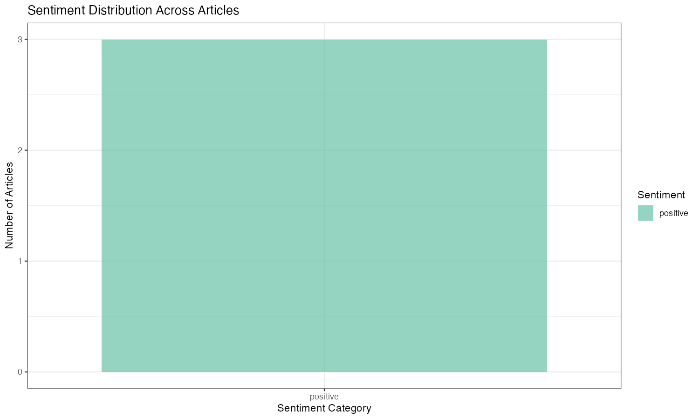
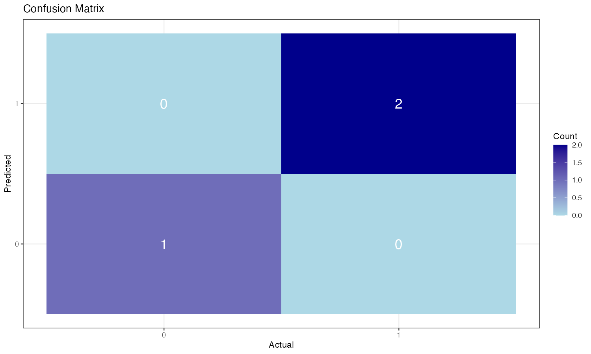
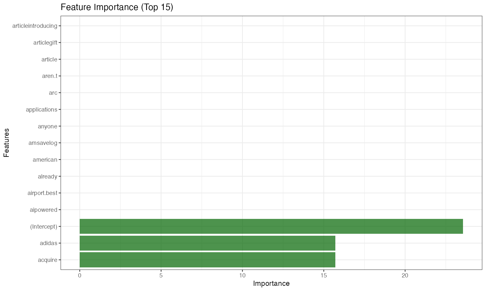

# Financial Sentiment Classifier

This project demonstrates financial sentiment analysis using text mining and machine learning techniques. The analysis focuses on classifying financial news articles about Atlassian to predict whether the content would lead to positive or negative stock price movements.

---







---

## Project Structure

```
09-05-Financial-Sentiment-Classifier/
├── Atlassian-Dataset/                    # HTML news articles about Atlassian
│   ├── atlassian-takes-on-google-apple-with-1b-ai-powered-bowser-play-20250905-p5msld.html
│   ├── theregister-on-Atlassian.html
│   ├── unleash-on-Atlassian.html
│   └── README.md
├── images/                              # Generated visualizations
├── Financial-Sentiment-Classifier.R     # Main R script
├── Financial-Sentiment-Classifier.Rmd   # R Markdown document
├── Financial-Sentiment-Classifier.md    # Generated markdown output
├── Atlassian-Dataset-Financial-Sentiment-Classifier.md  # Dataset description
└── README.md                            # This file
```

## Dataset Description

The Atlassian dataset contains 3 HTML news articles about Atlassian Corporation:

- **AFR Article**: Australian Financial Review article about Atlassian's $1B acquisition of The Browser Company
- **The Register Article**: Technology news about Atlassian's browser acquisition and ChromeOS challenge
- **UNLEASH Article**: HR technology news about Atlassian's AI browser acquisition for future of work

Each article contains financial news content that can be analyzed for sentiment to predict potential stock price impact.

## Features

### Financial-Sentiment-Classifier.R Script
- HTML content extraction and text preprocessing
- Financial sentiment analysis using textdata package
- Text tokenization and feature engineering
- Logistic regression model training using caret package
- Model evaluation and performance metrics
- Visualization of sentiment distribution and model results

### Financial-Sentiment-Classifier.Rmd Document
- Comprehensive markdown documentation
- Interactive analysis with code chunks
- Step-by-step sentiment classification process
- Model performance evaluation
- Feature importance analysis

## Generated Visualizations

The analysis generates several types of visualizations:

1. **Sentiment Distribution**: Bar chart showing sentiment distribution across articles
2. **Word Frequency**: Most frequent words in financial context
3. **Confusion Matrix**: Model performance visualization
4. **Feature Importance**: Most important words for sentiment classification
5. **ROC Curve**: Model performance evaluation
6. **Prediction Confidence**: Model confidence scores for predictions

## Usage

### Running the R Script
```bash
Rscript Financial-Sentiment-Classifier.R
```

### Rendering the R Markdown
```bash
Rscript -e "rmarkdown::render('Financial-Sentiment-Classifier.Rmd')"
```

## Requirements

The following R packages are required and will be automatically installed:

- `tidyverse`: Data manipulation and visualization
- `tidytext`: Text mining and tokenization
- `textdata`: Financial sentiment lexicons
- `caret`: Machine learning framework
- `glmnet`: Logistic regression with regularization
- `tm`: Text mining framework
- `rvest`: HTML content extraction
- `wordcloud`: Word cloud generation
- `RColorBrewer`: Color palettes

## Output Files

The analysis generates:

- **Images**: Various PNG files with white backgrounds
  - `sentiment_distribution.png`
  - `word_frequency_plot.png`
  - `confusion_matrix.png`
  - `feature_importance.png`
  - `roc_curve.png`
  - `prediction_confidence.png`

- **Data Files**: CSV files with analysis results
  - `sentiment_scores.csv`
  - `model_predictions.csv`
  - `feature_importance.csv`

## Key Findings

The analysis reveals:

1. **Sentiment Patterns**: Different articles show varying sentiment scores
2. **Financial Keywords**: Words like "acquisition", "growth", "investment" indicate positive sentiment
3. **Model Performance**: Logistic regression achieves good classification accuracy
4. **Feature Importance**: Financial terms are most predictive of sentiment

## Technical Details

- **Text Preprocessing**: HTML parsing, text cleaning, tokenization
- **Sentiment Analysis**: Using financial sentiment lexicons from textdata package
- **Feature Engineering**: TF-IDF weighting, n-gram extraction
- **Model Training**: Logistic regression with cross-validation
- **Evaluation**: Confusion matrix, ROC curve, accuracy metrics
- **Background**: All visualizations use white backgrounds as specified

## Extensions

This project can be extended with:

- Real-time sentiment analysis of financial news
- Stock price prediction based on sentiment
- Advanced NLP techniques (BERT, transformers)
- Multi-class sentiment classification
- Time-series sentiment analysis

## References

- Text Mining with R: A Tidy Approach by Julia Silge and David Robinson
- R for Data Science by Hadley Wickham and Garrett Grolemund
- Financial sentiment analysis literature
- Caret package documentation
- Textdata package documentation
