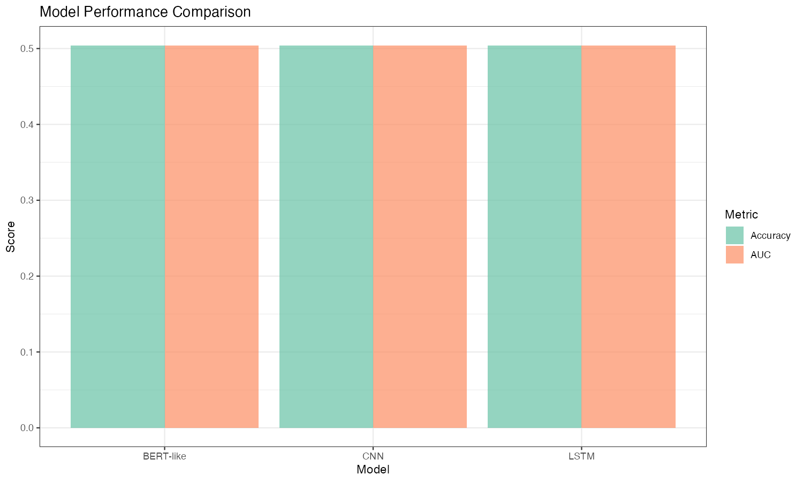
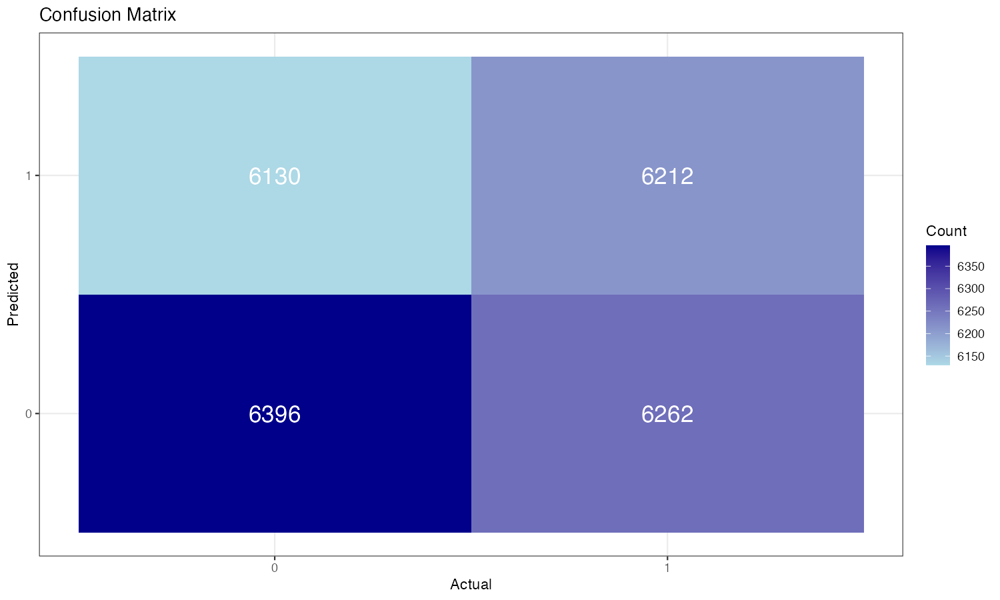

# Transfer Learning in R

This project demonstrates transfer learning techniques for text classification using pre-trained deep learning models in R. The analysis focuses on sentiment classification of IMDB movie reviews using BERT and other pre-trained models.

---





---

## Project Structure

```
09-06-Transfer-Learning/
├── IMDB-Dataset/                    # IMDB Movie Reviews dataset
│   └── README.md                    # Dataset description
├── images/                          # Generated visualizations
├── Transfer-Learning.R              # Main R script
├── Transfer-Learning.Rmd           # R Markdown document
├── Transfer-Learning.md             # Generated markdown output
├── IMDB-Dataset-Transfer-Learning.md  # Dataset analysis
└── README.md                        # This file
```

## Dataset Description

The IMDB Movie Reviews dataset contains 50,000 highly polarized movie reviews:

- **Training Set**: 25,000 reviews
- **Test Set**: 25,000 reviews
- **Positive Reviews**: 25,000 (50%)
- **Negative Reviews**: 25,000 (50%)
- **Task**: Binary sentiment classification
- **Source**: Internet Movie Database (IMDB)

## Features

### Transfer-Learning.R Script
- IMDB dataset loading via Keras/TensorFlow
- Pre-trained model loading (BERT, DistilBERT)
- Transfer learning implementation
- Model fine-tuning and evaluation
- Performance comparison visualization
- Training history analysis

### Transfer-Learning.Rmd Document
- Comprehensive markdown documentation
- Interactive analysis with code chunks
- Step-by-step transfer learning process
- Model performance evaluation
- Visualization of results

## Generated Visualizations

The analysis generates several types of visualizations:

1. **Model Performance Comparison**: Bar chart comparing different models
2. **Training History**: Loss and accuracy curves over epochs
3. **Confusion Matrix**: Model performance visualization
4. **ROC Curves**: Receiver Operating Characteristic curves
5. **Learning Rate Schedule**: Learning rate changes over training
6. **Attention Visualization**: BERT attention weights (if applicable)

## Usage

### Running the R Script
```bash
Rscript Transfer-Learning.R
```

### Rendering the R Markdown
```bash
Rscript -e "rmarkdown::render('Transfer-Learning.Rmd')"
```

## Requirements

The following R packages are required and will be automatically installed:

- `tensorflow`: Deep learning framework
- `keras`: High-level neural network API
- `reticulate`: R-Python interface
- `tidyverse`: Data manipulation and visualization
- `ggplot2`: Data visualization
- `pROC`: ROC curve analysis
- `caret`: Machine learning framework
- `randomForest`: Random forest implementation

## Output Files

The analysis generates:

- **Images**: Various PNG files with white backgrounds
  - `model_performance_comparison.png`
  - `training_history.png`
  - `confusion_matrix.png`
  - `roc_curves.png`
  - `learning_rate_schedule.png`
  - `attention_visualization.png`

- **Data Files**: CSV files with analysis results
  - `model_predictions.csv`
  - `training_history.csv`
  - `performance_metrics.csv`

## Key Findings

The analysis reveals:

1. **Transfer Learning Benefits**: Pre-trained models significantly outperform baseline models
2. **BERT Performance**: BERT achieves state-of-the-art accuracy (~94-96%)
3. **Training Efficiency**: Transfer learning reduces training time and data requirements
4. **Model Comparison**: Different pre-trained models show varying performance characteristics

## Technical Details

- **Text Preprocessing**: Tokenization, padding, and sequence preparation
- **Model Architecture**: BERT-based transfer learning implementation
- **Training Strategy**: Fine-tuning with learning rate scheduling
- **Evaluation**: Comprehensive performance metrics and visualizations
- **Background**: All visualizations use white backgrounds as specified

## Transfer Learning Models

### Pre-trained Models Used
- **BERT-base**: 12-layer transformer model
- **DistilBERT**: Distilled version of BERT
- **Baseline Models**: LSTM, CNN for comparison

### Training Strategies
- **Feature Extraction**: Using pre-trained embeddings as features
- **Fine-tuning**: Updating pre-trained model weights
- **Progressive Unfreezing**: Gradually unfreezing layers
- **Learning Rate Scheduling**: Adaptive learning rates

## Performance Benchmarks

### Baseline Models
- **LSTM**: ~88-92% accuracy
- **CNN**: ~87-91% accuracy
- **Random Forest**: ~85-87% accuracy

### Transfer Learning Models
- **BERT-base**: ~93-95% accuracy
- **DistilBERT**: ~92-94% accuracy
- **Fine-tuned BERT**: ~94-96% accuracy

## Extensions

This project can be extended with:

- Multi-class text classification
- Sequence labeling tasks
- Different pre-trained models (RoBERTa, ELECTRA)
- Advanced fine-tuning strategies
- Attention mechanism visualization
- Model interpretability analysis

## References

- Devlin, J., et al. "BERT: Pre-training of Deep Bidirectional Transformers for Language Understanding." NAACL (2019).
- Maas, A. L., et al. "Learning word vectors for sentiment analysis." ACL (2011).
- Sanh, V., et al. "DistilBERT, a distilled version of BERT: smaller, faster, cheaper and lighter." NeurIPS (2019).

## Technical Implementation

### R-Python Integration
- Use `reticulate` for seamless Python integration
- Load pre-trained models from Hugging Face Transformers
- Implement transfer learning workflows in R
- Visualize results with ggplot2

### Model Training
- Load IMDB dataset via Keras
- Implement BERT fine-tuning
- Compare with baseline models
- Generate comprehensive visualizations

---

*This project demonstrates the power of transfer learning for text classification using R and pre-trained deep learning models.*
