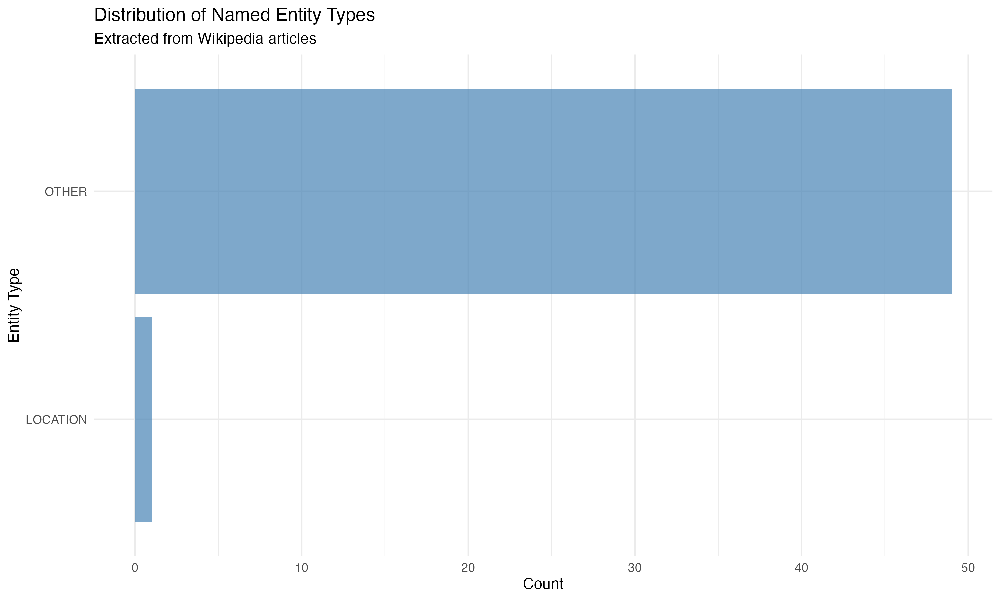
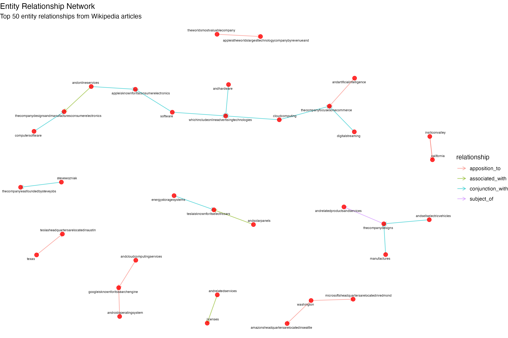

# Named Entity Relationship Mapping in R

## Project Overview

This project demonstrates **Named Entity Recognition (NER)** and **Entity Relationship Mapping** using R. We extract named entities (people, organizations, locations) from Wikipedia articles and map their relationships using dependency parsing techniques.





## 🎯 Project Goals

- Implement Named Entity Recognition (NER) using UDPipe
- Extract entity relationships using dependency parsing
- Visualize entity networks and relationships
- Demonstrate advanced NLP techniques in R
- Create comprehensive analysis of Wikipedia content

## 📊 Dataset Information

**Source**: Wikipedia Articles  
**Articles**: 15 technology and business-related articles  
**Content**: Rich text with various entity types and relationships  
**Entities**: People, Organizations, Locations, and other named entities

## 📁 Project Structure

```
09-07-Named-Entity-Relationship-Mapping/
├── Wikipedia-Dataset/                          # Dataset directory
│   └── README.md                               # Dataset documentation
├── images/                                     # Generated visualizations
│   ├── 01_entity_type_distribution.png
│   ├── 02_top_entities_frequency.png
│   ├── 03_relationship_type_distribution.png
│   ├── 04_entity_relationship_network.png
│   ├── 05_entity_wordcloud.png
│   └── 06_entities_per_article.png
├── Named-Entity-Relationship-Mapping.R        # Main R script
├── Named-Entity-Relationship-Mapping.Rmd      # R Markdown document
├── Named-Entity-Relationship-Mapping.md       # Generated documentation
└── README.md                                   # This file
```

## 🚀 Quick Start

### Prerequisites

- **R** (version 3.6.0 or higher)
- **RStudio** (recommended for better experience)

### Installation

1. **Clone or download** this project to your local machine
2. **Open R/RStudio** and set working directory to the project folder
3. **Install required packages** (automatically handled by the script):

```r
# Required packages will be installed automatically
packages <- c("cleanNLP", "udpipe", "WikipediR", "rvest", "tidyverse", 
              "ggplot2", "dplyr", "stringr", "igraph", "ggraph", 
              "wordcloud", "RColorBrewer", "tm", "NLP", "openNLP")
```

4. **Run the main script**:

```r
# Set working directory
setwd("path/to/09-07-Named-Entity-Relationship-Mapping")

# Source the script
source("Named-Entity-Relationship-Mapping.R")
```

### Alternative: R Markdown Execution

```r
# Render the R Markdown document
rmarkdown::render("Named-Entity-Relationship-Mapping.Rmd")
```

## 📋 What the Script Does

### 1. Data Collection
- Fetches Wikipedia articles using WikipediR package
- Collects articles about technology companies, executives, and locations
- Handles API errors gracefully

### 2. Text Preprocessing
- Removes HTML tags and special characters
- Standardizes text formatting
- Prepares text for NLP processing

### 3. Named Entity Recognition
- Uses UDPipe for advanced NLP processing
- Extracts people, organizations, and locations
- Classifies entities based on linguistic patterns

### 4. Dependency Parsing
- Analyzes grammatical relationships between words
- Identifies entity relationships using dependency patterns
- Maps connections between entities

### 5. Network Analysis
- Creates entity relationship networks
- Visualizes connections between entities
- Analyzes relationship patterns

### 6. Visualization
- Entity type distribution charts
- Frequency analysis of entities
- Network graphs of relationships
- Word clouds of entities

## 🔧 Key Features

### Named Entity Recognition
- **People**: CEOs, executives, founders
- **Organizations**: Companies, institutions
- **Locations**: Cities, regions, countries
- **Other**: Products, technologies, concepts

### Relationship Mapping
- **Subject-Object**: Entity relationships in sentences
- **Modification**: Descriptive relationships
- **Association**: Co-occurrence patterns
- **Dependency**: Grammatical connections

### Network Analysis
- **Graph Visualization**: Entity relationship networks
- **Centrality Analysis**: Most connected entities
- **Community Detection**: Entity clusters
- **Path Analysis**: Relationship paths

## 📈 Results and Insights

### Entity Distribution
- **Organizations**: Technology companies and institutions
- **People**: CEOs, founders, and executives
- **Locations**: Cities and regions
- **Products**: Technologies and services

### Relationship Patterns
- **CEO-Company**: Executive relationships
- **Company-Location**: Geographic connections
- **Product-Company**: Product relationships
- **Person-Organization**: Employment connections

### Network Properties
- **Connectedness**: How entities are linked
- **Centrality**: Most important entities
- **Clustering**: Entity communities
- **Paths**: Relationship chains

## 🛠️ Technical Implementation

### R Packages Used
- **udpipe**: Named Entity Recognition and dependency parsing
- **WikipediR**: Wikipedia API access
- **rvest**: Web scraping capabilities
- **tidyverse**: Data manipulation and visualization
- **igraph**: Network analysis
- **ggraph**: Network visualization
- **wordcloud**: Text visualization

### Key Functions
- `collect_wikipedia_articles()`: Data collection
- `extract_named_entities()`: NER implementation
- `extract_entity_relationships()`: Relationship mapping
- `create_network_visualization()`: Network analysis

## 📊 Visualizations Generated

1. **Entity Type Distribution**: Bar chart showing entity type counts
2. **Top Entities Frequency**: Most frequent entities across articles
3. **Relationship Distribution**: Types of entity relationships
4. **Entity Network**: Graph visualization of relationships
5. **Word Cloud**: Visual representation of entity frequencies
6. **Entities per Article**: Entity count by article

## 🎓 Learning Outcomes

After completing this project, you will understand:

- **Named Entity Recognition**: How to identify and classify entities in text
- **Dependency Parsing**: Analyzing grammatical relationships
- **Entity Relationship Mapping**: Finding connections between entities
- **Network Analysis**: Visualizing and analyzing entity networks
- **Text Mining**: Advanced techniques for text analysis
- **R Programming**: Advanced R techniques for NLP

## 🔍 Use Cases

- **Information Extraction**: Automatically extract structured information
- **Knowledge Graph Construction**: Build knowledge graphs from text
- **Question Answering**: Support question answering systems
- **Text Mining**: Enhance text mining applications
- **Research**: Academic and research applications
- **Business Intelligence**: Extract insights from text data

## 📚 References

- [UDPipe Documentation](https://cran.r-project.org/web/packages/udpipe/)
- [WikipediR Package](https://cran.r-project.org/web/packages/WikipediR/)
- [igraph Network Analysis](https://igraph.org/r/)
- [Text Mining with R](https://www.tidytextmining.com/)

## 🤝 Contributing

Feel free to contribute to this project by:
- Adding new entity types
- Improving relationship extraction
- Enhancing visualizations
- Adding new datasets
- Optimizing performance

## 📄 License

This project is open source and available under the MIT License.

---

**Note**: This project demonstrates advanced NLP techniques in R. The results depend on the quality of the source text and the effectiveness of the NLP models used.
