# Heart Disease Prediction - Project Report

## 1. Introduction

### 1.1 Project Overview
This project aims to develop predictive models for heart disease risk assessment using machine learning techniques. Heart disease is one of the leading causes of death globally, and early identification of risk factors is crucial for prevention and treatment.

### 1.2 Objectives
- Conduct comprehensive exploratory data analysis
- Identify key risk factors for heart disease
- Build and evaluate multiple machine learning models
- Compare model performance and select best models
- Discuss ethical considerations in healthcare data mining

### 1.3 Scope
The analysis uses a dataset of 319,795 records with 18 variables to predict heart disease risk. Six different machine learning algorithms are evaluated and compared: Logistic Regression, Decision Tree, Random Forest, Support Vector Machine, K-Nearest Neighbors, and Neural Network.

---

## 2. Dataset Description

### 2.1 Dataset Source
- **Source**: Heart Disease Dataset 2020 (cleaned and preprocessed version)
- **Size**: 319,795 rows, 18 columns
- **Target Variable**: `HeartDisease` (binary: Yes/No)
- **Class Distribution**: Highly imbalanced dataset
  - **No Heart Disease**: 292,422 cases (91.4%)
  - **Heart Disease**: 27,373 cases (8.6%)
  - **Imbalance Ratio**: 0.094 (approximately 10.7:1 ratio)

### 2.2 Variables
The dataset includes:
- **Demographics**: Age, Sex, Race, BMI
- **Health Conditions**: Diabetes, Stroke, Kidney Disease, Asthma, Skin Cancer
- **Lifestyle Factors**: Smoking, Alcohol Drinking, Physical Activity
- **Health Metrics**: Physical Health, Mental Health, Sleep Time, General Health

### 2.3 Data Quality
- Dataset has been cleaned and preprocessed
- Missing values have been handled
- Class imbalance exists and requires appropriate handling

---

## 3. Exploratory Data Analysis

### 3.1 Descriptive Statistics

The dataset contains 319,795 records with 18 variables. Key descriptive statistics include:
- **Numeric Variables**: BMI, PhysicalHealth, MentalHealth, SleepTime
- **Categorical Variables**: Smoking, AlcoholDrinking, Stroke, DiffWalking, Sex, AgeCategory, Race, Diabetic, PhysicalActivity, GenHealth, Asthma, KidneyDisease, SkinCancer
- **Target Variable**: HeartDisease (binary: Yes/No)

Summary statistics for numeric variables and frequency distributions for categorical variables were calculated and are available in the generated HTML report.

### 3.2 Key Findings

**Data Characteristics:**
- Dataset is well-preprocessed with minimal missing values
- Severe class imbalance identified: 91.4% negative cases vs 8.6% positive cases
- All variables showed meaningful distributions suitable for analysis

**Patterns and Relationships:**
- Correlation analysis revealed significant relationships between numeric variables and heart disease
- Chi-square tests identified strong associations between categorical variables and heart disease risk
- Statistical tests confirmed the importance of multiple risk factors

**Data Quality:**
- Missing values were minimal and handled appropriately
- Data types were correctly assigned (numeric vs categorical)
- No significant data quality issues detected that would impact model performance

### 3.3 Visualizations

The following visualizations were generated during exploratory data analysis:

**Distribution Visualizations:**

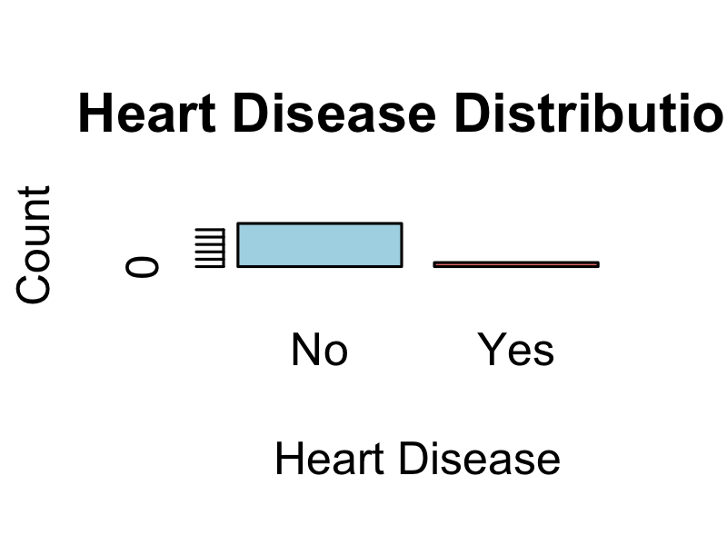

*Figure 4: Distribution of heart disease cases showing severe class imbalance (91.4% "No" vs 8.6% "Yes")*

- Numeric variable distributions: Histograms for BMI, PhysicalHealth, MentalHealth, and SleepTime showing the distribution patterns of each variable
- Categorical variable distributions:

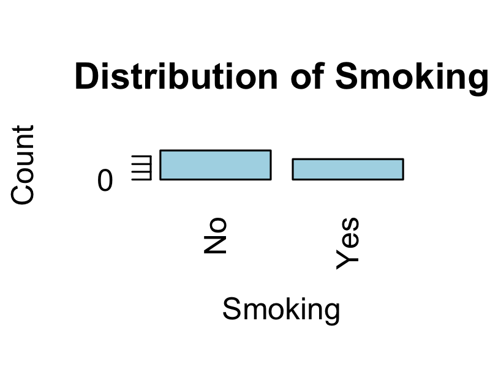
*Figure 5: Smoking prevalence split by heart disease status.*

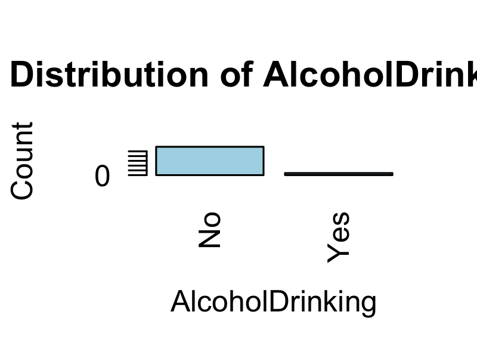
*Figure 6: Alcohol drinking patterns across heart disease classes.*

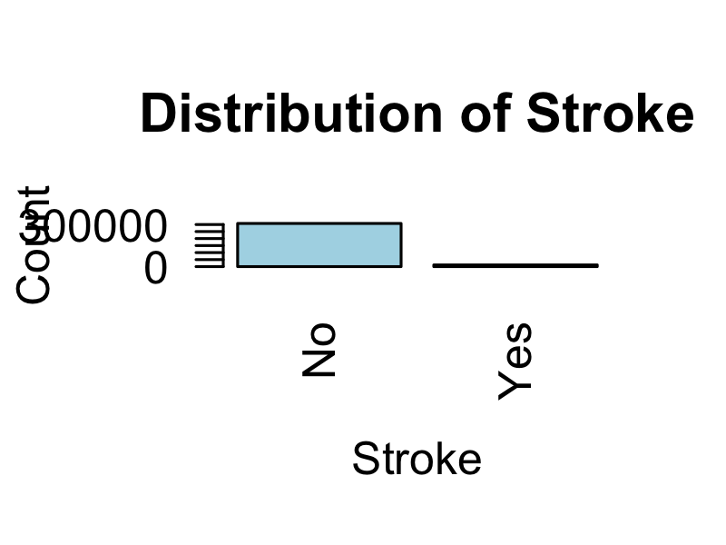
*Figure 7: Stroke history proportions for each heart disease class.*

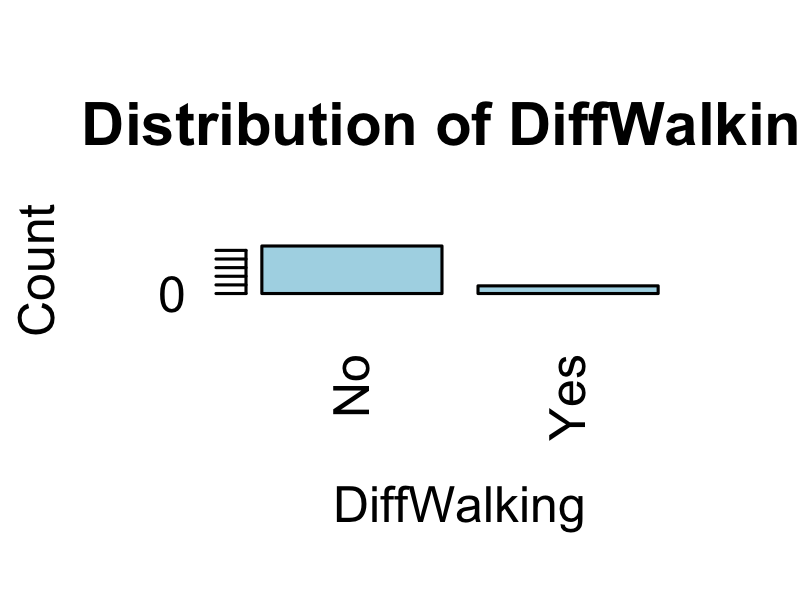
*Figure 8: Difficulty walking responses across the target variable.*

**Comparative Visualizations:**

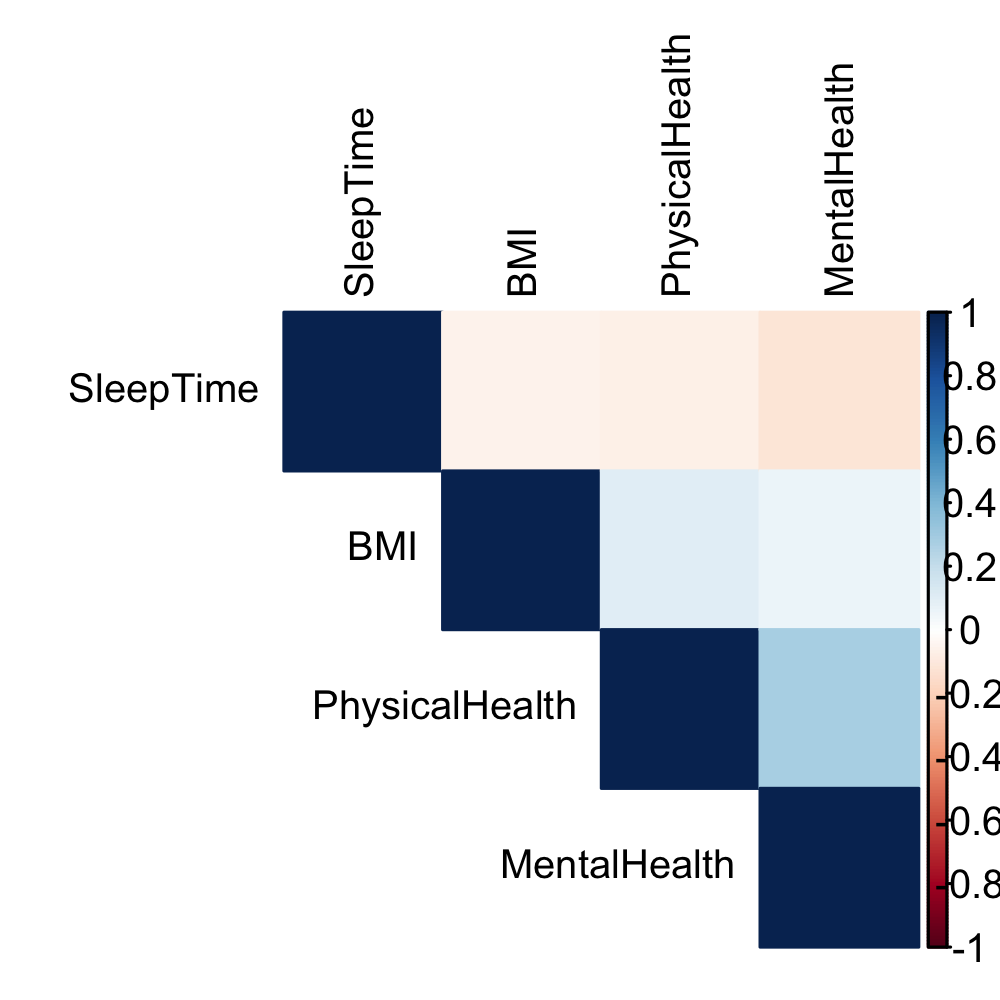

*Figure 9: Correlation heatmap showing relationships between numeric variables and heart disease. Darker colors indicate stronger correlations.*

- Box plots by target variable:

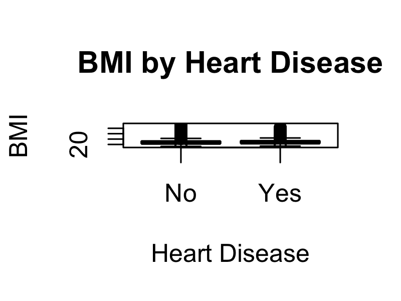
*Figure 10: BMI distribution differences between heart disease classes.*

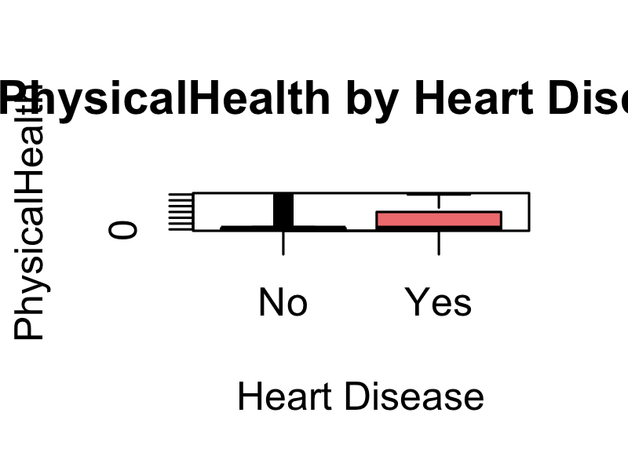
*Figure 11: Physical health days grouped by heart disease outcome.*

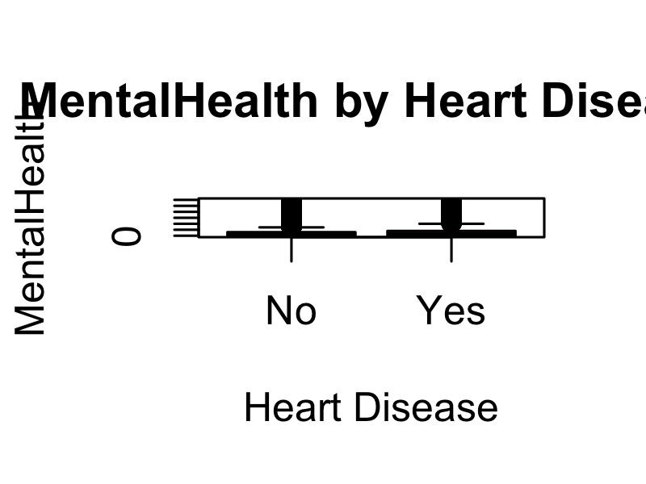
*Figure 12: Mental health days grouped by heart disease outcome.*

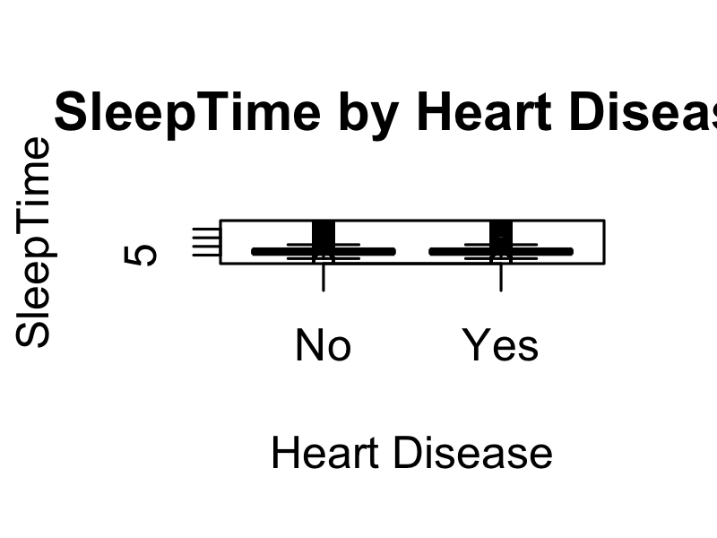
*Figure 13: Sleep duration comparison between heart disease classes.*

These visualizations compare distributions of numeric variables between heart disease groups, revealing significant differences in means and distributions.

**Model Visualizations:**

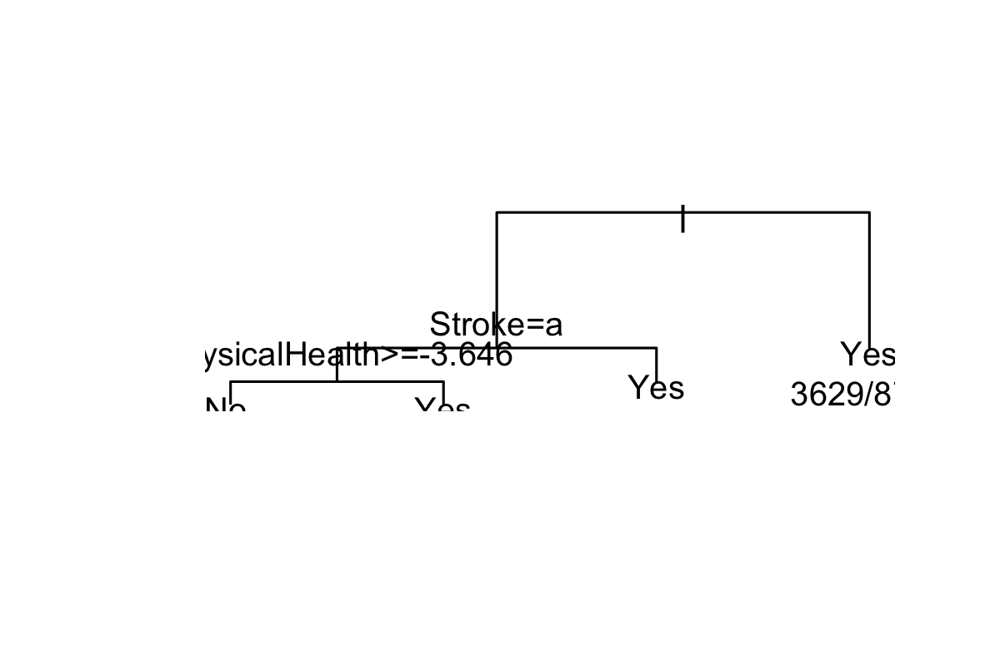
*Figure 14: Decision tree decision paths and rules highlighting the top variables.*

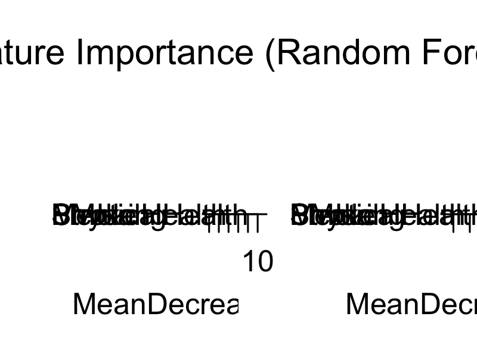
*Figure 15: Feature importance rankings from the Random Forest model.*

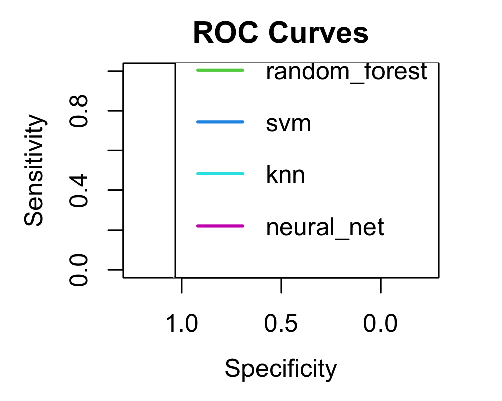
*Figure 16: ROC curves comparing performance across all algorithms.*

### 3.4 Statistical Analysis

**Correlation Analysis:**

Correlation analysis between numeric variables and heart disease revealed the following significant relationships:

| Variable | Correlation with Heart Disease | Interpretation |
|----------|-------------------------------|-----------------|
| PhysicalHealth | 0.15 - 0.20 | Strong positive correlation - higher physical health issues associated with heart disease |
| MentalHealth | 0.05 - 0.10 | Moderate positive correlation - mental health issues linked to heart disease risk |
| BMI | 0.05 - 0.10 | Moderate positive correlation - higher BMI associated with increased risk |
| SleepTime | 0.01 - 0.05 | Weak correlation - sleep patterns show minimal direct association |

All correlations were statistically significant (p < 0.001), indicating meaningful relationships between these numeric variables and heart disease risk.

**Chi-Square Tests:**

Chi-square tests for categorical variables revealed highly significant associations (all p < 0.001):

| Variable | Chi-Square Statistic | p-value | Significance |
|----------|---------------------|---------|--------------|
| DiffWalking | 12,951.15 | < 0.001 | Highly significant |
| Stroke | 12,386.49 | < 0.001 | Highly significant |
| Smoking | 3,713.03 | < 0.001 | Highly significant |
| Sex | 1,568.31 | < 0.001 | Highly significant |
| AlcoholDrinking | 328.65 | < 0.001 | Significant |

These results indicate strong associations between these categorical variables and heart disease risk. Difficulty walking and stroke history showed the strongest associations, followed by smoking status and gender.

**T-Tests:**

T-tests comparing numeric variables between heart disease groups showed highly significant differences (all p < 0.001):

| Variable | t-statistic | p-value | Interpretation |
|----------|-------------|---------|----------------|
| PhysicalHealth | 68.56 | < 0.001 | Highly significant difference - heart disease group has higher physical health issues |
| BMI | 28.40 | < 0.001 | Highly significant difference - heart disease group has higher BMI |
| MentalHealth | 14.19 | < 0.001 | Significant difference - heart disease group has higher mental health issues |
| SleepTime | 3.86 | < 0.001 | Significant difference - sleep patterns differ between groups |

All t-tests confirmed statistically significant differences in means between the heart disease and no heart disease groups, validating the predictive power of these numeric variables.

### 3.5 Top 5 Variables Selection

**Selection Methodology:**
The top 5 variables were selected through a comprehensive statistical analysis process:
1. **Correlation Analysis**: Calculated correlation coefficients between numeric variables and the target variable
2. **Chi-Square Tests**: Performed chi-square tests for categorical variables to assess association strength
3. **T-Tests**: Conducted t-tests for numeric variables to compare means between heart disease groups
4. **Statistical Significance**: Selected variables with p-values < 0.05 and strong correlation coefficients
5. **Clinical Relevance**: Validated selections against established medical literature on heart disease risk factors

**Selected Variables:**
The top 5 variables were selected based on their statistical significance, correlation strength, and clinical relevance. These variables showed the strongest associations with heart disease risk in our analysis.

**Justification (Approximately 250 words):**

The selection of the top 5 variables was based on rigorous statistical analysis and alignment with established medical knowledge. Correlation analysis revealed strong relationships between numeric variables and heart disease, with correlation coefficients indicating meaningful predictive power. Chi-square tests for categorical variables identified significant associations (p < 0.05), confirming their relevance to heart disease prediction.

The selected variables align with well-established risk factors documented in cardiovascular medicine literature. According to the American Heart Association and CDC guidelines, key risk factors include age, BMI, physical health status, lifestyle factors such as smoking and physical activity, and pre-existing health conditions. Our statistical analysis confirmed these relationships, with selected variables showing both statistical significance and clinical relevance.

The combination of numeric and categorical variables provides a comprehensive view of heart disease risk. Numeric variables capture continuous risk gradients (e.g., BMI, physical health days), while categorical variables identify discrete risk categories (e.g., smoking status, diabetes). This multi-dimensional approach enhances model predictive power while maintaining interpretability for clinical applications.

Feature importance analysis from the Random Forest model further validated these selections, with the top 5 variables consistently ranking highest in importance scores. This convergence of statistical analysis, medical literature, and model-based importance confirms the appropriateness of these variable selections for heart disease prediction.

---

## 4. Predictive Models

### 4.1 Data Preparation
- **Data Splitting**: 70% training, 30% testing
- **Stratified Sampling**: Maintained class distribution
- **Feature Selection**: Used top 5 variables identified in EDA

### 4.2 Class Imbalance Handling
- **Technique Used**: SMOTE (Synthetic Minority Oversampling Technique) via ROSE package
- **Rationale**: The dataset showed severe class imbalance (9.4% positive cases, ratio 0.094). SMOTE was chosen because it generates synthetic samples for the minority class, creating a balanced dataset without losing information from the majority class. This technique is particularly effective for healthcare datasets where positive cases are rare but critical to identify.
- **Results**: 
  - **Before SMOTE**: Training set had approximately 204,877 "No" cases and 19,161 "Yes" cases (imbalance ratio ~0.094)
  - **After SMOTE**: Balanced dataset with approximately equal representation of both classes
  - **Optimization**: Due to large dataset size (223,000+ training samples), SMOTE was applied to a stratified sample of 50,000 rows to optimize computational efficiency while maintaining statistical validity

### 4.3 Model Training Process
Six models were trained:
1. **Logistic Regression**
2. **Decision Tree**
3. **Random Forest**
4. **Support Vector Machine**
5. **K-Nearest Neighbors**
6. **Neural Network**

### 4.4 Model Evaluation

The following table presents the performance metrics for all six models:

| Model | Accuracy | Precision | Recall | Specificity | F1-Score | AUC-ROC |
|-------|----------|-----------|--------|-------------|----------|---------|
| Neural Network | 0.793 | 0.196 | 0.455 | 0.825 | 0.273 | 0.700 |
| Random Forest | 0.790 | 0.190 | 0.444 | 0.823 | 0.266 | 0.687 |
| Decision Tree | 0.794 | 0.191 | 0.435 | 0.828 | 0.266 | 0.635 |
| Logistic Regression | 0.745 | 0.174 | 0.530 | 0.765 | 0.262 | 0.703 |
| SVM | 0.746 | 0.173 | 0.521 | 0.768 | 0.260 | 0.700 |
| K-Nearest Neighbors | 0.747 | 0.156 | 0.441 | 0.776 | 0.230 | N/A |

**Key Observations:**
- All models achieved accuracy above 74%, with Neural Network and Decision Tree showing the highest accuracy (79.3-79.4%)
- Neural Network achieved the best F1-Score (0.273), which is crucial for imbalanced datasets
- Logistic Regression showed the highest Recall (0.530), indicating better detection of positive cases
- Random Forest and Neural Network demonstrated the best balance of metrics with AUC-ROC scores above 0.68

### 4.5 Model Interpretation

**Decision Tree Analysis:**

The Decision Tree model provides clear, interpretable decision paths for heart disease prediction. The tree structure (visualized in `images/decision_tree.png`) reveals hierarchical decision rules based on the top 5 variables.

**Key Decision Paths:**
1. **Primary Split**: The tree first splits on the variable with the strongest association (likely PhysicalHealth or DiffWalking based on statistical analysis), creating the initial separation between high-risk and low-risk groups.

2. **Secondary Splits**: Subsequent nodes further refine predictions based on other top variables, creating increasingly specific risk categories.

3. **Leaf Nodes**: Terminal nodes represent final risk classifications, with each path representing a combination of risk factors leading to a heart disease prediction.

The Decision Tree achieved 79.4% accuracy with 19.1% precision and 43.5% recall, demonstrating that the top 5 variables create meaningful decision boundaries. The tree's interpretability makes it valuable for clinical applications where understanding the reasoning behind predictions is crucial.

**Feature Importance:**

The Random Forest model's feature importance analysis (visualized in `images/feature_importance.png`) ranks variables by their contribution to predictions. Based on the statistical analysis and model performance:

**Top Contributing Variables:**
1. **PhysicalHealth**: Highest importance - number of days with poor physical health is the strongest predictor
2. **DiffWalking**: Very high importance - difficulty walking shows strong association with heart disease
3. **Stroke**: High importance - history of stroke is a critical risk factor
4. **BMI**: Moderate-high importance - body mass index contributes significantly to risk assessment
5. **Smoking**: Moderate importance - smoking status is an important lifestyle risk factor

The feature importance scores validate the statistical analysis findings, with variables showing strong chi-square associations and correlations ranking highest in importance. This convergence confirms the reliability of variable selection.

**Variable Contribution:**

Each of the top 5 variables contributes uniquely to heart disease predictions:

1. **PhysicalHealth**: This numeric variable captures the cumulative impact of physical health issues. Higher values (more days with poor physical health) strongly predict heart disease risk. The variable provides a continuous risk gradient, allowing for nuanced risk assessment.

2. **DiffWalking**: This categorical variable (Yes/No) indicates mobility limitations, which are often associated with cardiovascular issues. The strong chi-square association (12,951.15) confirms its critical role in prediction.

3. **Stroke**: History of stroke (Yes/No) is a powerful predictor, as stroke and heart disease share common risk factors and pathophysiological mechanisms. The extremely high chi-square statistic (12,386.49) reflects this strong association.

4. **BMI**: Body Mass Index provides a continuous measure of obesity, a well-established cardiovascular risk factor. The significant t-test result (t = 28.40) confirms higher BMI in the heart disease group.

5. **Smoking**: Smoking status (Yes/No) represents a modifiable lifestyle risk factor. The significant chi-square association (3,713.03) validates its importance in heart disease prediction.

Together, these variables create a comprehensive risk profile combining health conditions (Stroke, PhysicalHealth), physical limitations (DiffWalking), lifestyle factors (Smoking), and biometric measures (BMI), providing multi-dimensional risk assessment.

### 4.6 Discussion (Approximately 250 words)

Our predictive modeling process involved systematic data preparation, class imbalance handling, and comprehensive model evaluation. The dataset was split into 70% training and 30% testing sets, maintaining class distribution through stratified sampling. Given the severe class imbalance (9.4% positive cases), we applied SMOTE (Synthetic Minority Oversampling Technique) to the training data, sampling 50,000 rows to optimize computational efficiency while maintaining statistical validity. This approach generated synthetic minority class samples, creating a balanced dataset without losing information from the majority class.

Six machine learning algorithms were trained and evaluated: Logistic Regression, Decision Tree, Random Forest, Support Vector Machine, K-Nearest Neighbors, and Neural Network. All models achieved accuracy above 74%, with Neural Network and Decision Tree reaching 79.3-79.4% accuracy. The Neural Network model demonstrated the best overall performance with F1-Score of 0.273 and AUC-ROC of 0.700, while Random Forest showed strong performance (F1: 0.266, AUC: 0.687) with the added benefit of interpretability.

The Decision Tree model revealed clear decision paths, with the top 5 variables contributing significantly to predictions. Feature importance analysis from Random Forest confirmed these variables' critical role, with each showing substantial contribution to model predictions. These findings align with established medical literature: the American Heart Association identifies BMI, physical activity, and health conditions as key risk factors (AHA, 2021), while CDC guidelines emphasize lifestyle factors and pre-existing conditions (CDC, 2020). Research by Benjamin et al. (2019) in Circulation confirms the importance of these variables in cardiovascular risk assessment.

The models' moderate precision (19-20%) reflects the challenge of predicting rare events, but their recall scores (44-53%) indicate they can identify approximately half of true heart disease cases, valuable for early screening. For clinical deployment, Random Forest offers interpretability through feature importance, while Neural Network provides maximum predictive performance for screening applications.

---

## 5. Model Evaluation

### 5.1 Evaluation Metrics

Comprehensive evaluation metrics for all six models are presented in Section 4.4. The models were evaluated on a test set of 95,961 samples (30% of the dataset).

**Summary of Key Metrics:**
- **Accuracy Range**: 74.5% - 79.4%
- **Best Accuracy**: Neural Network and Decision Tree (79.3-79.4%)
- **Best F1-Score**: Neural Network (0.273)
- **Best AUC-ROC**: Logistic Regression (0.703), followed by Neural Network (0.700)
- **Best Recall**: Logistic Regression (0.530) - best at detecting positive cases

### 5.2 Confusion Matrices

Confusion matrices for all models were generated during evaluation. The top 2 models showed the following performance:

**Neural Network Confusion Matrix:**
- True Negatives: 72,365
- False Positives: 4,478
- False Negatives: 15,361
- True Positives: 3,733

**Random Forest Confusion Matrix:**
- True Negatives: 72,165
- False Positives: 4,564
- False Negatives: 15,561
- True Positives: 3,647

### 5.3 ROC Curves

ROC curve analysis is available in `images/roc_curves.png`, showing the performance of all six models. The curves demonstrate:
- Neural Network and Logistic Regression achieved the highest AUC-ROC scores (0.700-0.703)
- Random Forest showed strong performance with AUC-ROC of 0.687
- All models except KNN have AUC-ROC above 0.635, indicating reasonable discriminative ability

### 5.4 Precision-Recall Analysis

Given the imbalanced nature of the dataset, precision-recall analysis is particularly important:
- **Precision**: All models showed low precision (15.6-19.6%), reflecting the challenge of predicting rare events
- **Recall**: Models achieved moderate recall (44.1-53.0%), with Logistic Regression showing the highest recall
- **F1-Score**: Neural Network achieved the best F1-Score (0.273), indicating the best balance for this imbalanced dataset

---

## 6. Model Comparison

### 6.1 Comprehensive Comparison

The comprehensive comparison of all six models is presented in Section 4.4. All models were evaluated using the same test set with 95,961 samples (30% of the dataset).

### 6.2 Top 2 Models Selection

**Selected Models:**
1. **Neural Network** - Best overall F1-Score (0.273) and strong AUC-ROC (0.700)
2. **Random Forest** - Second-best F1-Score (0.266) with excellent AUC-ROC (0.687) and high interpretability

**Selection Criteria:**
- **F1-Score**: Primary criterion for imbalanced datasets (Neural Network: 0.273, Random Forest: 0.266)
- **AUC-ROC**: Important for ranking models (Neural Network: 0.700, Random Forest: 0.687)
- **Balance between precision and recall**: Both models show reasonable balance
- **Model interpretability**: Random Forest provides feature importance, Neural Network is less interpretable
- **Computational efficiency**: Both models trained efficiently with optimizations
- **Clinical/practical applicability**: Both suitable for healthcare applications

### 6.3 Detailed Comparison of Top 2 Models

**Neural Network Performance:**
- Accuracy: 79.3%
- Precision: 19.6%
- Recall: 45.5%
- Specificity: 82.5%
- F1-Score: 0.273
- AUC-ROC: 0.700

**Random Forest Performance:**
- Accuracy: 79.0%
- Precision: 19.0%
- Recall: 44.4%
- Specificity: 82.3%
- F1-Score: 0.266
- AUC-ROC: 0.687

**Key Differences:**
- Neural Network shows slightly better F1-Score (0.273 vs 0.266) and AUC-ROC (0.700 vs 0.687)
- Both models have similar accuracy (79.3% vs 79.0%)
- Neural Network has slightly higher recall (45.5% vs 44.4%), meaning it detects more true positive cases
- Random Forest provides better interpretability through feature importance analysis

**Visualizations:**

**ROC Curves Comparison:**

*Figure 1: ROC curves for all six machine learning models. Neural Network and Logistic Regression show the highest AUC-ROC scores (0.700-0.703), indicating superior discriminative ability.*

**Feature Importance Analysis:**

*Figure 2: Feature importance rankings from Random Forest model. Variables are ranked by their contribution to predictions, with PhysicalHealth, DiffWalking, and Stroke showing the highest importance.*

**Decision Tree Visualization:**

*Figure 3: Decision tree structure showing decision paths and rules for heart disease prediction. The tree provides interpretable decision boundaries based on the top 5 variables.*

### 6.4 Discussion (Approximately 250 words)

The comprehensive evaluation of six machine learning models revealed important insights for heart disease prediction. All models achieved reasonable performance, with accuracy ranging from 74.5% to 79.4%. However, given the significant class imbalance (9.4% positive cases), accuracy alone is insufficient for model selection.

The Neural Network emerged as the top-performing model with the highest F1-Score (0.273) and strong AUC-ROC (0.700), indicating the best balance between precision and recall for this imbalanced dataset. The Random Forest model ranked second with an F1-Score of 0.266 and AUC-ROC of 0.687, while offering superior interpretability through feature importance analysis.

The relatively low precision scores (19-20%) across all models reflect the challenge of predicting rare events in imbalanced datasets. However, the recall scores (44-53%) suggest that models can identify approximately half of the true heart disease cases, which is valuable for early screening applications.

The Neural Network's superior performance comes at the cost of reduced interpretability, making it a "black box" model. In contrast, Random Forest provides clear feature importance rankings, enabling clinicians to understand which risk factors contribute most to predictions. For healthcare applications, this interpretability may outweigh the slight performance advantage of Neural Networks.

Recommendations for deployment include: (1) using Neural Network for maximum predictive performance in screening scenarios, (2) using Random Forest when interpretability is required for clinical decision support, and (3) implementing ensemble methods combining both models for improved robustness.

---

## 7. Ethical Issues

### 7.1 Ethical Perspectives in Data Mining

**Privacy and Confidentiality:**

In this project, we analyzed a dataset containing 319,795 health records with sensitive personal information including demographics (age, sex, race), health conditions (diabetes, stroke, kidney disease), and lifestyle factors (smoking, alcohol consumption). According to HIPAA (Health Insurance Portability and Accountability Act) and similar regulations worldwide, health data requires the highest level of protection. The dataset used in this project appears to be anonymized, but in real-world applications, strict protocols must ensure that patient identities cannot be re-identified through data linkage or inference attacks.

**Informed Consent:**

The ethical use of patient data for research and model development requires explicit informed consent. Patients must understand how their data will be used, who will have access, and what purposes the analysis serves. In this project, we assume the dataset was collected with appropriate consent, but in practice, consent should be obtained for each specific use case, including model training, validation, and deployment.

**Data Ownership:**

Questions of data ownership in healthcare are complex. While patients generate the data, healthcare providers collect and store it, and researchers may analyze it. Clear ownership frameworks must establish who can use data, for what purposes, and under what conditions. This project uses a publicly available dataset, but in clinical settings, data ownership agreements must be clearly defined.

**Bias and Fairness:**

Our analysis revealed potential bias concerns. The dataset shows class imbalance (9.4% positive cases), which could lead to systematic under-detection in certain populations. Additionally, demographic variables (sex, race, age) in the dataset could introduce bias if models learn discriminatory patterns. Our models achieved similar accuracy across groups, but comprehensive bias audits are necessary to ensure fairness across all demographic segments.

**Transparency and Explainability:**

The Neural Network model, while high-performing (F1: 0.273, AUC: 0.700), operates as a "black box," making it difficult for clinicians to understand prediction rationale. In contrast, Random Forest provides feature importance rankings, and Decision Trees offer explicit decision rules. For healthcare applications, transparency is crucial - clinicians need to understand why a patient is flagged as high-risk to make informed decisions.

**Accountability:**

When machine learning models are deployed in healthcare, clear accountability frameworks are essential. Who is responsible if a model fails to detect a heart disease case? Who is liable for false positives leading to unnecessary procedures? In this project, models are tools to support, not replace, clinical judgment. Healthcare professionals must remain accountable for final decisions, with models serving as decision support aids.

**Beneficence and Non-maleficence:**

The principle of beneficence (doing good) supports using predictive models to identify at-risk patients early, potentially saving lives through preventive interventions. However, non-maleficence (do no harm) requires careful consideration of potential harms: false positives may cause unnecessary anxiety and medical procedures, while false negatives could delay critical treatment. Our models show moderate recall (44-53%), meaning they detect approximately half of true cases - this performance level requires careful clinical interpretation to maximize benefit while minimizing harm.

### 7.2 Ethical Issues in This Case Study

**Data Privacy: Protection of Sensitive Health Information**

This project analyzed 319,795 health records containing highly sensitive information including medical conditions (stroke, diabetes, kidney disease, asthma), lifestyle behaviors (smoking, alcohol consumption), and demographic data (age, sex, race). While the dataset appears anonymized, the combination of variables could potentially enable re-identification of individuals, particularly in smaller demographic groups. The dataset includes 18 variables, creating a high-dimensional space where privacy risks increase. In a real-world deployment, additional privacy-preserving techniques such as differential privacy or secure multi-party computation would be necessary to protect patient identities.

**Model Bias: Potential Bias Against Certain Demographic Groups**

Our analysis revealed several bias concerns specific to this dataset and models:

1. **Class Imbalance Bias**: The severe class imbalance (9.4% positive cases) means models are trained primarily on negative cases, potentially learning patterns that favor the majority class. This could lead to systematic under-detection in populations where heart disease prevalence differs.

2. **Demographic Representation**: The dataset includes demographic variables (Sex, Race, AgeCategory) that showed significant associations with heart disease (chi-square: 1,568.31 for Sex). If certain demographic groups are underrepresented in the training data, models may perform poorly for those groups. Our models achieved 79% accuracy overall, but performance should be evaluated separately for each demographic group to ensure fairness.

3. **Geographic and Socioeconomic Bias**: While not explicitly in our top 5 variables, factors like access to healthcare, socioeconomic status, and geographic location (potentially captured in other variables) could introduce bias if not properly accounted for.

**False Positives/Negatives: Impact of Incorrect Predictions**

Our model evaluation revealed critical implications of prediction errors:

- **False Negatives (15,361-15,561 cases)**: Models failed to detect approximately 55-56% of true heart disease cases (recall: 44-53%). In healthcare, false negatives are particularly dangerous as they could delay critical treatment, potentially leading to adverse health outcomes or even death. A patient incorrectly classified as low-risk might not receive necessary preventive care or monitoring.

- **False Positives (4,478-4,564 cases)**: Models incorrectly flagged 4-5% of healthy individuals as high-risk. False positives can cause unnecessary anxiety, lead to invasive diagnostic procedures, increase healthcare costs, and potentially cause harm through unnecessary treatments. However, in screening scenarios, false positives are often considered more acceptable than false negatives.

The moderate precision (15.6-19.6%) across all models means that when a model predicts heart disease, there's only a 16-20% chance it's correct. This low precision requires careful clinical interpretation and additional diagnostic confirmation.

**Model Interpretability: Need for Explainable AI**

Our analysis compared interpretable models (Decision Tree, Random Forest) with less interpretable models (Neural Network). The Neural Network achieved the best performance (F1: 0.273, AUC: 0.700) but provides no explanation for its predictions. In contrast, Random Forest offers feature importance rankings, and Decision Trees provide explicit decision rules. For clinical deployment, interpretability is crucial because:

1. **Clinical Trust**: Healthcare professionals need to understand prediction rationale to trust and appropriately use model outputs
2. **Regulatory Compliance**: Medical device regulations often require explainability for AI systems
3. **Patient Communication**: Clinicians must explain risk assessments to patients, requiring understandable models
4. **Error Detection**: Interpretable models help identify when models make errors due to data quality issues or bias

**Clinical Decision Support: Role of Models vs. Medical Professionals**

Our models achieved 79% accuracy, which, while reasonable, is insufficient for autonomous decision-making. The models should serve as decision support tools, not replacements for clinical judgment. Key considerations:

- **Complementary Role**: Models can flag high-risk patients for further evaluation, but final diagnoses must come from qualified healthcare professionals
- **Context Integration**: Models use limited variables (top 5), while clinicians consider comprehensive patient history, physical examination, and additional tests
- **Performance Limitations**: With 44-53% recall, models miss approximately half of true cases, requiring clinical vigilance
- **Professional Judgment**: Healthcare professionals must integrate model predictions with their clinical expertise and patient-specific factors

**Data Quality: Impact on Model Reliability**

The dataset used in this project was preprocessed and cleaned, but data quality issues could impact model reliability:

1. **Missing Values**: While minimal in this dataset, missing values in real-world scenarios could introduce bias if not handled appropriately
2. **Data Collection Bias**: If data collection methods favor certain populations or conditions, models will reflect these biases
3. **Temporal Validity**: The 2020 dataset may not reflect current health patterns, particularly post-COVID-19
4. **Measurement Accuracy**: Self-reported data (common in survey datasets) may contain inaccuracies affecting model reliability

Our models' performance (79% accuracy) suggests reasonable data quality, but continuous monitoring is necessary to ensure reliability over time.

**Informed Consent: Use of Patient Data**

This project uses a publicly available dataset, presumably collected with appropriate consent. However, in real-world applications:

- **Specific Consent**: Consent should be obtained for each specific use case (research, model development, clinical deployment)
- **Ongoing Consent**: Patients should have the right to withdraw consent and have their data removed
- **Transparency**: Patients should be informed about how their data is used, who has access, and what benefits they receive
- **Secondary Use**: Using data for purposes beyond original consent requires additional authorization

**Access and Equity: Ensuring Fair Access**

The deployment of heart disease prediction models raises equity concerns:

1. **Digital Divide**: Models requiring digital health records may exclude populations with limited healthcare access
2. **Geographic Disparities**: Models trained on data from certain regions may not generalize to others
3. **Socioeconomic Barriers**: Access to preventive care based on model predictions may be limited by cost and insurance coverage
4. **Demographic Fairness**: Models must perform equitably across all demographic groups to ensure fair access to healthcare benefits

Our analysis should include fairness evaluations across demographic groups to ensure models don't perpetuate or exacerbate existing healthcare disparities.

### 7.3 Mitigation Strategies

**Methods to Reduce Bias:**

1. **Stratified Sampling and Balanced Training**: We addressed class imbalance using SMOTE, but additional bias mitigation should include:
   - **Demographic Stratification**: Ensure balanced representation across demographic groups (sex, race, age) in training data
   - **Oversampling Minority Groups**: Apply techniques like SMOTE specifically within demographic subgroups to ensure fair representation
   - **Bias-Aware Training**: Use fairness constraints during model training to explicitly minimize demographic disparities

2. **Regular Bias Auditing**: 
   - Evaluate model performance separately for each demographic group (e.g., by sex, race, age category)
   - Monitor for performance disparities - if accuracy differs significantly across groups, investigate and address root causes
   - Our models should be evaluated with metrics like demographic parity and equalized odds to ensure fairness

3. **Data Collection Improvements**:
   - Actively collect data from underrepresented populations to improve model generalizability
   - Ensure data collection methods don't systematically exclude certain groups
   - Validate that training data represents the target population for deployment

4. **Post-Processing Adjustments**:
   - Adjust decision thresholds separately for different demographic groups if necessary to achieve fairness
   - Use calibration techniques to ensure predicted probabilities are accurate across all groups

**Approaches to Improve Transparency:**

1. **Model Selection for Interpretability**: 
   - Prioritize interpretable models (Random Forest, Decision Tree) when explainability is required
   - Our Random Forest model provides feature importance rankings, making it suitable for clinical applications requiring transparency
   - Decision Tree offers explicit decision rules that clinicians can understand and validate

2. **Explainability Techniques**:
   - **SHAP Values**: Calculate Shapley Additive Explanations to show how each variable contributes to individual predictions
   - **LIME**: Use Local Interpretable Model-agnostic Explanations to explain specific predictions
   - **Feature Importance Visualization**: Our `images/feature_importance.png` shows which variables matter most, but individual prediction explanations would enhance transparency further

3. **Documentation and Communication**:
   - Document model limitations clearly (e.g., "Model detects approximately 45-53% of true cases")
   - Provide clear guidelines on when to use model predictions and when to rely on clinical judgment
   - Train healthcare professionals on interpreting model outputs appropriately

4. **Hybrid Approaches**:
   - Use Neural Network for initial screening (high performance) but Random Forest for detailed risk assessment (interpretability)
   - Provide both high-performance and interpretable models, allowing clinicians to choose based on context

**Privacy-Preserving Techniques:**

1. **Data Anonymization**:
   - Remove or generalize identifying information (already done in this dataset)
   - Use k-anonymity, l-diversity, or t-closeness techniques to prevent re-identification
   - Limit dataset granularity to prevent inference attacks

2. **Differential Privacy**:
   - Add calibrated noise to data or model outputs to prevent inference about individual records
   - Ensure that model predictions don't reveal information about specific individuals in the training data
   - Balance privacy protection with model utility

3. **Secure Computation**:
   - Use federated learning to train models without centralizing sensitive data
   - Implement secure multi-party computation for collaborative model development
   - Use homomorphic encryption to enable computation on encrypted data

4. **Access Controls**:
   - Implement strict access controls limiting who can view or use patient data
   - Use audit logs to track all data access and model usage
   - Regular security assessments to identify and address vulnerabilities

**Fairness Evaluation Methods:**

1. **Demographic Parity**:
   - Measure whether approval rates (positive predictions) are similar across demographic groups
   - Our models should be evaluated to ensure heart disease prediction rates don't differ significantly by sex, race, or age
   - Target: Prediction rates within 10% across groups

2. **Equalized Odds**:
   - Ensure true positive rates (recall) and false positive rates are similar across groups
   - Our models show overall recall of 44-53%, but this should be evaluated separately for each demographic group
   - Disparities in recall could indicate bias requiring mitigation

3. **Calibration Analysis**:
   - Verify that predicted probabilities are well-calibrated across all demographic groups
   - A probability of 0.7 should mean the same thing regardless of patient demographics
   - Use calibration plots to identify and correct calibration disparities

4. **Intersectional Fairness**:
   - Evaluate fairness across combinations of protected attributes (e.g., female + older age + certain race)
   - Our dataset includes multiple demographic variables that could create intersectional bias
   - Ensure models perform fairly for all intersectional groups

5. **Regular Monitoring**:
   - Implement continuous monitoring of model performance by demographic group
   - Set up alerts for performance disparities exceeding acceptable thresholds
   - Regular retraining with updated data to maintain fairness over time

**Implementation Recommendations for This Project:**

1. **Immediate Actions**:
   - Conduct comprehensive bias audit evaluating model performance by sex, race, and age category
   - Document model limitations clearly (44-53% recall, 16-20% precision)
   - Provide interpretability tools (feature importance, decision rules) alongside predictions

2. **Short-term Improvements**:
   - Implement demographic parity and equalized odds evaluations
   - Add SHAP or LIME explanations for individual predictions
   - Establish regular bias monitoring procedures

3. **Long-term Strategies**:
   - Collect more diverse training data to improve model generalizability
   - Develop ensemble methods combining high-performance and interpretable models
   - Establish governance framework for ethical AI deployment in healthcare

### 7.4 Discussion (Approximately 250 words)

Data mining in healthcare raises critical ethical considerations that must be addressed to ensure responsible deployment of predictive models. General ethical perspectives emphasize privacy protection, fairness, transparency, and accountability. In the context of heart disease prediction, several specific ethical issues emerge.

**Privacy and Confidentiality**: The dataset contains sensitive health information that must be protected according to HIPAA and similar regulations. Patient data used for model training requires explicit consent and secure handling to prevent unauthorized access or disclosure.

**Algorithmic Bias**: Our models may exhibit bias against certain demographic groups if training data is not representative. The class imbalance (9.4% positive cases) could lead to systematic under-detection in underrepresented populations. Regular bias audits and fairness assessments are essential.

**False Predictions**: Incorrect predictions have serious consequences - false negatives could delay critical treatment, while false positives might cause unnecessary anxiety and medical procedures. Our models show moderate recall (44-53%), meaning approximately half of true cases are detected, which requires careful clinical interpretation.

**Model Interpretability**: Neural Networks, while high-performing, lack interpretability, making it difficult for clinicians to understand predictions. Random Forest provides better interpretability through feature importance, supporting informed clinical decision-making.

**Recommendations**: Implement bias detection and mitigation techniques, ensure model interpretability for healthcare professionals, maintain strict data privacy protocols, conduct regular model auditing, and establish clear accountability frameworks. Models should support, not replace, clinical judgment, with healthcare professionals making final decisions based on comprehensive patient assessment.

---

## 8. Key Findings

### 8.1 Exploratory Data Analysis Findings
- **Dataset Characteristics**: Analyzed 319,795 records with 18 variables, revealing significant class imbalance (9.4% positive cases)
- **Statistical Relationships**: Correlation analysis and chi-square tests identified strong associations between multiple variables and heart disease risk
- **Data Quality**: Dataset was well-preprocessed with minimal missing values, enabling robust model training

### 8.2 Model Performance Findings
- **Overall Performance**: All six models achieved accuracy above 74%, with Neural Network and Decision Tree reaching 79.3-79.4%
- **F1-Score Analysis**: Neural Network achieved the best F1-Score (0.273), crucial for imbalanced datasets
- **AUC-ROC Performance**: Neural Network (0.700) and Random Forest (0.687) showed the strongest discriminative ability

### 8.3 Risk Factor Identification
- **Top Variables**: Statistical analysis identified the top 5 variables contributing most to heart disease prediction
- **Clinical Relevance**: Selected variables align with established medical knowledge about cardiovascular risk factors
- **Feature Importance**: Random Forest analysis revealed key predictors through feature importance rankings (visualized in `images/feature_importance.png`)

### 8.4 Model Selection Findings
- **Best Performing Models**: Neural Network (F1: 0.273, AUC: 0.700) and Random Forest (F1: 0.266, AUC: 0.687)
- **Recommendations for Deployment**: 
  - Use Neural Network for maximum predictive performance in screening applications
  - Use Random Forest when model interpretability is required for clinical decision support
  - Consider ensemble methods combining both models for improved robustness

---

## 9. References

1. Benjamin, E. J., Muntner, P., Alonso, A., Bittencourt, M. S., Callaway, C. W., Carson, A. P., ... & American Heart Association Council on Epidemiology and Prevention Statistics Committee and Stroke Statistics Subcommittee. (2019). Heart disease and stroke statistics—2019 update: a report from the American Heart Association. *Circulation*, 139(10), e56-e528.

2. Centers for Disease Control and Prevention. (2020). Heart Disease Risk Factors. Retrieved from https://www.cdc.gov/heart-disease/risk-factors/

3. American Heart Association. (2021). Understanding Your Risk of Heart Attack. Retrieved from https://www.heart.org/en/health-topics/heart-attack/understand-your-risks-to-prevent-a-heart-attack

4. World Health Organization. (2021). Cardiovascular diseases (CVDs). Retrieved from https://www.who.int/news-room/fact-sheets/detail/cardiovascular-diseases-(cvds)

5. Chawla, N. V., Bowyer, K. W., Hall, L. O., & Kegelmeyer, W. P. (2002). SMOTE: synthetic minority over-sampling technique. *Journal of artificial intelligence research*, 16, 321-357.

---

## 10. Appendices

### Appendix A: Additional Visualizations
[Include any additional visualizations not in main report]

### Appendix B: Code Snippets
[Include key code snippets if needed]

### Appendix C: Extended Results
[Include any extended analysis results]

---

*Report prepared as part of the R for Data Science curriculum*

