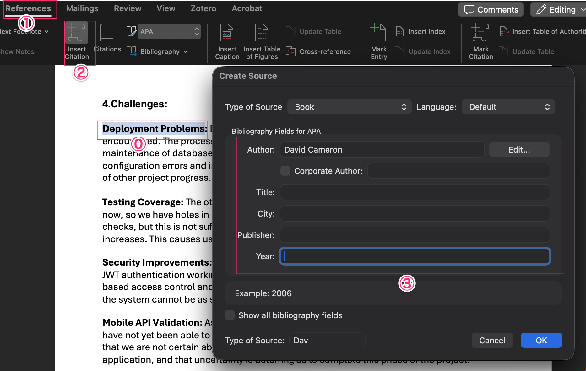

# References: A Complete How-To Guide

## Introduction

References are an essential component of academic and professional writing that serve to acknowledge the sources of information, ideas, and data used in your work. They provide credibility to your arguments, allow readers to verify your claims, and demonstrate the depth of your research. Proper referencing is not just a formality—it's a fundamental practice that distinguishes scholarly work from casual writing.

In academic writing, references serve multiple critical functions:
- **Attribution**: Giving credit to original authors and researchers
- **Verification**: Allowing readers to locate and examine your sources
- **Context**: Placing your work within the broader scholarly conversation
- **Ethics**: Avoiding plagiarism and maintaining academic integrity

## Why References?

References are crucial for several reasons:

### 1. **Academic Integrity**
Proper referencing demonstrates that you have conducted thorough research and are building upon the work of others in an ethical manner. It shows respect for intellectual property and helps avoid plagiarism.

### 2. **Credibility and Authority**
Well-chosen references from reputable sources strengthen your arguments and establish your work's credibility. They show that your conclusions are based on solid evidence and established research.

### 3. **Transparency and Reproducibility**
References allow readers to trace your research path, verify your claims, and potentially build upon your work. This transparency is fundamental to the scientific method.

### 4. **Contextualization**
References help position your work within the existing body of knowledge, showing how your research relates to previous studies and contributes to the field.

### 5. **Legal and Ethical Requirements**
Many institutions and publishers have strict requirements for proper citation. Failure to cite sources appropriately can result in academic penalties or legal issues.

## IEEE Style: What it is, Sample

The IEEE (Institute of Electrical and Electronics Engineers) style is widely used in engineering, computer science, and related technical fields. It uses numbered citations in square brackets that correspond to a numbered reference list.

### Key Features of IEEE Style:
- **In-text citations**: Use numbered citations in square brackets [1], [2], [3]
- **Reference list**: Numbered list at the end of the document
- **Format**: Author names, "Title of Article," *Journal/Conference Name*, vol. X, no. Y, pp. Z-Z, Month Year
- **DOI**: Include Digital Object Identifier when available

### Sample IEEE References:

**In-text citation:**
```
Recent studies have shown that machine learning algorithms can achieve 
superior performance [1], [2]. However, some researchers argue that 
traditional methods still have advantages [3].
```

**Reference list:**
```
[1] J. Smith, A. Johnson, and M. Brown, "Deep Learning Applications in 
    Computer Vision," IEEE Transactions on Pattern Analysis and Machine 
    Intelligence, vol. 42, no. 8, pp. 1234-1245, Aug. 2020.

[2] R. Davis, "Neural Networks for Image Recognition," in Proc. IEEE 
    International Conference on Computer Vision, 2019, pp. 456-461.

[3] L. Wilson, "Traditional vs. Modern Approaches in Machine Learning," 
    IEEE Computer, vol. 53, no. 3, pp. 78-85, Mar. 2021.
```

## Adding References to a TeX File

LaTeX is the de facto standard for academic papers, especially in STEM fields. Here's how to add references:

### 1. **Basic Setup**
```latex
\documentclass{article}
\usepackage[numbers]{natbib}
\usepackage{url}

\begin{document}
Your content here with citations \cite{smith2020}.

\bibliographystyle{ieeetr}
\bibliography{references}
\end{document}
```

### 2. **BibTeX Database (.bib file)**
Create a `references.bib` file:
```bibtex
@article{smith2020,
  author = {Smith, John and Johnson, Alice and Brown, Michael},
  title = {Deep Learning Applications in Computer Vision},
  journal = {IEEE Transactions on Pattern Analysis and Machine Intelligence},
  volume = {42},
  number = {8},
  pages = {1234--1245},
  year = {2020},
  month = {August},
  doi = {10.1109/TPAMI.2020.1234567}
}

@inproceedings{davis2019,
  author = {Davis, Robert},
  title = {Neural Networks for Image Recognition},
  booktitle = {Proceedings of the IEEE International Conference on Computer Vision},
  pages = {456--461},
  year = {2019},
  publisher = {IEEE}
}

@misc{website2021,
  author = {Wilson, Lisa},
  title = {Traditional vs. Modern Approaches in Machine Learning},
  howpublished = {IEEE Computer},
  volume = {53},
  number = {3},
  pages = {78--85},
  year = {2021},
  month = {March}
}
```

### 3. **Compilation Process**
```bash
pdflatex document.tex
bibtex document
pdflatex document.tex
pdflatex document.tex
```

### 4. **Advanced Features**
```latex
% Multiple citations
\cite{smith2020,davis2019}

% Page-specific citations
\cite[p.~123]{smith2020}

% Author-year style (alternative)
\citep{smith2020}  % (Smith et al., 2020)
\citet{smith2020}  % Smith et al. (2020)
```

## Adding References to a MS Word File

Microsoft Word offers several methods for managing references:

### 1. **Using Word's Built-in Citation Manager**



**Step 1: Set Citation Style**
- Go to References tab → Style dropdown
- Select "IEEE" or your preferred style

**Step 2: Add Sources**
- Click "Insert Citation" → "Add New Source"
- Choose source type (Book, Journal Article, Website, etc.)
- Fill in the required fields

**Step 3: Insert Citations**
- Place cursor where citation should appear
- Click "Insert Citation" → Select source from list

**Step 4: Generate Bibliography**
- Place cursor where bibliography should appear
- Click "Bibliography" → "References" or "Works Cited"

### 2. **Manual IEEE Formatting**
For manual formatting, follow this structure:

**Journal Article:**
```
[1] J. Smith, A. Johnson, and M. Brown, "Deep Learning Applications in 
    Computer Vision," IEEE Trans. Pattern Anal. Mach. Intell., vol. 42, 
    no. 8, pp. 1234-1245, Aug. 2020.
```

**Conference Paper:**
```
[2] R. Davis, "Neural Networks for Image Recognition," in Proc. IEEE 
    Int. Conf. Computer Vision, 2019, pp. 456-461.
```

**Website:**
```
[3] L. Wilson, "Machine Learning Best Practices," IEEE Computer Society, 
    2021. [Online]. Available: https://www.computer.org/machine-learning
```

### 3. **Using Reference Management Software**
- **Zotero**: Free, integrates with Word
- **Mendeley**: Academic-focused, good for PDFs
- **EndNote**: Professional-grade, widely used in academia

## What Sources to Choose

### 1. **URLs and Websites**

**When to use:**
- Current information, news, or recent developments
- Government publications, official reports
- Reputable organizations' websites

**Best practices:**
- Use stable, permanent URLs when possible
- Include access date for time-sensitive content
- Prefer .edu, .gov, .org domains over .com
- Avoid Wikipedia for academic papers (use as starting point only)

**Example:**
```
[4] National Science Foundation, "Artificial Intelligence Research 
    Funding," NSF, 2021. [Online]. Available: 
    https://www.nsf.gov/ai-funding. [Accessed: Mar. 15, 2021].
```

### 2. **Books and Book Chapters**

**When to use:**
- Foundational theories and comprehensive treatments
- Historical context and background information
- Edited volumes with multiple expert contributions

**Structure:**
```
[5] A. Turing, Computing Machinery and Intelligence, 2nd ed. 
    Cambridge, UK: Cambridge University Press, 1950.

[6] J. McCarthy, "Artificial Intelligence: A New Synthesis," in 
    Handbook of Artificial Intelligence, M. Minsky, Ed. 
    New York: McGraw-Hill, 1981, pp. 123-156.
```

### 3. **Academic Papers**

**When to use:**
- Primary research findings
- Peer-reviewed research
- Recent developments in the field

**Types:**
- **Journal articles**: Highest credibility, peer-reviewed
- **Conference papers**: Cutting-edge research, often preliminary
- **Preprints**: Latest research, but not yet peer-reviewed

**Example:**
```
[7] S. Chen et al., "Transformer Architecture for Natural Language 
    Processing," Nature Machine Intelligence, vol. 3, no. 4, 
    pp. 234-245, Apr. 2021.
```

### 4. **Source Selection Criteria**

**Authority:**
- Author credentials and institutional affiliation
- Publisher reputation and peer-review process
- Citation count and impact factor

**Relevance:**
- Direct connection to your research question
- Appropriate scope and level of detail
- Current information (within 5-10 years for most fields)

**Reliability:**
- Reproducible methodology
- Clear data presentation
- Transparent funding sources

## Conclusions

Proper referencing is a cornerstone of academic and professional writing that serves multiple essential functions. It demonstrates scholarly integrity, provides credibility to your arguments, and allows readers to verify and build upon your work. The IEEE style, with its numbered citation system, is particularly well-suited for technical and engineering fields.

Whether you're using LaTeX with BibTeX for automated reference management or Microsoft Word's built-in citation tools, the key is consistency and accuracy. Choose your sources carefully, prioritizing peer-reviewed academic papers, authoritative books, and reputable websites. Remember that the quality of your references reflects the quality of your research.

Mastering the art of referencing takes practice, but it's an investment that pays dividends in the credibility and impact of your written work. As you develop your referencing skills, you'll find that proper citation not only meets academic requirements but also strengthens your arguments and contributes to the broader scholarly conversation.

---

*This guide provides a foundation for understanding and implementing proper referencing practices. Always consult your institution's specific style guide and requirements for the most current formatting standards.*
