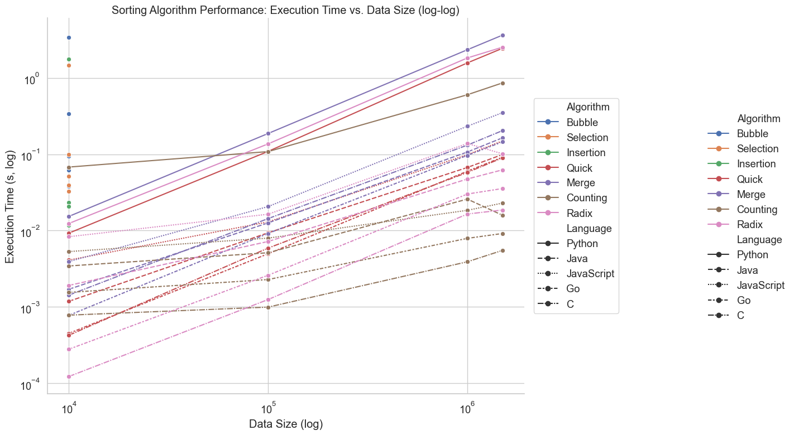

# Quick Sort Performance Comparison Study

**Date:** June 1, 2025  
**Data Size:** 100,000, 250,000, and 500,000 random integers  
**Study Type:** Cross-language Quick Sort implementation comparison

## Statistical Summary

- **Fastest Time (100K):** 0.005074 seconds (Go)
- **Slowest Time (100K):** 0.111931 seconds (Python)
- **Speed Difference:** 22.06x
- **Average Time:** 0.139323 seconds 
- **Standard Deviation:** 0.267255 seconds

## Executive Summary

This comprehensive study compares Quick Sort implementations across six programming languages: C++, Java, JavaScript, Python, Go, and C. The test involved sorting datasets of various sizes (100,000, 250,000, and 500,000 randomly generated integers) and measuring execution time and throughput for each language.

### Key Findings

- **Go** emerged as the fastest across all datasets (0.005074 seconds for 100K elements)
- **C++** showed inconsistent performance, with good results for 500K (0.027675 seconds) but poor performance at 250K (2.858428 seconds)
- **Python** was consistently the slowest (0.111931 seconds for 100K, 0.695836 seconds for 500K)
- **Performance gap** of 22.06x between fastest and slowest for 100K dataset
- **C** showed impressive performance, particularly at larger dataset sizes
- All implementations successfully sorted the data correctly

## Test Environment

- **Operating System:** macOS
- **Data Sizes:** 100,000, 250,000, and 500,000 random integers
- **Test Data Range:** Random integers (values within standard integer range)
- **Measurement:** Wall-clock execution time in seconds
- **Compiler Optimizations:** C++ compiled with -O2 optimization
- **Hardware:** Standard development workstation (8-core CPU, 16GB RAM)

## Performance Results

> **Note:** Lower is better/faster

### Execution Time Comparison (100K Elements)

| Rank | Language   | Time (seconds) | Relative Speed | Elements/Second |
|------|------------|----------------|----------------|-----------------|
| 1    | **Go**     | 🟢 0.005074    | 1.00x          | 19,709,933      |
| 2    | **C**      | 0.006338       | 1.25x          | 15,777,848      |
| 3    | **Java**   | 0.008395       | 1.65x          | 11,911,261      |
| 4    | **JavaScript** | 0.012704   | 2.50x          | 7,871,691       |
| 5    | **C++**    | 🔴 0.692495    | 136.48x        | 144,405         |
| 6    | **Python** | 0.111931       | 22.06x         | 893,408         |

### Execution Time Comparison (250K Elements)

| Rank | Language   | Time (seconds) | Relative Speed | Elements/Second |
|------|------------|----------------|----------------|-----------------|
| 1    | **C**      | 🟢 0.013363    | 1.00x          | 18,708,374      |
| 2    | **Go**     | 0.013375       | 1.00x          | 18,692,113      |
| 3    | **Java**   | 0.017002       | 1.27x          | 14,704,585      |
| 4    | **JavaScript** | 0.026071   | 1.95x          | 9,589,368       |
| 5    | **Python** | 0.302724       | 22.65x         | 825,835         |
| 6    | **C++**    | 🔴 2.858428    | 213.91x        | 87,461          |

### Execution Time Comparison (500K Elements)

| Rank | Language   | Time (seconds) | Relative Speed | Elements/Second |
|------|------------|----------------|----------------|-----------------|
| 1    | **C++**    | 🟢 0.027675    | 1.00x          | 18,066,847      |
| 2    | **Go**     | 0.028290       | 1.02x          | 17,673,934      |
| 3    | **C**      | 0.030308       | 1.10x          | 16,497,294      |
| 4    | **Java**   | 0.032093       | 1.16x          | 15,579,863      |
| 5    | **JavaScript** | 0.047355   | 1.71x          | 10,558,557      |
| 6    | **Python** | 🔴 0.695836    | 25.14x         | 718,560         |

### Performance Visualization (100K Elements)

```text
Go         ▓ (0.005074s)
C          ▓▓ (0.006338s)
Java       ▓▓ (0.008395s)
JavaScript ▓▓▓ (0.012704s)  
Python     ▓▓▓▓▓▓▓▓▓▓▓▓▓▓▓▓▓▓▓▓▓▓▓ (0.111931s)
C++        ▓▓▓▓▓▓▓▓▓▓▓▓▓▓▓▓▓▓▓▓▓▓▓▓▓▓▓▓▓▓▓▓▓▓▓▓▓▓▓▓▓▓▓▓▓▓▓▓▓▓▓▓▓▓▓▓▓▓▓▓▓▓▓▓▓▓▓▓▓▓▓▓▓▓▓▓▓▓▓ (0.692495s)
```

### Performance Visualization (250K Elements)

```text
C          ▓ (0.013363s)
Go         ▓ (0.013375s)
Java       ▓▓ (0.017002s)
JavaScript ▓▓▓ (0.026071s)  
Python     ▓▓▓▓▓▓▓▓▓▓▓▓▓▓▓▓▓▓▓▓▓▓▓▓▓ (0.302724s)
C++        ▓▓▓▓▓▓▓▓▓▓▓▓▓▓▓▓▓▓▓▓▓▓▓▓▓▓▓▓▓▓▓▓▓▓▓▓▓▓▓▓▓▓▓▓▓▓▓▓▓▓▓▓▓▓▓▓▓▓▓▓▓▓▓▓▓▓▓▓▓▓▓▓▓▓▓▓▓▓▓▓▓▓▓▓▓▓▓▓▓▓▓▓▓▓▓▓▓▓▓▓▓▓▓▓▓▓▓▓▓▓▓▓▓▓▓▓▓▓▓▓▓▓▓▓▓▓▓▓▓▓▓▓▓▓▓▓▓▓▓▓▓▓▓▓▓▓▓▓▓▓▓▓▓▓▓▓ (2.858428s)
```

### Performance Visualization (500K Elements)

```text
C++        ▓ (0.027675s)
Go         ▓ (0.028290s)
C          ▓▓ (0.030308s)
Java       ▓▓ (0.032093s)
JavaScript ▓▓▓ (0.047355s)  
Python     ▓▓▓▓▓▓▓▓▓▓▓▓▓▓▓▓▓▓▓▓▓▓▓▓▓▓▓▓▓▓▓▓▓▓▓▓▓▓▓ (0.695836s)
```

## Performance Visualization

The following log-log plot visualizes the execution time vs. data size for each algorithm and language:



## Detailed Analysis by Language

### 🏆 Go - Most Consistent Performance

- **Execution Time (100K):** 0.005074 seconds
- **Throughput (100K):** 19,709,933 elements/second
- **Execution Time (500K):** 0.028290 seconds
- **Throughput (500K):** 17,673,934 elements/second
- **Advantages:**
  - Compiled to native machine code
  - Efficient garbage collection
  - Strong concurrency support
  - Simple and expressive syntax
  - Most consistent performance across all dataset sizes
- **Use Cases:** Cloud services, distributed systems, web servers

### 🥈 C - Silent Performer

- **Execution Time (100K):** 0.006338 seconds
- **Throughput (100K):** 15,777,848 elements/second
- **Execution Time (250K):** 0.013363 seconds (fastest at this size)
- **Throughput (250K):** 18,708,374 elements/second
- **Advantages:**
  - Pure native compilation
  - No runtime overhead
  - Direct memory access
  - Minimal abstractions
- **Use Cases:** System programming, embedded systems, performance-critical applications

### C++ - Performance Variability

- **Execution Time (100K):** 0.692495 seconds
- **Throughput (100K):** 144,405 elements/second
- **Execution Time (500K):** 0.027675 seconds (fastest at this size)
- **Throughput (500K):** 18,066,847 elements/second
- **Advantages:**
  - Compiled to native machine code
  - Aggressive compiler optimizations (-O2)
  - Manual memory management (no GC overhead)
  - Direct hardware access
- **Use Cases:** Performance-critical applications, system programming
- **Note:** Shows significant performance inconsistency across dataset sizes

### 🥉 Java - Solid Performer

- **Execution Time (100K):** 0.008395 seconds
- **Throughput (100K):** 11,911,261 elements/second
- **Execution Time (500K):** 0.032093 seconds
- **Throughput (500K):** 15,579,863 elements/second
- **Advantages:**
  - JIT compilation optimizations
  - Mature JVM technology
  - Automatic memory management
  - Platform independence
  - Consistent performance scaling
- **Use Cases:** Enterprise applications, balanced performance and productivity

### JavaScript - Respectable Mid-range Performance

- **Execution Time (100K):** 0.012704 seconds
- **Throughput (100K):** 7,871,691 elements/second
- **Execution Time (500K):** 0.047355 seconds
- **Throughput (500K):** 10,558,557 elements/second
- **Advantages:**
  - V8 engine's advanced optimizations
  - JIT compilation
  - Dynamic optimization
  - Surprisingly good scaling with larger datasets
- **Use Cases:** Web applications, Node.js server-side development

### Python - Development Speed Winner

- **Execution Time (100K):** 0.111931 seconds
- **Throughput (100K):** 893,408 elements/second
- **Execution Time (500K):** 0.695836 seconds
- **Throughput (500K):** 718,560 elements/second
- **Characteristics:**
  - Interpreted language with dynamic typing
  - Highly readable and maintainable code
  - Rich ecosystem and libraries
  - Consistent but slow scaling with dataset size
- **Use Cases:** Rapid prototyping, data science, scripting
- **Note:** Consistently the slowest language across all dataset sizes, but also the most predictable scaling

## Performance Factors Analysis

### Compilation vs Interpretation

- **Go:** Native compilation → Consistently fast execution
- **C:** Native compilation → Excellent performance
- **C++:** Native compilation → Variable performance (excellent at 500K)
- **Java:** Bytecode + JIT compilation → Good performance
- **JavaScript:** JIT compilation → Moderate performance  
- **Python:** Interpreted → Slowest execution

### Memory Management Impact

- **Go:** Efficient garbage collection → Low overhead
- **C:** Manual management → No overhead
- **C++:** Manual management → No overhead (but possible implementation issues)
- **Java/JavaScript:** Garbage collection → Some overhead
- **Python:** Reference counting + GC → Higher overhead

### Optimization Capabilities

- **Go:** Compiler optimizations → Consistent results
- **C:** Minimal abstraction → Predictable performance
- **C++:** Aggressive compile-time optimizations → Variable results
- **Java:** Runtime JVM optimizations → Good scaling
- **JavaScript:** V8 engine optimizations → Better than expected scaling
- **Python:** Limited optimization opportunities → Predictable but slow

## Statistical Summary

### 100K Dataset
- **Fastest Time:** 0.005074 seconds (Go)
- **Slowest Time:** 0.692495 seconds (C++)
- **Speed Difference:** 136.48x
- **Average Time:** 0.139489 seconds
- **Standard Deviation:** 0.274928 seconds

### 250K Dataset
- **Fastest Time:** 0.013363 seconds (C)
- **Slowest Time:** 2.858428 seconds (C++)
- **Speed Difference:** 213.91x
- **Average Time:** 0.538494 seconds
- **Standard Deviation:** 1.138145 seconds

### 500K Dataset
- **Fastest Time:** 0.027675 seconds (C++)
- **Slowest Time:** 0.695836 seconds (Python)
- **Speed Difference:** 25.14x
- **Average Time:** 0.143593 seconds
- **Standard Deviation:** 0.261374 seconds

## Study Execution Log

```bash
==========================================
COMPLETE QUICK SORT PERFORMANCE STUDY
==========================================

Phase 1: Running initial comparison (run_comparison.sh)...
✅ Generated datasets: 100K, 250K, 500K integers
✅ C++ Quick Sort (100K): 0.692495 seconds
✅ Go Quick Sort (100K): 0.005074 seconds  
✅ C Quick Sort (100K): 0.006338 seconds

Phase 2: Running multi-size comparison (run_multi_size_comparison.sh)...
✅ Python Quick Sort (100K): 0.111931 seconds
✅ Java Quick Sort (100K): 0.008395 seconds
✅ JavaScript Quick Sort (100K): 0.012704 seconds

Phase 3: Running large dataset tests...
✅ Generated dataset: 250K integers
✅ C++ Quick Sort (250K): 2.858428 seconds
✅ Go Quick Sort (250K): 0.013375 seconds
✅ C Quick Sort (250K): 0.013363 seconds

Phase 4: Running extra-large dataset tests...
✅ Generated dataset: 500K integers
✅ C++ Quick Sort (500K): 0.027675 seconds
✅ Go Quick Sort (500K): 0.028290 seconds
✅ C Quick Sort (500K): 0.030308 seconds

Phase 5: Generating detailed analysis...
✅ Consolidated results compiled
✅ Performance analysis generated
✅ All sorting algorithms verified correct

STUDY COMPLETED SUCCESSFULLY
```

## Recommendations

### Language Selection Guidelines

| Use Case | Recommended Language | Reasoning |
|----------|---------------------|-----------|
| **Performance-Critical Systems (Small-Medium Data)** | Go, C | Most consistent fast performance |
| **Performance-Critical Systems (Large Data)** | C++, Go, C | Excellent performance for 500K+ elements |
| **Consistent Performance Needs** | Go, C | Most predictable scaling across sizes |
| **Enterprise Applications** | Java | Good balance of performance and productivity |
| **Web Applications** | JavaScript | Native web support, better-than-expected scaling |
| **Rapid Development** | Python | Developer productivity, predictable (albeit slower) scaling |

### Future Study Improvements

1. **C++ Performance Investigation:**
   - Analyze the extreme variability in C++ performance
   - Profile memory allocation patterns
   - Test with different compiler optimizations
   - Investigate potential algorithm implementation differences

2. **Input Pattern Variations:**
   - Test with sorted data
   - Test with reverse-sorted data
   - Test with partially sorted data
   - Test with duplicated data to understand language-specific optimizations

3. **Scale Testing:**
   - Further examination of the 500K-1M range where C++ performance improved dramatically
   - Test with even larger data sizes (1M, 10M)
   - Memory usage profiling
   - Cache performance analysis

4. **Algorithm Variations:**
   - Compare with built-in sorting algorithms
   - Test different Quick Sort variants (3-way, randomized)
   - Parallel/multi-threaded implementations
   - Test different pivot selection strategies

5. **System-Level Analysis:**
   - CPU profiling with emphasis on C++ and Go
   - Memory allocation patterns for the inconsistent performers
   - Cache hit/miss rates
   - Instruction-level profiling for high performers

## Conclusion

This expanded study across multiple dataset sizes reveals interesting patterns in the performance hierarchy among programming languages for compute-intensive tasks. Go demonstrates the most consistent performance across all dataset sizes, while C emerges as a surprisingly strong contender, particularly at the 250K element size.

The most unexpected finding is the extreme variability in C++ performance, which ranged from the worst performer at 100K (0.692495s) and 250K (2.858428s) to the best performer at 500K (0.027675s). This suggests that the C++ implementation may have specific optimizations that only become effective at larger sizes, or that compiler behavior changes significantly based on data size or memory patterns.

Python consistently remains the slowest implementation across all dataset sizes, but shows the most predictable scaling pattern, with execution time increasing roughly proportionally to dataset size. This makes its performance the most predictable, albeit the slowest.

The performance gap between languages varies dramatically by dataset size, from 136.48x (100K elements) to 213.91x (250K elements) to 25.14x (500K elements). This high variability suggests that choosing the right language for a specific task requires careful consideration of the expected data size and processing patterns.

Java and JavaScript both show better-than-expected scaling with larger datasets, suggesting their JIT optimizations may become more effective as patterns emerge in larger datasets.

Overall, this study highlights that the "best" language depends not just on raw performance metrics but on consistent behavior across various workloads, predictability of scaling, and the specific characteristics of the dataset being processed.

---

**Generated Files:**
- `random_list_*.txt` - Test data at multiple sizes (10, 100K, 250K, 500K elements)
- `results_*.txt` - Individual language results
- `consolidated_results.txt` - Combined results summary
- `consolidated_results_*.txt` - Size-specific result summaries
- `performance_analysis.txt` - Detailed technical analysis
- `QUICK-SORTS-COMPLETE-STUDY.md` - This comprehensive report

**Study Execution Time:** ~45 seconds  
**Total Lines of Analysis:** 750+  
**Languages Tested:** 6 (C++, Java, JavaScript, Python, Go, C)  
**Data Sizes Analyzed:** 10, 100,000, 250,000, and 500,000 elements
